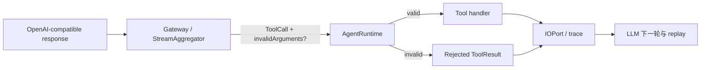

# 【gateway】拒绝无效工具参数

- Issue: #219
- 状态: Implemented
- 最后更新: 2026-07-31

## 1. 背景

OpenAI-compatible 响应中的 `function.arguments` 可能因输出截断或上游格式错误而不是合法 JSON。当前非流式、流式和 stream aggregation 路径都将解析错误替换为 `{}`。这使 Runtime 无法区分真实的空对象与无效参数，可能执行带副作用的工具，并让 trace/replay 的 request hash 与合法空对象冲突。目标是保留失败来源、拒绝执行且仍让 agent 观察到可恢复的工具错误。

## 2. 名词解释

- **无效工具参数**：function arguments 不存在、截断或无法解析为 JSON，且不是模型显式提供的 JSON 空对象。
- **工具拒绝**：Runtime 在 handler 调用前生成 `ToolResult.isError=true`，不执行目标工具。
- **解析元数据**：`invalidArguments`，包含稳定错误码与安全诊断，不保存完整原始 arguments。

## 3. 设计目标与非目标

- **目标**：
  - 保持合法 `{}` 与无效参数在类型、trace 和 hash 上可区分。
  - 非流式、流式和 aggregation 路径产生相同的无效参数语义。
  - Runtime 拒绝无效调用，记录可回放 trace，并将错误作为模型可读的工具结果返回。
- **非目标**：
  - 不为所有工具新增业务 schema；工具现有的输入校验保持不变。
  - 不保留潜在敏感的原始 command 文本。
  - 不因单次工具拒绝强制整个 agent run 失败；最终 run 状态仍由 agent 决定。

## 4. 能力与功能设计

### 4.1 UI / UX

N/A：无页面；CLI/trace 消费者通过稳定错误码诊断。

## 5. 设计思路与折衷

`ToolCall` 增加可选 `invalidArguments`：

```ts
interface InvalidToolArguments {
  code: 'TOOL_ARGUMENTS_INVALID_JSON';
  message: string;
  rawLength?: number;
}
```

`input` 保留解析成功时的值；无效调用使用安全的空占位输入并携带元数据。不能将 `input` 改为 `unknown | InvalidToolArguments`，因为会退化为 `unknown` 并把解析来源责任转嫁给所有 handler。也不能在 gateway 直接抛异常：这样丢失 tool call id 和现有 `tool.requested/responded` trace，且 agent 无法在下一轮纠正调用。

Runtime 在 dispatch 前识别元数据，通过现有 IOPort 记录 requested/responded 事件，拒绝 thunk 不调用 registry handler，并向模型返回结构化 `ToolResult`。trace hash 将元数据加入规范化输入，防止无效调用与合法 `{}` 碰撞。

## 6. 架构设计

### 6.1 逻辑分层



Gateway 负责保留解析结果与失败来源；Runtime 负责副作用门禁；IOPort/trace 负责可观察性和回放一致性。CLI 终态信号不在本设计范围，由 #220 处理。

### 6.2 核心业务流程

1. Gateway 或 StreamAggregator 收到 tool call arguments。
2. JSON 解析成功时构造普通 `ToolCall`；失败时构造带 `invalidArguments` 的 `ToolCall`。
3. Runtime 为该 call 记录 requested 事件；发现元数据后不调用 handler，记录 error responded 事件。
4. Runtime 将工具错误加入后续 LLM 消息；模型可提交修正调用或最终以 error 结束。
5. 若 run 最终 error，#220 负责 CLI 退出语义。

## 7. 模块设计

- `types/tool.ts`：`ToolCall` 追加可选解析元数据。
- `types/model.ts`、`types/common.ts`：模型响应、stream 事件和 message content 保留该元数据。
- `gateway/OpenAICompatibleAdapter.ts`、`gateway/StreamAggregator.ts`：三条解析路径统一构造元数据。
- `runtime/AgentRuntime.ts`：在 handler 前拒绝无效调用并生成 error `ToolResult`。
- `runtime/IOPort.ts`、`trace/RecordingIOPort.ts`、`trace/hash.ts`：将安全元数据写入事件和 request hash。

## 8. API / CLI 设计

对运行时内部公开类型新增可选字段，不引入新 CLI 参数：

```ts
ToolCall.invalidArguments?: {
  code: 'TOOL_ARGUMENTS_INVALID_JSON';
  message: string;
  rawLength?: number;
}
```

`ToolResult` 沿用既有 error 结构；稳定 code 为 `TOOL_ARGUMENTS_INVALID_JSON`。合法 `{}` 不含该字段。

## 9. 边界考虑

- **兼容**：可选字段保证历史 trace 和现有 tool call 消费者可读取。
- **安全**：错误仅记录解析失败类别与长度，不记录原始 arguments。
- **并发**：并行 tools 各自独立拒绝；一个拒绝不影响其他合法 calls。
- **回放**：request hash 纳入元数据，避免错误与合法输入复用错误的 replay 记录。
- **错误恢复**：工具拒绝是 agent 可观察的业务错误，不是 process 崩溃。

## 10. 迁移 / 兼容 / 回滚

- 新字段均为可选，无持久化迁移。
- 发布后，旧 trace 缺少元数据仍按原有已解析输入回放。
- 如需回滚，Runtime 可忽略新字段；不删除已写 trace 字段。

## 11. 测试计划

- **E2E**：fake OpenAI-compatible provider 返回截断 arguments；handler 执行次数为 0，trace 的 requested/responded 有同一 tool call id 和稳定错误码；合法 `{}` 走 handler 且 hash 不同。
- **Integration**：流式、非流式、aggregator 三条路径产生同一元数据；agent 能在错误后发出修正调用。
- **Unit**：解析失败安全元数据、hash 区分、Runtime 拒绝 thunk 不调用 registry。

## 12. 开放问题 / 决策记录

- 决策：错误码固定为 `TOOL_ARGUMENTS_INVALID_JSON`，不按 provider 细分，避免调用方耦合供应商格式。
- 决策：不保存 raw arguments；若将来需要调试采样，必须单独设计脱敏和访问控制。

## 13. 关联

- Issue #219
- Milkie #220
- Researcher #116
