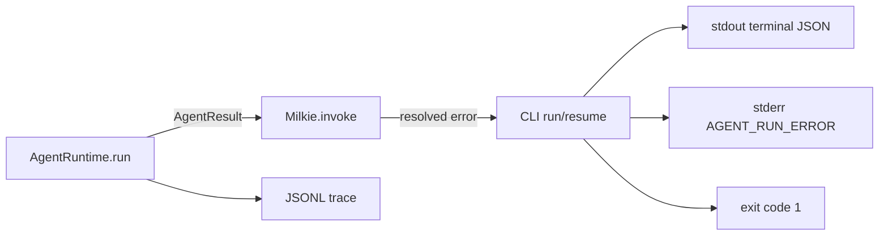

# 【runtime】终态错误的 CLI 失败契约

- Issue: #220
- 状态: Implemented
- 最后更新: 2026-07-31

## 1. 背景

AgentRuntime 将模型、工具和状态执行错误收敛为 resolved `AgentResult { status: 'error' }`，并正确持久化 run trace。CLI 的 `agent run` 与 `agent resume` 仅将该结果序列化到 stdout，未检查 status，因此 shell 进程仍以 0 结束。子进程调用方将失败误判为成功，必须重复解析内部终态 JSON 才能发现异常。

## 2. 名词解释

- **terminal error**：已完成生命周期并返回 `AgentResult.status === 'error'` 的 run；不是 commander 参数错误或未捕获异常。
- **terminal JSON**：CLI 在 stdout 末尾输出的 `{ runId, contextId, status, lastOutput }` 记录。
- **error envelope**：stderr 上稳定、可机读的 JSON 诊断对象。

## 3. 设计目标与非目标

- **目标**：terminal error 以非零进程状态结束；成功 stdout 终态 JSON 格式不变；失败仍能通过 stdout 获取 runId；stderr 提供稳定错误码和诊断。
- **非目标**：不将 Runtime 的正常错误返回改为 throw；不改变 `completed`/`interrupted` 语义；不要求 consumers 将 stderr 作为唯一失败判断。

## 4. 能力与功能设计

### 4.1 UI / UX

N/A：CLI contract。人类仍可阅读 stderr，程序优先检查 exit code。

## 5. 设计思路与折衷

CLI 在收到 resolved AgentResult 后始终输出既有 terminal JSON。若 `status === 'error'`，再写入一条 stderr envelope 并设置 `process.exitCode = 1`；不抛异常，以免 catch 路径覆盖 stdout 或将业务错误误标为 `CLI_ERROR`。只检查 stdout status 会使每个 sidecar 重复解析且漏改；改 Runtime throw 会破坏嵌入式 API 和 lifecycle 语义。

## 6. 架构设计

### 6.1 逻辑分层



Runtime 和 trace 保持现有行为；CLI 仅负责将终态错误映射为进程级信号。#219 的工具拒绝仅当最终 AgentResult 为 error 时走该映射。

### 6.2 核心业务流程

1. CLI 调用 `milkie.invoke()` 并得到 resolved result。
2. CLI 输出既有 terminal JSON。
3. completed/interrupted：保留 exit 0。
4. error：构造 stderr envelope，设置 exit 1，保留 stdout JSON 和 trace。
5. commander/infrastructure throw：保留既有 `CLI_ERROR` catch 行为。

## 7. 模块设计

- `src/cli/main.ts`：抽取 run/resume 共享终态输出函数，统一 status 分支。
- `src/types/common.ts`：复用 `AgentResult.error`，不改变 runtime 类型。
- `src/trace/types.ts`：不增加事件；CLI envelope 的字段映射 terminal result。
- CLI tests：通过子进程或 main 入口断言 stdout、stderr 与 exit code 三者关系。

## 8. API / CLI 设计

成功 stdout 不变。terminal error 追加 stderr JSON：

```json
{
  "error": {
    "code": "AGENT_RUN_ERROR",
    "message": "...",
    "status": "error",
    "runId": "...",
    "contextId": "...",
    "details": { "code": "...", "phase": "..." }
  }
}
```

- `code` 恒为 `AGENT_RUN_ERROR`；`details` 复用可用的 `AgentErrorEnvelope`。
- `runId` 与 `contextId` 来自 AgentResult，缺失字段不伪造。
- `agent run` 与 `agent resume` 同时适用。

## 9. 边界考虑

- **兼容**：现有 stdout terminal JSON 解析继续工作；新 consumers 应以 exit code 判定结果。
- **安全**：message/details 沿用 Runtime 已脱敏内容，不追加 prompt、工具输入或堆栈。
- **可诊断**：错误时 stdout runId 保证能定位 JSONL。
- **中断**：`interrupted` 不是本 issue 的失败定义，保持当前 exit 0。
- **嵌入**：不改变 `Milkie.invoke()` 的 resolved result contract。

## 10. 迁移 / 兼容 / 回滚

- 无数据迁移。
- 在包含 terminal error 的 shell scripts 中，升级后会正确进入失败分支；这是预期兼容性修复。
- 回滚可恢复旧 exit 行为，但不改变既有 trace。

## 11. 测试计划

- **E2E**：真实 CLI 子进程运行确定性 error agent；exit 1，stdout 最后一行仍含 runId/status，stderr 为 `AGENT_RUN_ERROR`。
- **Integration**：`agent run` 和 `agent resume` 的 completed/interrupted 仍 exit 0；terminal error 的 details 映射正确。
- **Unit**：终态 envelope 构造在缺少可选 error/details 时有稳定 message。

## 12. 开放问题 / 决策记录

- 决策：business terminal error 使用 `AGENT_RUN_ERROR`，不复用 `CLI_ERROR`。
- 决策：先输出 stdout 再设置 exit 状态，保证 sidecar 可提取 runId 后落入失败分支。

## 13. 关联

- Issue #220
- Milkie #219
- Researcher #116
