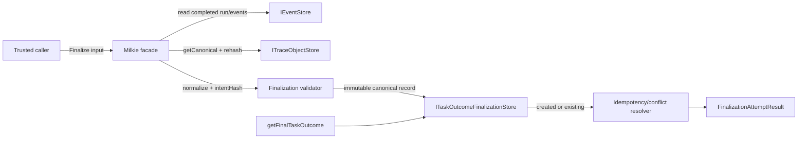

# 【outcome】证据绑定且不可覆盖的任务结果封账

- Issue: #227
- 状态: Approved
- 最后更新: 2026-08-09

## 1. 背景

当前 `Milkie.recordTaskOutcome` 向 EventStore 追加 `task.outcome.recorded`，`getTaskOutcome` 返回最后一条记录。该能力适合 human/eval/rule 持续写入 observation，但 last-write-wins 不能表示“验证完成且最终结论不可再改”。如果在 Milkie 层先读取 EventStore 判断“尚未封账”，再 append final event，两个并发调用都可能通过检查并分别写入，无法满足一次性封账。

`IEventStore` 只有 append/read，没有原子条件写入；为 JSONL 增加锁式 CAS 又会引入跨进程 stale lock、崩溃恢复与日志领域约束。另一方面，ARCHITECTURE.md 对 Outcome 允许使用 append-only event 或 equivalent auditable record。因此本设计保留现有 observation event，新增独立、不可更新的 Task Outcome Finalization Store 作为 final result 唯一事实源。

finalization 只接受已结束 run 的同 run 证据，并把规范化 intent、verifier claim、evidence refs、时间和哈希写成一次性 canonical record。并发 create-if-absent 在线性化存储层裁决；网络未知结果用 caller finalizationId 幂等恢复。recordHash 提供非恶意存储损坏检测，不声称抵御可替换整条记录并重算 hash 的管理员。

## 2. 名词解释

- **Outcome observation**：现有 `task.outcome.recorded`，允许多次追加，查询 last-write-wins。
- **Finalization / 封账**：同一 run 最多存在一个不可更新、不可删除的 final result。
- **verifier claim**：调用方提供的验证主体声明；milkie 持久化但不认证该主体。
- **evidence ref**：指向同 run Trace event，或指向同 run `object.created` 与内容地址对象的不可变引用。
- **finalizationId**：caller 生成的幂等键，用于未知提交结果后的安全重试。
- **intentHash**：规范化业务 intent 的 SHA-256 内容地址，不包含幂等键和时间。
- **recordHash**：完整 final record（除自身字段外）的 SHA-256 内容地址，用于读取时检测损坏。
- **durable acknowledgment**：File final store 只有在文件内容与目录项均 fsync 后才向本次调用返回 final/existing；crash-safe 封账还要求证据源先完成耐久确认。

## 3. 设计目标与非目标

- **目标**：
  - 一个 run 最多有一个 final result，Memory/File 共享并发域内 create 线性化。
  - final result 与 verifier claim、至少一个同 run evidence ref 和可验证 hash 绑定。
  - 相同幂等 intent 可安全重试；不同封账尝试得到明确 conflict 和已有结果，不能覆盖。
  - observation API 和 finalization API 语义完全隔离。
  - crash-safe File final 成功确认前，run/event/object evidence 已由对应 store 耐久确认；重启后仍可取得并复验。
- **非目标**：
  - 不判断业务任务是否成功，也不生成或解释领域证据。
  - 不认证/授权 verifier claim；调用边界的身份与权限由上层负责。
  - 不允许 reopen、override、delete 或管理员修订 final result。
  - 不把 finalization 双写进 EventStore，也不让 Trace 与 final store 成为两个事实源。
  - 不抵御能修改整个存储并重算 hash、删除记录的恶意管理员；该威胁需签名、WORM 或 transparency witness。
  - 不为 Redis/SQLite 实现 finalization store；本期提供 Memory 与跨进程 File，实现者可按 SPI conformance contract 扩展。
  - 不承诺 Memory store 跨进程或重启耐久；Memory final 与 Memory evidence 只提供显式的 process-lifetime 模式。

## 4. 能力与功能设计

调用方在 trusted boundary 完成业务验证、认证和授权后，提交 runId、期望状态、finalizationId、TaskOutcomeValue、verifierClaim 和 evidence。Milkie 先验证 run 与输入，规范化 intent 并计算 intentHash；如果 final store 已有 record，立即按幂等表返回，不重新验证历史 evidence。如果尚无 record，Milkie 验证全部 evidence，生成 finalizedAt 和 recordHash，再调用 store 原子 create。

`create` 返回 winner 或 existing。winner 得到 `status:'finalized'`；loser 根据 finalizationId/intentHash 返回 `idempotent` 或 conflict。冲突结果包含 existing final 和安全 attempted summary，因此调用方能即时诊断，不需要写第二条事实或维护可变 conflict history。

查询 final result 时先确认 run 存在，再从 final store 读取并验证 canonical schema/recordHash。未封账返回 null。现有 `getTaskOutcome` 永远只返回 observation；即使 finalized run 后续追加 observation，final view 也不变化。

### 4.1 UI / UX

无新页面。SDK 返回判别联合供 CLI/UI 后续展示：finalized、idempotent、already_finalized、idempotency_key_reused。展示 existing final 时可显示 value、verifierClaim、evidence refs、finalizedAt 和 recordHash；不得把 verifierClaim 呈现为“已由 milkie 认证”。存储损坏显示稳定 corruption code，不允许“重新封账修复”。

## 5. 设计思路与折衷

### 方案 A：EventStore read-then-append

最少新增类型，但检查与 append 之间没有原子性；并发调用可产生多个 final event。Memory mutex 只能覆盖单进程，无法覆盖共享 File 后端，放弃。

### 方案 B：为通用 EventStore 增加 `appendIfAbsent`

能维持所有 Outcome 在 Trace 中，但 JSONL 需要跨进程锁、stale lease、崩溃恢复和条件索引。finalization 的唯一 key 会污染通用 append-only 事件接口；成功 event 与锁文件也存在提交一致性问题，放弃。

### 方案 C：独立 immutable finalization store

本设计选择该方案。store 只暴露 create/get，后端可以直接使用内存 Map 原子临界区或文件系统 atomic link。它与 observation EventStore 分别拥有不同概念的单一事实源：Trace 记录可修订 observation，final store 保存不可修订结论。代价是 MilkieOptions 多一个显式依赖，部署者必须选择持久化后端；相比隐式降级到 Memory，这一失败是安全的。

冲突选择返回判别联合，不使用异常：并发失败是预期业务结果，调用方通常需要 existing final。输入无效、run/evidence 缺失、配置错误和存储损坏仍通过 typed error fail closed。

## 6. 架构设计

### 6.1 逻辑分层



事实源边界：

- EventStore 是 run lifecycle、event evidence 和 observation Outcome 的事实源。
- TraceObjectStore 是 object evidence canonical bytes 的事实源。
- TaskOutcomeFinalizationStore 是 final result 的唯一事实源。
- finalization 不产生 `task.outcome.finalized` Trace event；不存在需要原子双写的第二副本。
- durability class 必须成组匹配：process final 可配 process evidence；crash-safe final 必须配可确认 run/event/object 已耐久的 evidence stores，禁止耐久 final 引用未耐久证据。

### 6.2 核心业务流程

#### 新封账

1. 检查 `eventStore`、`outcomeFinalizationStore` 已配置；输入通过 shape/size/JSON-safe 校验；final/evidence store durability class 可兼容。
2. 读取 run events；未知 run 抛 `TaskOutcomeRunNotFoundError`，`agent.run.completed` 数量不是 1 则拒绝。
3. 规范化 claim/evidence/scores/note，计算 intentHash。
4. 先 `finalStore.get(runId)`：File get 只有在确认 target 目录项耐久后才返回 existing；已有则直接进入幂等/冲突解析。
5. 尚无 final 时验证每条 event/object evidence。
6. crash-safe 模式调用 evidence store durability capability：先确认 run event file，再确认所有 object bytes 与目录项；任一步失败则不创建 final。
7. 生成 finalizedAt，构造无 recordHash record，计算 recordHash。
8. `finalStore.create(record)` 以 atomic link 线性化；winner/loser 均在成功 fsync target parent directory 后才返回 created/existing。
9. created 返回 finalized；existing 再按同一幂等表解析。directory fsync 失败只抛 `commit_unknown`，不得返回任何 final/existing。

#### 幂等与冲突判定

| existing.finalizationId | existing.intentHash | 结果 |
|---|---|---|
| 等于 attempted | 等于 attempted | `status:'idempotent'`，返回 existing |
| 等于 attempted | 不等于 attempted | `status:'conflict' / idempotency_key_reused` |
| 不等于 attempted | 任意 | `status:'conflict' / already_finalized` |

同 value、同 evidence 但不同 finalizationId 仍是新的封账尝试，必须 `already_finalized`。只有相同 key + 相同 intent 才是网络重试。

#### 查询

1. 从 EventStore 确认 run 存在；未知 run 抛现有 not-found error。
2. final store `get` 返回 null 或校验后的独立 snapshot；crash-safe File get 观察到 target 后必须先 fsync parent directory，失败则抛 `commit_unknown`。
3. null 表示其文件查找线性化点上已知 run 未封账；recordHash/schema/runId 不一致则抛 corruption error。

## 7. 模块设计

| 模块 | 变更与职责 |
|---|---|
| `src/types/outcome.ts` | finalization input、record、result、evidence、claim、durability class、typed validation/config/corruption errors。 |
| `src/outcome/TaskOutcomeFinalizationStore.ts` | SPI 与 Memory/File 实现；canonical snapshot、linearizable create/get、durable visibility。 |
| `src/outcome/finalizationHash.ts` | 唯一 normalize/preimage/intentHash/recordHash helper，复用 trace canonical hash。 |
| `src/outcome/validateEvidence.ts` | run lifecycle、event/object uniqueness、getCanonical 与内容 hash 重算、durability capability 协调。 |
| `src/trace/EventStore.ts` / `JsonlEventStore.ts` | 新增可选 crash-safe evidence capability；JSONL 文件与父目录 fsync。 |
| `src/trace/TraceObjectStore.ts` | File object store 确认 object inode 与目录项耐久；Memory 明确 process durability。 |
| `src/trace/BroadcastingEventStore.ts` | 仅在 durable inner store 可用时代理 run durability confirmation。 |
| `src/runtime/Milkie.ts` | facade 流程、durability compatibility、幂等/conflict resolver、query；保持 observation 方法不变。 |
| `src/index.ts` | 导出 store SPI/实现、durability capability、finalization API 类型与 typed errors。 |
| `docs/stories/s-017-immutable-task-outcome-finalization.md` | 新用户场景，区分 s-016 observation。 |
| `docs/stories/INDEX.md` | 注册 s-017、readiness/capability/notes。 |
| `tests/e2e/s-017-immutable-task-outcome-finalization.e2e.test.ts` | S1/S2 用户闭环。 |

## 8. API / CLI 设计

### 8.1 输入与公共类型

```ts
export type VerifierClaimType = 'human' | 'eval' | 'rule' | 'service'

export interface VerifierClaim {
  readonly type: VerifierClaimType
  readonly id: string
}

export type EvidenceRef =
  | { readonly kind: 'event'; readonly eventId: string }
  | { readonly kind: 'object'; readonly objectId: string; readonly hash: `sha256:${string}` }

export interface FinalizeTaskOutcomeInput {
  readonly runId: string
  readonly expectedState: 'unfinalized'
  readonly finalizationId: string
  readonly value: TaskOutcomeValue
  readonly verifierClaim: VerifierClaim
  readonly evidence: readonly EvidenceRef[]
  readonly note?: string
  readonly scores?: readonly TaskOutcomeScore[]
}
```

输入限制：

- runId/verifierClaim.id：trim 后 1–256 字符且不含 Unicode control character；
- finalizationId：trim 后 1–128 字符且不含 control character；
- evidence：1–128 条，规范化后不得重复；
- note：缺省或最多 8192 Unicode code points；
- scores：最多 64 条，name trim 后 1–128 字符、唯一，value 保持现有 JSON-safe scalar；
- value 必须是现有四值闭集；expectedState 只能是 literal；
- 全部值必须可被 `canonicalize` 接受，禁止 class instance、function、symbol、BigInt、循环引用和 undefined array member。

### 8.2 Canonical preimage

规范化规则：

- trim runId、finalizationId、claim id、score name；note 保留原文本，不隐式 trim；
- evidence 排序键：event 为 `event\0<eventId>`，object 为 `object\0<objectId>\0<hash>`；完全相同项拒绝；
- scores 按 normalized name 排序，重复 name 拒绝；
- 省略未提供的 note/scores，不写 undefined。

```ts
const intentPreimage = {
  schemaVersion: 1,
  runId,
  value,
  verifierClaim,
  evidence: normalizedEvidence,
  ...(note !== undefined ? { note } : {}),
  ...(scores !== undefined ? { scores: normalizedScores } : {}),
}

intentHash = hashCanonical(intentPreimage)
```

明确排除：expectedState、finalizationId、finalizedAt、recordHash。finalizationId 是幂等命名空间，不是业务 intent；expectedState 是 CAS 前置条件。

```ts
const recordWithoutHash = {
  ...intentPreimage,
  state: 'finalized',
  finalizationId,
  intentHash,
  finalizedAt,
}
recordHash = hashCanonical(recordWithoutHash)
```

最终 record 等于 `{...recordWithoutHash, recordHash}`。hash 格式固定 `sha256:<64 lowercase hex>`，所有实现只能调用同一 `canonicalize/hashCanonical` helper。

### 8.3 Final record 与结果

```ts
export interface TaskOutcomeFinalization {
  readonly schemaVersion: 1
  readonly state: 'finalized'
  readonly runId: string
  readonly value: TaskOutcomeValue
  readonly verifierClaim: VerifierClaim
  readonly evidence: readonly EvidenceRef[]
  readonly note?: string
  readonly scores?: readonly TaskOutcomeScore[]
  readonly finalizationId: string
  readonly intentHash: `sha256:${string}`
  readonly finalizedAt: number
  readonly recordHash: `sha256:${string}`
}

export type FinalizationConflictKind =
  | 'already_finalized'
  | 'idempotency_key_reused'

export type FinalizationAttemptResult =
  | { readonly status: 'finalized'; readonly final: TaskOutcomeFinalization }
  | { readonly status: 'idempotent'; readonly final: TaskOutcomeFinalization }
  | {
      readonly status: 'conflict'
      readonly existing: TaskOutcomeFinalization
      readonly conflict: {
        readonly kind: FinalizationConflictKind
        readonly attempted: {
          readonly finalizationId: string
          readonly value: TaskOutcomeValue
          readonly intentHash: `sha256:${string}`
        }
      }
    }
```

conflict attempted summary 不包含 note、scores 或 evidence 内容；existing 与 `getFinalTaskOutcome` 返回相同 final view。

### 8.4 Store SPI

```ts
export type DurabilityClass = 'process' | 'crash-safe'

export interface ITaskOutcomeFinalizationStore {
  readonly durability: DurabilityClass
  create(record: TaskOutcomeFinalization): Promise<
    | { readonly created: true; readonly record: TaskOutcomeFinalization }
    | { readonly created: false; readonly existing: TaskOutcomeFinalization }
  >
  get(runId: string): Promise<TaskOutcomeFinalization | null>
}
```

SPI contract：

- create-if-absent 以 runId 为唯一 key，在共享后端并发域内线性化；
- create 返回 false 时 existing 与 winner 是同一校验 record，不能先返回 false 再另行非原子 get；
- 不提供 update/delete；
- 只接受 canonical JSON-safe record，并在存储前验证 recordHash；
- 内部不保存 caller 对象引用，create/get 返回独立 readonly snapshot；
- 每次 create/get 返回 final 或 existing 前，必须达到该 store 声明的 durability class；未知提交/确认结果抛 typed store error，由 caller 同 key 重试；
- crash-safe store 不得把“已观察但未成功确认目录项耐久”的 target 作为 final/existing 返回；
- custom store 必须通过共享 conformance suite。

### 8.5 Memory store

内部 `Map<runId, canonicalString>`。`create` 在任何 await 前完成 has/set，因此同一 store instance 的 JavaScript 执行域内线性化。winner/loser 都从 canonicalString parse 新对象返回；`get` 也 parse 新对象并重验 schema/hash。修改输入或任一返回 snapshot 的嵌套 evidence/scores 不影响 Map。

Memory store 只承诺单进程、单实例共享域，不用于持久化部署；测试和显式临时场景必须主动构造，Milkie 不自动 fallback。

### 8.6 File store

target 使用 `sha256Hex(runId)`，布局：`<base>/sha256/<first2>/<remaining>.json`。record 内保留原 runId，读取时必须与请求严格相等，避免路径注入与理论 hash collision 静默误读。

提交与 durable visibility 协议：

1. 在 target 同目录创建唯一 temp，flag `wx`；
2. 写入完整 canonicalString，`FileHandle.sync()`，关闭 temp；
3. `link(temp,target)` 作为原子 create-if-absent 线性化点；
4. winner 打开 parent directory 并 `sync()`；成功后才返回 `created:true`；
5. `EEXIST` loser 读取 existing，完整验证 schema/hash/runId，再对 parent directory `sync()`；成功后才返回 `created:false`；
6. `get` 若观察到 target，同样先完整验证并 `sync()` parent directory，再返回 final；未观察到 target 可在线性化查找点返回 null；
7. 任一 observer 的 directory sync 都可耐久化第 3 步的目录项。因此 A 在 link 后 sync 失败得到 `commit_unknown` 时，B 只有自己 sync 成功才能返回 existing；否则 B 也得到 `commit_unknown`，不存在 pending target 被当成成功 final 暴露；
8. 仅在完成上述结果后清理 temp；temp 清理失败只记 service log，不改变已确认 target。

崩溃恢复不依赖 lock：若 target 缺失，则此前没有调用方获得 durable acknowledgment，可重新 create；若 target 存在，下一次 create/get 必须验证并 sync parent 后才返回；若 target malformed/tampered，fail closed。create 前错误不得留下 target 或占位 lock。启动/调用时可清理匹配 temp 命名且超过安全阈值的残留文件，但绝不删除 target。

### 8.7 Facade

```ts
class Milkie {
  finalizeTaskOutcome(input: FinalizeTaskOutcomeInput): Promise<FinalizationAttemptResult>
  getFinalTaskOutcome(runId: string): Promise<TaskOutcomeFinalization | null>
}
```

配置：

```ts
interface MilkieOptions {
  outcomeFinalizationStore?: ITaskOutcomeFinalizationStore
}
```

调用新 API 时缺少 eventStore 或 finalization store 分别抛稳定配置错误。object evidence 存在但缺少 traceObjectStore 时抛 evidence configuration error；只有 event evidence 时不要求 object store。

若 final store 声明 `crash-safe`，eventStore 必须实现 crash-safe run durability capability；存在 object evidence 时 traceObjectStore 也必须实现 crash-safe object durability capability。Memory/未声明 capability 的 store 组合在 create 前以 configuration error 拒绝。若 final store 为 `process`，允许显式 process evidence stores，但 result 只承诺当前进程生命周期。

`getFinalTaskOutcome` 对未知 run 抛 `TaskOutcomeRunNotFoundError`，已知未封账返回 null。`recordTaskOutcome/getTaskOutcome` 签名和行为不变。

### 8.8 Evidence validation

对 run events 建立全量 eventId map：id 必须非空且全局唯一，否则 evidence validation error。`agent.run.completed` 必须恰有一个。

- event evidence：eventId 在同 run map 中恰好存在，ref 自身字符串通过输入限制。
- object evidence：同 run 中按 objectId 查 `object.created`，必须恰好一个；payload.hash 必填且等于 ref.hash；调用 `traceObjectStore.getCanonical(ref.hash)`，undefined/throw 均失败；再计算 `contentAddressForCanonicalBytes(bytes)`，必须同时等于 ref.hash 和 event hash。
- 不调用 `has()` 作为完整性判断。
- 任一证据失败时绝不调用 final store create。

crash-safe capability 采用独立窄接口，避免把 Memory SPI 伪装成耐久：

```ts
export interface ICrashSafeEventStore extends IEventStore {
  readonly durability: 'crash-safe'
  confirmRunDurable(runId: string): Promise<void>
}

export interface ICrashSafeTraceObjectStore extends ITraceObjectStore {
  readonly durability: 'crash-safe'
  confirmObjectsDurable(hashes: readonly `sha256:${string}`[]): Promise<void>
}
```

`JsonlEventStore.confirmRunDurable` 在目标 events 已可读后 fsync run file 与其 parent directory；构造/首次创建 base 时同步建立的目录链。`FileTraceObjectStore.confirmObjectsDurable` 对每个已验证 target fsync inode，再 fsync从 object leaf 到已配置 durable root 的目录链。`BroadcastingEventStore` 只有在 inner store 实现该接口时代理；Memory stores 不实现。确认在 evidence validation 后、final create 前发生；确认后 append-only/content-addressed API 不会合法修改已确认 bytes。

E2E fixture 通过真实 Tool/Recording 路径：先 `putCanonical(bytes)` 获取 hash，再以该 hash 声明 object；finalizer 不为无 hash legacy object 补铸 hash。crash-safe E2E 使用 JsonlEventStore + FileTraceObjectStore + File final store，不用 Memory evidence 冒充耐久。

### 8.9 Public exports 与错误

`src/index.ts` 导出所有 finalization DTO、store SPI/Memory/File 实现，以及：

- `TaskOutcomeFinalizationValidationError`；
- `TaskOutcomeFinalizationConfigurationError`；
- `TaskOutcomeEvidenceError`（稳定 reason kind，不含 evidence 内容）；
- `TaskOutcomeFinalizationStoreError`（含 `commit_unknown` 等稳定 stage/kind，cause 只供 live logging）；
- `TaskOutcomeFinalizationCorruptionError`。

输入/证据/配置/存储损坏为异常；并发冲突不是异常，使用 `FinalizationAttemptResult.status:'conflict'`。

## 9. 边界考虑

- **线性化域**：Memory 仅单实例进程内；File 覆盖同一文件系统目录上的独立进程。网络文件系统只有在其声明 POSIX atomic link/fsync 语义时支持。
- **耐久可见性**：link 是唯一性线性化点；每个 winner、loser、reader 都必须在返回 final/existing 前成功 fsync target parent。link 与确认之间失败属于 commit_unknown，未确认 target 不对 API 可见为成功结果。
- **跨事实源耐久**：crash-safe 模式先确认 EventStore run file 与全部 object inode/目录项，再创建 final。崩溃只能留下“有证据无 final”，不能合法留下“已确认 final 无证据”。配置与备份必须保持三者同一 durability class。
- **引用不可变性**：canonical string 内存/文件快照隔离 caller 引用；TypeScript readonly 只表达接口意图，不代替深快照。
- **幂等**：同 key+intent 可在任意未知结果后重试；同 key+不同 intent 永远 conflict。
- **证据 TOCTOU**：run completed 后 EventStore append-only，event/object ref 不会被合法 API 修改；object bytes 由内容地址校验。存储管理员删除仍属非目标。
- **身份安全**：verifierClaim 不是认证结果；上层必须限制 finalization capability。将 agent 可控文本直接映射为 claim 是调用方漏洞。
- **恶意存储**：普通 hash 不能阻止管理员替换/删除记录并重算；本期只检测非恶意损坏和部分写入。
- **隐私**：conflict attempted summary 不回显 note/evidence；final record 本身按 final query 权限保护，本期 SDK 不实现权限层。
- **大小与性能**：evidence/scores 有上限；每次新封账线性扫描单 run events并读取 object bytes；crash-safe 模式额外 fsync evidence 与 final 目录。已封账冲突只确认 final target，不重读 evidence bytes。
- **时钟**：finalizedAt 是审计时间，不参与 intentHash；winner 的时间成为 recordHash 一部分，loser 不生成第二事实。
- **删除/生命周期**：没有 delete API；运维备份、保留和灾难恢复必须把 final store 与 EventStore/ObjectStore 一并管理。

## 10. 迁移 / 兼容 / 回滚

- `recordTaskOutcome/getTaskOutcome`、`task.outcome.recorded` 和 s-016 保持原样；不把旧 observation 自动升级为 final。
- 新 API 只在显式配置 finalization store 时可用，避免升级后把耐久 final 静默写进 Memory。
- JsonlEventStore 与 FileTraceObjectStore 新增 crash-safe confirm capability；原 append/put/get 签名兼容。只有 finalization 的 crash-safe 路径强制调用该 capability。
- 没有存量数据迁移；调用方可在验证并耐久确认证据后显式 finalization 历史 run。
- finalization store schemaVersion 从 1 开始；reader 对未知版本 fail closed，不猜测。
- 新建 s-017 story/INDEX；它与 s-016 分别代表 immutable final 与 mutable observation。
- 回滚代码时不能删除或覆盖已有 final store。旧代码不认识 finalization，但 observation 仍可写；再次升级后 final view 必须恢复原记录。EventStore/ObjectStore 的 confirm 方法是新增能力，旧 reader 可忽略。运维回滚/恢复必须保持三类 store 的一致备份边界。

## 11. 测试计划

- **E2E（S1 / s-017）**：
  1. 使用 JsonlEventStore、FileTraceObjectStore、File final store 和真实 Recording Tool 路径产生 `agent.run.completed`、event evidence 与带 hash 的 object evidence。
  2. 以 verifierClaim 和两类 evidence 调用 finalization。
  3. 断言 status finalized；query 的 state/value/claim/evidence/intentHash/recordHash 一致；store 恰一条 record。
  4. 关闭并重建全部 store 实例后仍可读取 run、object bytes 与同一 final，并重新验证 object/record hash。
  5. 再调用 `recordTaskOutcome` 写相反 observation；`getTaskOutcome` 返回新 observation，而 `getFinalTaskOutcome` 保持原 final。
- **E2E（S2 / s-017）**：
  1. barrier 同时提交不同 finalizationId 的相同/相反 value。
  2. 断言恰一项 finalized，所有其他项 `conflict.kind === 'already_finalized'` 且 existing.recordHash 相同。
  3. winner 相同 key+intent 重试返回 idempotent；同 key+不同 intent 的 `conflict.kind === 'idempotency_key_reused'`；磁盘/Map 始终一条 record。
- **Integration**：
  - 两个独立 Node 子进程竞争同一 File store；最终 target 恰一条可校验 record，败者取得同 existing。
  - barrier 令 winner 在 link 后、directory fsync 前暂停，同时 reader/loser 进入；分别注入 sync 成功/失败，断言任何调用只有自身 directory sync 成功后才能收到 finalized/idempotent/conflict/final，全部失败只得到 commit_unknown。
  - fault injection 覆盖 temp create/write/fsync、link、link 后 directory fsync、temp cleanup；只有完成 directory fsync 才可确认结果。
  - 底层已 create 后 wrapper 抛 unknown；同 key 重试先确认 target 耐久，再返回 idempotent且 recordHash/内容不变。
  - create 前失败无 target/lock；malformed/tampered existing、runId collision fail closed，不创建替代 record。
  - Jsonl/Event 与 FileObject durability fault injection：evidence file/inode/directory 任一 sync 失败时不创建 final；成功后 kill/restart，run、event、object bytes 与 final 全部可复验。
  - crash-safe final + Memory/无 capability evidence 配置在 create 前拒绝；process final + Memory evidence 明确只做进程内测试。
  - event/object evidence 真实 getCanonical+rehash；duplicate eventId/objectId、跨 run、无 hash、缺 bytes、hash mismatch 均不调用 create。
  - shared SPI conformance suite 同时跑 Memory/File/custom fixture，并核对 durability class。
- **Unit**：
  - intentHash/recordHash 精确 preimage、sha256 格式、evidence/scores canonical 顺序。
  - 输入边界、JSON-unsafe 值、重复 evidence/score name、finalizedAt safe integer。
  - 修改 create input、create result、get result 的嵌套 evidence/scores，不改变 Memory/File record/hash。
  - 三行幂等/conflict 判定表和安全 attempted summary。
  - known-unfinalized→null、unknown run→not found、observation/final query 隔离。
  - public barrel 可导入 DTO/store/durability capability/errors，`instanceof` 对实际抛出对象成立。

测试中的跨进程竞争必须使用独立 Node process，不以同进程 Promise 并发替代；文件故障通过可注入 filesystem operations 精确落在提交步骤，不用时间猜测。crash/restart 用真实子进程退出与新实例读取，不以 close/reopen mock 替代断电边界。

## 12. 开放问题 / 决策记录

- D1：finalization 使用独立 immutable store，不扩展 EventStore CAS，不双写 final event。
- D2：Memory/File 是本期内置实现；持久化部署必须显式配置。
- D3：不同 finalizationId 永远是新尝试；只有同 key+同 intent 幂等。
- D4：intentHash 排除 key/time，recordHash 包含完整 winner record。
- D5：object evidence 必须 getCanonical 并重算 hash；无 hash legacy object 不可封账。
- D6：verifierClaim 仅为 provenance claim，认证授权在 trusted boundary。
- D7：File 以 link 线性化；winner/loser/reader 各自在返回 final 前 fsync parent，未确认 target 只产生 commit_unknown。
- D8：crash-safe final 强制先确认 run event 与 object bytes/目录项耐久；process 模式不声称跨重启。
- D9：recordHash 不提供管理员级防篡改保证。
- D10：冲突通过返回联合即时诊断，不持久化第二事实或 conflict history。

无开放问题。

## 13. 关联

- Issue: https://github.com/xforce-io/milkie/issues/227
- L1 概要: https://github.com/xforce-io/milkie/issues/227#issuecomment-5229390704
- L1 reviewer: https://github.com/xforce-io/milkie/issues/227#issuecomment-5229391250
- L2 reviewer: https://github.com/xforce-io/milkie/issues/227#issuecomment-5229459616
- PR: https://github.com/xforce-io/milkie/pull/232
- 现有 observation story: `docs/stories/s-016-record-and-query-task-outcome.md`
- 新 finalization story: `docs/stories/s-017-immutable-task-outcome-finalization.md`
- 相关模块：`src/types/outcome.ts`、`src/runtime/Milkie.ts`、`src/trace/TraceObjectStore.ts`、`src/trace/hash.ts`
