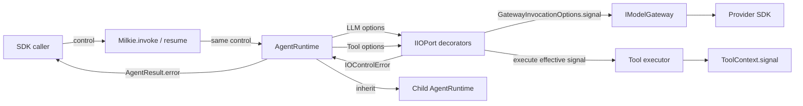

# 【runtime】IOPort 端到端截止时间与取消

- Issue: #228
- 状态: Approved
- 最后更新: 2026-08-09

## 1. 背景

当前 `Milkie.invoke/resume` 的调用方不能把墙钟预算或主动取消信号传入 `AgentRuntime`。Runtime 内部的 `IIOPort.invokeLLM` 与 `invokeTool` 也没有统一控制参数，`IModelGateway.complete/stream` 和 Tool executor 因而收不到取消信号。现有 `Milkie.interrupt` 通过状态存储设置标记，只能在 Runtime 下一次 `checkEvents()` 时生效，无法及时终止正在等待的 LLM 或 Tool。结果是上层已经放弃 run，底层调用仍可能占用连接、继续回调流事件或执行副作用。

本设计为一次 `invoke/resume` 建立统一 control，并把同一绝对截止时间与取消信号传播至所有 LLM、Tool、重试、并行批次与子 Agent。它只定义控制传递和稳定终态；预算数值、业务重试和可恢复中断生命周期仍由上层决定。LLM 失败的 Trace 完整记录与确定性重放由 #229 承接。

## 2. 名词解释

- **caller signal**：调用方通过 `AbortSignal` 主动发出的取消信号。
- **deadline**：`deadlineAt` 指定的 Unix epoch 毫秒绝对截止时间；`now >= deadlineAt` 视为已到期。
- **effective signal**：IOPort 将 caller signal 与 deadline timer 组合后传给 Gateway 或 Tool executor 的信号。
- **control latch**：成功、供应商/Tool 失败、主动取消、deadline 四种候选终态中的首次原子结算点；一旦 latch，后续候选不得改变结果。
- **物理中止**：远端供应商或 Tool 背后的外部系统实际停止工作；区别于 milkie 已发出 signal 并停止等待。

## 3. 设计目标与非目标

- **目标**：
  - `Milkie.invoke/resume` 的调用方可提供 deadline 和 caller signal。
  - 同一 control 覆盖本次调用的 LLM、所有注册 Tool 路径、重试、并行批次和子 Agent，不重新计算预算。
  - Gateway SDK、流迭代器和 Tool handler 收到 effective signal。
  - LLM 与 Tool 以相同、可序列化、可判型的错误契约返回 cancel/deadline 终态。
  - 已有供应商超时继续是 `MODEL_TIMEOUT`，不会与调用方 deadline 混淆。
- **非目标**：
  - 不决定默认预算、最大迭代次数或业务重试策略。
  - 不承诺不协作 Tool 或供应商远端任务的物理中止。
  - 不把 `Milkie.interrupt` 改造成 AbortSignal，也不改变其可恢复 checkpoint 语义。
  - 不记录任意 `AbortSignal.reason`、供应商原始异常或堆栈。
  - 不在 #228 改造 LLM Trace/Replay 终态；该部分由 #229 完成。

## 4. 能力与功能设计

调用方在 `invoke` 或 `resume` 时传入可选 control。facade 校验后立即捕获 `deadlineAt` 数值并保留 caller `AbortSignal` 引用，生成运行期不可变的 resolved control；后续对原 control 对象的修改不影响本次调用。Runtime 将该快照传给每个 IOPort effect；子 Agent 继承父快照，重试和并行 Tool 不能获得新的相对预算。

没有 control 时行为与当前版本相同。存在 control 时，IOPort 同时完成两件事：

1. 将 effective signal 传播到真实执行边界；
2. 使用结算门保证 cancel/deadline 获胜后，IOPort Promise 在规定容差内结束。

仅做第二项的 `Promise.race` 不合格，因为底层仍会继续运行；仅做第一项也不合格，因为不协作的 SDK/Tool 可能导致调用方继续等待。两项必须同时存在，但物理中止仍取决于底层协作。

### 4.1 UI / UX

N/A — 本设计仅改变 TypeScript SDK 和运行时契约，没有页面或交互界面。

## 5. 设计思路与折衷

### 方案 A：只在 Runtime 外层 `Promise.race`

改动最小，也能让上层 Promise 按时 reject；但 Gateway、流迭代器和 Tool handler 不知道调用已取消，副作用、连接与回调仍可能继续。它不能满足 S2，放弃。

### 方案 B：只透传 `AbortSignal`

契约简洁，协作良好的 SDK 能正常停止；但自定义 Tool、第三方 SDK 或错误 adapter 可能忽略 signal，无法保证 milkie 自身及时 settle。它不能满足 S1 的固定容差，放弃。

### 方案 C：signal 传播加外层结算门

本设计选择该方案。effective signal 负责协作式停止，结算门负责 milkie 的及时终态。它比 A/B 多一个明确的竞态状态机和清理责任，但能同时满足可取消性、固定结算边界与诊断一致性。

deadline 选择绝对 `deadlineAt`，不选择逐层 `timeoutMs`。相对 timeout 在重试、child 和 adapter 层重新开始计时会放大总预算；绝对时间可以跨层原样传递。deadline/cancel 不进入 `ModelRequest`，也不进入 request hash，因为它们是执行控制而非模型采样输入；最终观察到的失败由 #229 记录。

## 6. 架构设计

### 6.1 逻辑分层



职责边界：

- SDK facade 与每个 IOPort implementation/decorator 都先调用同一 shared control resolver；在 run/effect/request event 启动前拒绝非法 deadline。
- AgentRuntime 传播 resolved control，不创建新的业务预算，也不重置 deadline；control error 是不可降级的运行终态。
- DefaultIOPort 拥有 signal 组合、终态 latch、timer/listener 清理和及时 settle。
- RecordingIOPort 在任何 request event 前 resolve/validate control；合法的 pre-aborted/expired control 再由 #229 记录 inner 的稳定 control failure。
- ReplayingIOPort 在任何 FIFO 访问前 resolve/validate control，再执行 preflight；不访问真实 Gateway/Tool。
- Gateway adapter 只把 effective signal 映射到 SDK；不得重新分类已被本地 control latch 的 AbortError。
- 所有注册 Tool 路径都经 `invokeTool`；executor 用收到的 effective signal 构造 `ToolContext.signal`。普通 Tool 捕获 `IOControlError` 时必须原样向上抛出，不得转换成 `ToolResult`、重试或继续 LLM loop。

### 6.2 核心业务流程

#### 正常执行

1. facade 校验 control；没有 control 时继续现有路径。
2. Runtime 把同一 control 传给 IOPort。
3. DefaultIOPort 建立 effective signal、deadline timer 和一次性 latch。
4. Gateway 或 Tool 完成并先 latch；IOPort 清理 timer/listener，返回原成功结果或原供应商/Tool 错误。

#### 主动取消或 deadline

1. caller abort 或 deadline timer 先 latch 对应 control cause。
2. IOPort abort effective signal，使 Gateway SDK、stream iterator 或 Tool handler 可协作停止。
3. IOPort 在 100ms 容差内 reject `IOControlError`。
4. 后到的 SDK AbortError、成功结果、Tool 失败或 stream event 被忽略；不得覆盖 control code。
5. #229 将已启动的 LLM invocation 写成结构化失败终态；Tool 复用现有 error responded 事件。

Runtime 的顶层 `run()` 识别 `IOControlError` 并把原 envelope 写入 `AgentResult.error`。LLM-state Tool 的执行层遇到该错误立即向上抛出，不生成 LLM 可见的普通 Tool error；action-state handler 改为经 `invokeTool` 执行，因此两条 Tool 路径都保留 `operation:'tool'`。

流式路径使用内部 `StreamSession` 契约：DefaultIOPort 把 effective signal 与只读 `isLatched()` 传给 StreamAggregator，Aggregator 是 iterator 的唯一 owner。control latch 时 Aggregator 的幂等 cleanup 至多调用一次 `iterator.return()`，并在每次 `onEvent` 前二次检查 signal/latch。IOPort 的 control rejection 不等待不协作 iterator 的 cleanup；cleanup 在后台 `finally` 中最终移除 listener。DefaultIOPort 与 Aggregator 不得各自重复关闭同一 iterator。

#### Replay

1. ReplayingIOPort 先做 control 参数校验和 preflight。
2. caller 已取消或 deadline 已过期时，直接 reject control error，不消费 FIFO。
3. 其余情况同步消费已录 outcome；已录成功则返回，已录失败则重建同类错误。
4. 一旦同步消费完成，随后到来的 caller abort 不改变该次 replay 结果。

## 7. 模块设计

| 模块 | 变更与职责 |
|---|---|
| `src/types/common.ts` | `AgentInvokeRequest.control?`；`AgentResult.error` 接受新增 control envelope。 |
| `src/types/model.ts` | 公共 control、Gateway options、control error envelope；扩展 `AgentErrorEnvelope`；固定 Gateway 新签名。 |
| `src/runtime/IOPort.ts` | LLM/Tool options、Tool executor signal、shared `resolveIOInvocationControl`、DefaultIOPort latch 与 cleanup。 |
| `src/runtime/Milkie.ts` | `invoke/resume` facade 调用 shared resolver 并传入 Runtime；replay proxy 迁移新签名。 |
| `src/runtime/AgentRuntime.ts` | 所有效果、action-state Tool、重试、并行 Tool 与 child 继承同一快照；control error 原样终止 run，Tool 不降级为 `ToolResult`；retry backoff 改为 control-aware wait。 |
| `src/types/tool.ts` / ToolContext | 暴露只读 `signal: AbortSignal`，由 `invokeTool` executor 收到的 effective signal 构造。 |
| `src/gateway/*Adapter.ts` | 把 `GatewayInvocationOptions.signal` 传入各 SDK request options。 |
| `src/gateway/StreamAggregator.ts` | 实现内部 `StreamSession`：持有 iterator、回调前检查 latch、幂等 `return/finally` cleanup；不阻塞 IOPort 及时 reject。 |
| `src/trace/RecordingIOPort.ts` | public LLM/Tool 入口先调用 shared resolver；非法 control 不写 request，合法 inner 失败记录由 #229 定义。 |
| `src/trace/ReplayingIOPort.ts` | public 入口先调用 shared resolver，再做 control preflight/FIFO 不消费；已录 outcome 由 #229 重建。 |

## 8. API / CLI 设计

### 8.1 公共 control

```ts
export interface IOInvocationControl {
  readonly signal?: AbortSignal
  readonly deadlineAt?: number
}

export interface LLMInvocationOptions {
  readonly onEvent?: (event: ModelEvent) => void
  readonly control?: IOInvocationControl
}

export interface GatewayInvocationOptions {
  readonly signal?: AbortSignal
}
```

`deadlineAt` 必须是有限且非负的 Unix epoch 毫秒。`0` 是合法但已过期的 deadline。非法值由导出的 `IOInvocationValidationError` 拒绝：

```ts
{
  code: 'IO_INVALID_DEADLINE'
  message: 'I/O invocation deadline must be a finite non-negative Unix epoch millisecond.'
  retryable: false
}
```

在 `Milkie.invoke/resume` 中，验证发生在 run/effect 启动前：Promise reject，不返回 `AgentResult`，不创建 I/O Trace 事件。直接调用 Default/Recording/Replaying IOPort 也遵守同一错误类型；非法 control 不进入 #229 sanitizer，不写 `llm.requested/responded` 或 Tool request/terminal，也不消费 Replay FIFO。

`src/runtime/IOPort.ts` 提供唯一 shared `resolveIOInvocationControl(control?)`。它不 await、在任何异步副作用前验证 deadline，并复制 `deadlineAt` 数值形成内部 readonly `ResolvedIOInvocationControl`；只保留原 signal 引用以继续观察 abort。每个 public IOPort implementation/decorator 入口必须先调用该 resolver，后续 decorator/inner、Runtime、retry、parallel batch 与 child 只接收同一快照，禁止重新读取 caller control 对象。resolver 只做 shape validation/snapshot；合法的 pre-aborted signal 或已过期 deadline 属于后续 preflight control failure，不是 validation error。

### 8.2 IOPort 与 Gateway

```ts
interface IIOPort {
  invokeLLM(request: ModelRequest, options?: LLMInvocationOptions): Promise<ModelResponse>

  invokeTool(
    toolName: string,
    input: unknown,
    execute: (signal: AbortSignal) => Promise<unknown>,
    options?: ToolInvocationOptions,
  ): Promise<unknown>
}

interface ToolInvocationOptions {
  toolCallId?: string
  lineage?: LineageBuffer
  invalidArguments?: InvalidToolArguments
  control?: IOInvocationControl
}

interface IModelGateway {
  complete(request: ModelRequest, options?: GatewayInvocationOptions): Promise<ModelResponse>
  stream(request: ModelRequest, options?: GatewayInvocationOptions): AsyncIterable<ModelEvent>
}
```

没有 control 时，Tool executor 仍获得一个共享、永不取消的 signal，避免每次调用分配新的 controller，也避免 Tool handler 出现可选分支。Gateway options 可以省略；signal 不得写入 `ModelRequest.metadata` 或任何 hash 输入。

### 8.3 SDK facade

```ts
interface AgentInvokeRequest {
  // existing fields
  control?: IOInvocationControl
}

resume(
  checkpointId: string,
  agentId: string,
  goal: string,
  input: string,
  options?: { onModelEvent?: (event: ModelEvent) => void; control?: IOInvocationControl },
): Promise<AgentResult>
```

一次 resume 是新的调用边界：调用方可以提供新的 absolute deadline，也可以原样继续旧 deadline；框架不自动延长或根据相对时长生成新 deadline。当前调用内部的 retries/children 始终继承该 absolute deadline。

### 8.4 稳定错误

```ts
export interface IOControlErrorEnvelope {
  code: 'IO_CANCELLED' | 'IO_DEADLINE_EXCEEDED'
  message: 'I/O invocation was cancelled.' | 'I/O invocation deadline exceeded.'
  phase: 'io_control'
  operation: 'llm' | 'tool'
  retryable: false
  provider?: undefined
  model?: undefined
}
```

`IOControlError` 是导出的 `Error` 子类并持有该 envelope；`IOControlErrorEnvelope` 是 `AgentErrorEnvelope` 的新分支。

- 直接 IOPort 调用：Promise reject `IOControlError`。
- effect 已启动的 `Milkie.invoke/resume`：Runtime 顶层识别该类并原样 resolved 为 `{ status: 'error', error: envelope }`。
- 普通 Tool 和 action-state Tool 均保留 `operation:'tool'`；Tool 执行层不得把 control error 转成 `ToolResult`、参与 retry 或交回 LLM。
- 不额外发送 `ModelEvent.error`，避免流回调与 Promise 出现双终态。
- `IO_CANCELLED` 和 `IO_DEADLINE_EXCEEDED` 均为 `retryable:false`；上层若要以新预算重试，应显式发起新调用。

### 8.5 终态优先级

1. 先验证 control；非法 deadline 是 validation error。
2. preflight：caller signal 已取消优先于已过 deadline。
3. 运行中四个候选按第一个 latch 获胜：provider/Tool success、provider/Tool 非 abort failure、caller abort、deadline timer。
4. 本地 control latch 后由 SDK 产生的 AbortError 只用于清理，不再归类成 `MODEL_*`。
5. provider/Tool 非 abort failure 若先 latch，保留其原错误。
6. caller abort 和 deadline callback 在同一 event-loop turn 内按实际 callback 先后 latch；没有依赖墙钟相等的第二套优先级。
7. latch 后清理 timer/listener；stream 已拉取但尚未回调的事件若此时 signal 已 abort，则丢弃。终态后任何 `onEvent` 调用都是契约违规。

## 9. 边界考虑

- **并发**：每个 effect 有独立 latch；并行 Tool 共享 run control，但一个 Tool 自身成功不会结算其他 Tool。run control abort 会同时触发所有在途 effect。
- **子 Agent**：继承 parent signal 和 absolute deadline；不得创建更晚的 deadline。未来若允许 child 缩短预算，只能取 `min(parent, child)`，本期不增加 child override。
- **重试**：每次重试仍使用同一 deadline；retry backoff 本身是 control-aware wait，同时监听 caller signal 与同一 absolute deadline。control 在 backoff 中先到时立即抛出对应 `IOControlError`，不开始下一 attempt；不得等待现有固定 500ms sleep 结束。
- **流式调用**：DefaultIOPort 将 effective signal/latch 交给内部 StreamSession；Aggregator 唯一持有 iterator，回调前二次检查，幂等调用一次 `return()` 并在 `finally` 清理。IOPort reject 不等待不协作 iterator cleanup，不能仅停止 UI 回调而继续读取网络流。
- **不协作 Tool**：milkie Promise 仍按时 reject，但 Tool 可能继续产生外部副作用。Tool 作者必须检查 `ctx.signal.aborted`，并在长循环或 I/O 中传递 signal。
- **时间源**：deadline 调度属于 IOPort 内部实时控制，不调用可重放的 `ioPort.now()`，不额外产生 `clock.read`；可重放事实是最终 outcome，由 #229 记录。
- **安全**：不持久化任意 signal reason，避免把调用方对象、凭证或堆栈写入 Trace。稳定 message 由 milkie 定义。
- **性能**：仅 control 含 deadline 时创建 timer；effect settle 后立即清理。无 control 路径不创建 controller/timer，Tool 使用共享 never-aborted signal。
- **可观察性**：本期不新增单独 metrics；Trace 通过稳定 code 区分 caller deadline、caller cancel 和 provider timeout。

## 10. 迁移 / 兼容 / 回滚

这是公共 TypeScript 契约的一次干净切换：

- `invokeLLM(request, onEvent?)` 改为 `invokeLLM(request, { onEvent?, control? })`。
- Tool executor 从 `() => Promise<unknown>` 改为 `(signal: AbortSignal) => Promise<unknown>`。
- `IModelGateway.complete/stream` 增加可选 `GatewayInvocationOptions`。
- 所有仓库内 Default/Recording/Replaying IOPort、Milkie proxy、Runtime 调用、两个 adapter、测试 double 同批迁移。
- 外部自定义 IOPort/Gateway/Tool handler 必须按发布说明迁移；不保留 overload、运行期参数探测或 deprecated alias。

没有存量数据迁移。#228 单独发布时，旧成功 Trace 仍可读取；新增 LLM 失败终态的历史兼容由 #229 负责。回滚必须整体回退公共签名及所有调用方；一旦新签名进入正式发布，不提供新旧签名并存的长期回滚层。

## 11. 测试计划

- **E2E（S1）**：
  1. 构造可观察 abort 的 deferred LLM 与 Tool，并通过 `Milkie.invoke` 传入临近 `deadlineAt`。
  2. 等待底层进入执行态后让 deadline 到期。
  3. 断言 LLM observer、普通 Tool 与 action-state Tool observer 均收到 abort；`AgentResult.error` 分别为 `code:'IO_DEADLINE_EXCEEDED'` 且 Tool 路径保留 `operation:'tool'`；latch 到 settle 不超过 100ms，终态后无 stream event。
- **E2E（S2）**：
  1. 让 LLM、普通 Tool 与 action-state Tool 进入在途态并注册 signal observer/iterator `finally`。
  2. 调用 caller controller.abort()。
  3. 断言底层 observer 和 iterator cleanup 被触发，结果为 `IO_CANCELLED`；Tool 路径的 `operation` 为 `tool`，且不是 `MODEL_TIMEOUT` 或普通 Tool 错误。
- **Integration**：
  - OpenAI-compatible 与 Anthropic complete/stream 均把 signal 放入正确 SDK request options。
  - 受控 StreamSession 证明 iterator `return/finally`、late event 丢弃、cleanup 幂等，且不协作 iterator 不阻塞 IOPort 在 100ms 内 reject。
  - action-state Tool、普通 Tool、三次重试、并行批次、child Agent 均观察 resolved control 的同一 signal/deadline。
  - direct RecordingIOPort 的 LLM/Tool 非法 deadline：shared resolver 在 request append 前拒绝，event 数 0、provider/executor 调用数 0。
  - retryable Tool 失败进入 backoff 后分别 abort/到期；断言 100ms 内 settle 且没有第二次 Tool 调用。
  - #229 落地后，Recording→Replay 的 cancel/deadline 失败不访问真实 provider，调用次数为 0。
- **Unit**：
  - non-finite/negative deadline；`0` 与 `now === deadlineAt`。
  - shared resolver 对 facade、Default/Recording/Replaying LLM/Tool 入口返回同一 `IOInvocationValidationError`；非法输入无 Trace/FIFO/provider side effect。
  - 合法 pre-aborted/expired direct Recording 调用会经过 request + #229 control terminal，不与非法 control 分支混淆。
  - preflight caller-cancel 优先级。
  - 调用开始后修改原 control 对象，不改变 resolved deadline。
  - 四方 latch 全矩阵与 late result 忽略。
  - control latch 后 SDK AbortError 不被归类为 `MODEL_*`。
  - timer/listener、StreamSession iterator 清理与已取 stream event 丢弃。
  - pre-aborted/expired Replay 不消费 CacheIndex FIFO。

测试使用 deferred promise、显式 barrier、fake timer 和 signal observer，不使用不稳定的裸 `sleep` 证明竞态。100ms 只用于受控 E2E 的进程内 settle 容差；event-loop starvation 不纳入保证。

## 12. 开放问题 / 决策记录

- D1：采用 absolute `deadlineAt`，不采用逐层 `timeoutMs`。
- D2：采用 signal 传播加外层结算门，不接受单独 `Promise.race` 或单独 signal。
- D3：caller cancel/deadline 使用 `IO_*`，不复用 `MODEL_TIMEOUT`。
- D4：control error 不映射为可恢复 `Milkie.interrupt`；run 维持现有 error 生命周期。
- D5：control 不进入 request hash；Replay preflight 失败不消费 FIFO。
- D6：公共签名一次性迁移，不保留兼容 overload。
- D7：LLM 失败事件、CacheIndex outcome 联合与 Replay 错误重建由 #229 定义。
- D8：所有 IOPort decorator 在任何 Trace/inner/FIFO 副作用前调用同一 shared resolver；非法 control 无 Trace，合法 preflight control failure 可记录。

无开放问题。

## 13. 关联

- Issue: https://github.com/xforce-io/milkie/issues/228
- L1 概要: https://github.com/xforce-io/milkie/issues/228#issuecomment-5229238511
- L1 reviewer: https://github.com/xforce-io/milkie/issues/228#issuecomment-5229238815
- L2 reviewer: https://github.com/xforce-io/milkie/issues/228#issuecomment-5229268847
- PR: https://github.com/xforce-io/milkie/pull/230
- 配套 Issue: https://github.com/xforce-io/milkie/issues/229
- 相关模块：`src/runtime/IOPort.ts`、`src/runtime/AgentRuntime.ts`、`src/runtime/Milkie.ts`、`src/types/model.ts`、`src/gateway/StreamAggregator.ts`
