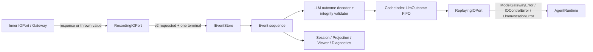

# 【trace】完整记录并确定性重放 LLM 调用失败

- Issue: #229
- 状态: Approved
- 最后更新: 2026-08-09

## 1. 背景

当前 `RecordingIOPort.invokeLLM` 先写 `llm.requested`，inner 成功后再写 `llm.responded`。inner 抛错时没有失败 terminal，Trace 只剩悬空 request。`CacheIndex` 只从成功 `llm.responded.payload.response` 建立 `ModelResponse` FIFO，`ReplayingIOPort` 因而只能重放成功；真实 provider failure、#228 cancel/deadline、cache miss 与损坏 Trace 最终都可能表现成相似的 Replay 失败。

这还影响诊断消费者：`sessionHistory`、execution projection 等代码默认每个 `llm.responded` 都包含 response。一旦新增失败 terminal，如果没有集中 decoder 和消费者迁移，失败 Trace 会在查询或渲染时再次抛错。

本设计让新 LLM request 显式声明 outcome schema 代际，并让成功/失败共用一个判别式 `llm.responded` terminal。Recording 对 inner outcome 只追加一次 terminal；CacheIndex 严格验证 v2 因果配对并按 request 顺序建立 outcome FIFO；Replay 重建 typed error 而不访问 provider。#228 定义的 control error 直接复用，不进入 request hash。

## 2. 名词解释

- **request event**：`llm.requested`，表示一次 LLM effect 已进入 Recording 边界。
- **terminal event**：与 request 唯一配对的 `llm.responded`；新格式通过 `status:'ok'|'error'` 区分结果。
- **v2 outcome schema**：本设计新增的 request/terminal 格式代际，由 request 的 `outcomeSchemaVersion:2` 判定。
- **legacy success**：旧 Trace 中无 status、含 `response` 和 `requestHash` 的成功 `llm.responded`。
- **模糊确认**：EventStore 已持久化 event，但 `append()` Promise 仍 rejection，调用方无法仅凭 rejection 判断落盘事实。
- **Trace 完整性错误**：已持久化事件之间存在 duplicate、orphan、hash mismatch、dangling、malformed 或 ambiguous legacy，区别于运行时 provider failure 和 Replay divergence。

## 3. 设计目标与非目标

- **目标**：
  - 新格式每个已启动且 terminal append 明确成功的 LLM invocation 恰有一个 terminal。
  - rate limit、provider timeout、provider/auth/connection failure、#228 cancel/deadline 和未知 thrown value 均形成稳定、脱敏失败 envelope。
  - Replay 对相同结构请求重建同错误类、code 和稳定 envelope，真实 provider 调用次数为 0。
  - CacheIndex 在 Replay 前识别损坏或不完整 Trace，不把它伪装成 cache miss。
  - 旧成功 Trace 维持可重放兼容，所有生产消费者安全处理 success/error/legacy。
- **非目标**：
  - 不保证进程硬崩溃或 EventStore 模糊确认下的绝对 exactly-once。
  - 不保存原始异常 message/name/stack/cause、自定义属性、SDK body、token 或 abort reason。
  - 不重放错误对象 identity、stack、cause 或供应商瞬态文本。
  - 不改变 provider retry、Tool error/Replay 或 #228 control hash 语义。
  - 不自动修复损坏 Trace，也不从后续 `agent.run.completed` 猜测缺失 LLM terminal。

## 4. 能力与功能设计

Recording 的事实顺序固定为：

1. 构造 v2 request event，并尝试 append；失败则 fail closed，绝不调用 inner。
2. inner settle 后在内存中归一化为 success 或稳定 failure outcome。
3. 从 outcome 构造唯一 terminal event，并且只调用一次 append。
4. terminal append 明确成功后更新 causal cursor；success 返回 response，failure 一律根据已写入的安全 envelope 重建 typed error 后抛出，使 live Recording、Trace 与 Replay 的 class/code/envelope 完全一致。
5. terminal append rejection 优先返回 `TraceWriteError`，不返回 response，也不抛原 effect error，更不能再追加第二 terminal。

Replay 构建阶段先验证事件关系，再建立 `LlmOutcome` FIFO。v2 以 request event 的 append index 排序，不按 terminal 完成顺序；因此同 hash invocation 即使反序完成，仍按调用顺序重放。消费 outcome 后，success 返回 response，error 重建对应 typed error。

### 4.1 UI / UX

无新页面。现有 trace execution projection、tree/viewer 与 diagnostics 对失败 terminal 显示稳定 `code/message/phase`，不得显示原始异常或把失败 terminal 当作 assistant 消息。空/错态规则：完整失败 Trace 显示 LLM failure step；损坏 Trace 显示 `TraceIntegrityError.kind` 和 event id，不尝试渲染 payload。

## 5. 设计思路与折衷

### 方案 A：新增 `llm.failed`

事件名直观，但成功与失败成为两个 terminal 事件族。CacheIndex、projection、causal graph 和所有查询都必须自行合并两种 event kind，增加漏读风险。Tool 已采用单一 `tool.responded` 加 status，本方案不一致，放弃。

### 方案 B：失败写入旁路错误表

可以不改 `LlmRespondedPayload`，但错误表会成为与 append-only Trace 平行的事实源；Replay 需要跨存储原子关联，也无法通过 `causedBy` 保证唯一配对，放弃。

### 方案 C：`llm.responded` 判别联合

本设计选择该方案。success/error terminal 共用事件类型和 `causedBy/requestHash` 关联，CacheIndex 只消费一种 terminal。代价是所有现有消费者必须经过集中 decoder，旧 Trace 也需要显式兼容规则。该迁移是一次干净切换，不允许继续无条件读取 `.response`。

错误记录选择稳定 envelope，不复制 `Error` 属性。公开 `ModelGatewayError` 构造函数可接受任意 envelope，不能因为 `instanceof` 就信任其 message/provider/model；Recording 必须重新验证并安全重建。

## 6. 架构设计

### 6.1 逻辑分层



职责边界：

- RecordingIOPort 控制 request/terminal append 顺序、错误归一化、单 terminal 尝试和 cursor 更新。
- 错误 sanitizer 只产生闭集、稳定、脱敏 envelope。
- 集中 decoder 对 unknown payload 做 runtime 校验，输出 success/error/legacy 或 `TraceIntegrityError`。
- CacheIndex 负责 v2 因果配对、legacy 兼容和 request-order FIFO。
- ReplayingIOPort 只处理 consume 结果；仅 empty queue 变成 Replay divergence。
- AgentRuntime 识别三类 typed error，把其 envelope 原样放入 `AgentResult.error`。
- diagnostics/render/projection 消费 decoder 结果，不自行猜测 payload shape。

### 6.2 核心业务流程

#### Recording 成功

1. request append 明确成功，inner 返回 `ModelResponse`。
2. 构造 `status:'ok'` terminal，保留 `cacheStats?`，append 一次。
3. append 明确成功后更新 `lastLlmTerminalId`、`lastLlmRespondedId` 和 `lastIoEventId`，返回原 response。

#### Recording 失败

1. inner 抛错；按 Model → #228 control → generic 的顺序归一化。
2. 构造 `status:'error'` terminal；error branch 禁止 response/cacheStats。
3. append 明确成功后更新 `lastLlmTerminalId` 和 `lastIoEventId`，不更新供 Tool decision 使用的 `lastLlmRespondedId`。
4. 根据已写 terminal 的 envelope 重建并抛出 `ModelGatewayError`、`IOControlError` 或 `LlmInvocationError`；绝不重抛可能含未信任字段的原 error。
5. Runtime 将 envelope 放进 error `AgentResult`，`agent.run.completed.causedBy` 指向 `lastLlmTerminalId`。

#### EventStore rejection

- request append rejection：抛 `TraceWriteError(stage:'request')`，inner 调用数为 0。
- terminal append rejection：抛 `TraceWriteError(stage:'terminal')`；不 retry、不二次 append、不返回 inner outcome。
- rejection 不等于未持久化。后续 CacheIndex 只按读到的事件事实判断：terminal 存在且合法即可构建；request 存在但 terminal 缺失才是 dangling。

#### Replay

1. `Milkie.replay` 读取 events；CacheIndex 构建前运行完整性验证。
2. #228 control validation/preflight 先于 consume；pre-aborted/expired 不消费 FIFO。
3. 按 request order 消费 outcome；success 返回 response，failure 重建 typed error。
4. Runtime 把 reconstructed envelope 放入 `AgentResult.error`；provider 调用数保持 0。

## 7. 模块设计

| 模块 | 变更与职责 |
|---|---|
| `src/trace/types.ts` | v2 request marker、success/error terminal 联合、legacy wire 类型与集中 type guard。 |
| `src/types/model.ts` | `LlmInvocationFailureEnvelope` 加入 `AgentErrorEnvelope`。 |
| `src/gateway/ModelGatewayError.ts` | 导出 code→safe message 映射或等价 sanitizer 输入；不信任公开 error 自带 message。 |
| `src/trace/LlmOutcome.ts` | 集中 normalize/decode/reconstruct；三类 envelope、payload 和秘密字段约束只有一个实现。 |
| `src/trace/TraceWriteError.ts` | 稳定 stage/operation/eventId 与安全 message；live cause 不序列化。 |
| `src/trace/TraceIntegrityError.ts` | 稳定 integrity kind 和 event 标识，不包含 payload。 |
| `src/trace/RecordingIOPort.ts` | request fail-closed、inner outcome 捕获、单 terminal append、trusted provider context、cursor 更新。 |
| `src/trace/CausalCursor.ts` | 新增 `lastLlmTerminalId`；保留 `lastLlmRespondedId` 的成功 decision 语义。 |
| `src/trace/CacheIndex.ts` | v2 严格配对、legacy 兼容、request-order `LlmOutcome` FIFO。 |
| `src/trace/ReplayingIOPort.ts` | 重建 failure；只把 `CacheIndexEmptyError` 转为 divergence。 |
| `src/runtime/Milkie.ts` | 向 Recording 提供可信 provider family；Replay 构建时让 integrity error 直接逸出。 |
| `src/runtime/AgentRuntime.ts` | 识别 `LlmInvocationError` 并安全返回其 envelope。 |
| `src/index.ts` | 公开导出 `LlmInvocationError`、`TraceWriteError`、`TraceIntegrityError` 及对应 envelope/details/kind；复用 #228 公开的 `IOControlError`。 |
| `src/trace/diagnostics/sessionHistory.ts` | 仅 success terminal 生成 assistant message，failure 跳过。 |
| `src/trace/diagnostics/buildExecutionProjection.ts` | 按 causedBy 配对，显示 success 或稳定 failure step，不按 hash 覆盖。 |
| renderer / viewer / explain / CLI trace | 统一通过 decoder 安全显示 failure；不得无条件访问 response。 |

## 8. API / CLI 设计

### 8.1 v2 request 与 terminal

```ts
export const LLM_OUTCOME_SCHEMA_VERSION = 2 as const

export interface LlmRequestedPayloadV2 {
  request: ModelRequest
  requestHash: string
  outcomeSchemaVersion: 2
}

export interface LlmSucceededPayloadV2 {
  status: 'ok'
  response: ModelResponse
  requestHash: string
  cacheStats?: CacheStats
  error?: never
}

export interface LlmFailedPayloadV2 {
  status: 'error'
  error: RecordedLlmFailureEnvelope
  requestHash: string
  response?: never
  cacheStats?: never
}

export type LlmRespondedPayloadV2 = LlmSucceededPayloadV2 | LlmFailedPayloadV2
```

新 terminal event 自身还必须满足：

- `causedBy` 存在并指向同 run 的 v2 request；
- terminal `requestHash === request.payload.requestHash`；
- 一个 requestEventId 最多被一个 terminal 占用；
- `status` 与 branch 字段严格互斥。

历史 event 不强转成上述类型。`decodeLlmOutcome(event, context)` 接受 `unknown` payload，返回已验证的 v2/legacy outcome 或抛 `TraceIntegrityError`。

### 8.2 稳定错误 envelope

```ts
export interface LlmInvocationFailureEnvelope {
  code: 'LLM_INVOCATION_FAILED'
  message: 'LLM invocation failed.'
  phase: 'ioport'
  model: string
  retryable: false
  provider?: undefined
}

export type RecordedLlmFailureEnvelope =
  | ModelErrorEnvelope
  | IOControlErrorEnvelope
  | LlmInvocationFailureEnvelope
```

`LlmInvocationError extends Error`：

- `name === 'LlmInvocationError'`；
- `message` 固定取 envelope.message；
- `envelope` 是防御性复制；
- 不接受或暴露原始 cause。

`LlmInvocationFailureEnvelope` 是 `AgentErrorEnvelope` 新分支。三种 failure 在 terminal append 成功后都根据已持久化 envelope 构造新的 typed error；live Recording、Trace 与 Replay 因而共享完全相同的 class/name/code/envelope。原 error 只在归一化期间使用，之后不再向 Runtime 传播。

### 8.3 Model error sanitizer 与信任边界

`sanitizeModelFailure(error, request, trustedContext)` 仅在以下条件全部成立时产生 `ModelErrorEnvelope`：

- error 是 `ModelGatewayError`；
- code 属于现有 `ModelErrorCode` 闭集；
- phase 属于 `request | stream_open | stream_read | response_parse`；
- retryable 是 boolean；
- status 缺省或为 100–599 整数。

输出字段不直接复制自由值：

- message 始终按 code 使用 milkie 固定 safe message；
- model 使用经安全 identifier 校验的 `request.model`，不合法时为 `unknown`；
- provider 不读取 error envelope。正常 GatewayFactory 路径由 adapter 闭集生成可信 provider family：`anthropic | openai-compatible`；注入/custom Gateway 或缺少 trusted context 时固定为 `unknown`。

任何核心字段不合法，或伪造 `ModelGatewayError`，均降为 generic envelope。provider/model 的安全 identifier 规则固定为 `/^[A-Za-z0-9._:/-]{1,128}$/`；该规则仅防止把非标任意文本写入 Trace，provider 仍只来自上述闭集或 `unknown`。

`sanitizeControlFailure(error)` 同样不信任公开 `IOControlError` 自带 envelope。仅当 error 类型正确、code 属于 `IO_CANCELLED | IO_DEADLINE_EXCEEDED`、operation 严格为 `llm`、phase 为 `io_control`、retryable 为 false、provider/model 均不存在时接受；输出 message 始终按 code 重建为 #228 固定文本，其他字段也从闭集常量重建而非复制。任一核心字段不合法即降为 generic。

读取已持久化 terminal 时不做“宽松修复”：`decodeRecordedLlmFailure` 对 Model/control/generic 三个 branch 分别验证完整闭集、固定 message、字段类型与禁止字段。任何 tampered/未知组合直接抛 `TraceIntegrityError('malformed_payload')`，不得作为 generic 继续 Replay。

归一化顺序不可交换：

1. sanitizer 接受并安全重建的 ModelGatewayError；
2. sanitizer 接受并安全重建的 IOControlError；
3. 其他全部 generic。

### 8.4 TraceWriteError

```ts
export interface TraceWriteErrorDetails {
  stage: 'request' | 'terminal'
  operation: 'llm'
  eventId: string
}
```

`TraceWriteError` 的 message 只由 stage 生成，不含 EventStore cause message。`cause` 可在当前进程供 service logging 使用，但不写入 Trace、AgentResult envelope 或 Replay outcome。

request event id 和 terminal event id 都在 append 前生成；terminal rejection 后不复用 id 发起 retry。模糊确认由后续读事实判定。

### 8.5 TraceIntegrityError

```ts
export type TraceIntegrityErrorKind =
  | 'duplicate_event_id'
  | 'duplicate_terminal'
  | 'orphan_terminal'
  | 'hash_mismatch'
  | 'dangling_request'
  | 'malformed_payload'
  | 'ambiguous_legacy'
```

错误只携带：`kind`、可选 `eventId`、可选 `requestEventId` 和固定 message；不附 payload/request 内容。它在 `CacheIndex.fromEvents` 阶段直接从 `Milkie.replay()` reject，不转换为 `ReplayDivergenceError` 或 `AgentResult.error`。

### 8.6 Legacy 兼容算法

1. 先验证整个 run 的 event id：每个 id 必须是非空字符串且全局唯一；任何 request/terminal/其他 event collision 均为 `duplicate_event_id`。LLM terminal 的 causedBy 若存在必须是非空字符串，否则为 `malformed_payload`。验证后才按 append index 收集 LLM request/terminal，禁止 map 覆盖。
2. v2 request 由 `outcomeSchemaVersion:2` 唯一识别；它只能接受有 status 的 v2 terminal。
3. legacy terminal 必须无 status、有 response/requestHash、无 error。
4. legacy terminal 有 causedBy 时，目标必须是 legacy request且 hash 相同。
5. legacy terminal 无 causedBy时：若同 hash 有尚未占用的 legacy request，按 FIFO 配对；若该 hash 从未出现任何 legacy/v2 request，作为旧 Phase 3 合法 terminal-only success 直接入队；若存在 legacy request 但均已占用，额外 terminal 为 `duplicate_terminal`；若存在 v2 request 且无法明确配给 legacy request，则为 `ambiguous_legacy`。
6. legacy terminal 有 causedBy 但目标不存在时为 `orphan_terminal`，不降级成 terminal-only。
7. 若同 hash 存在 v2 request，缺 causedBy 且无法明确配给 legacy request 的 terminal 为 `ambiguous_legacy`。
8. 无 requestHash 的 Phase 2 event 不参与 Replay 索引，也绝不配给 v2；Replay 需要它时按既有 cache miss/divergence 处理。
9. v2 request 扫描结束后没有 terminal即 `dangling_request`；legacy request 的 dangling 同样报告 integrity error，只要该 request 含可重放 requestHash。
10. outcome 的排序锚点：已配对 outcome 取 request append index；合法 terminal-only legacy 取 terminal append index。每个 hash 队列按锚点升序。

### 8.7 消费者读取规则

- 集中 decoder 向消费者提供安全 `LlmFailureView = { code, message, phase, retryable, provider?, model?, status? }`；字段只来自已验证 envelope。
- `ExecutionStep` 的 LLM 分支新增 `status:'pending'|'ok'|'error'` 与 `error?:LlmFailureView`；仅 ok 暴露 response/cacheStats，error step 必须暴露 code/message/phase。
- failure terminal 不生成 session assistant message。
- execution projection 以 request event 为 step 主体，通过 terminal.causedBy 精确关联；failure step 的 label 固定为 `LLM failure · <code>`。
- `DecisionNode` 的 LLM 分支新增 `status:'ok'|'error'` 与可选 `error`；failure label 同为 `LLM failure · <code>`，不得回退为 `LLM → 文本`，也不得解释为产生 Tool decision 的成功 response。
- explain/CLI execution 对 failure 返回/打印同一 `LlmFailureView`；HTML/tree/viewer 显示 code、固定 message、phase，且不渲染原 payload。
- malformed payload 只显示 `TraceIntegrityError.kind` 与 event id，不 stringify 原 payload。

## 9. 边界考虑

- **唯一性**：应用层只调用一次 terminal append；EventStore 没有幂等/确认协议，所以 exactly-once 只以最终读到的 event 事实判定。
- **模糊确认**：after-commit rejection 可能让调用方收到 TraceWriteError 而 Trace 实际完整；这是正确且诚实的失败边界。
- **并发与顺序**：同 hash 并发 invocation 按 request append index 重放，不按 terminal 完成时间。request append 本身定义结构调用顺序。
- **错误优先级**：terminal append rejection 总是覆盖 inner outcome；否则调用方可能拿到一个无法确认已记录的 success/failure。
- **安全**：不信任公开 Error 类自带自由字段；所有持久化字段经闭集校验、安全映射或固定值重建。
- **control**：#228 validation/preflight 在 Replay consume 前；control 不进 hash。已消费 outcome 后的迟到 abort 不改变同步 Replay 结果。
- **in-flight Trace**：只在 Replay/完整性检查时要求 terminal；实时 viewer 读取正在执行的 run 可以显示 pending request，不能提前把它标为 corruption。
- **EventStore 故障**：request append fail closed，避免发生未记录的 provider side effect；terminal failure不尝试补偿写，避免双 terminal。
- **性能**：CacheIndex 构建为事件数线性扫描，使用 eventId map 配对；不增加外部存储或网络 I/O。
- **可观察性**：TraceWriteError 进入 service logging；模型/control/generic failure 进入 Trace。两者职责不同。

## 10. 迁移 / 兼容 / 回滚

- 新写 request 一律带 `outcomeSchemaVersion:2`，新 terminal 一律带 status；不双写 `llm.failed`。
- `LlmRespondedPayload` 改为严格 v2 union；历史 wire payload 只通过 legacy decoder 读取，不把 status 继续做 optional 新写字段。
- Recording、CacheIndex、ReplayingIOPort、CausalCursor、AgentRuntime 与所有 production consumer 同批迁移，禁止保留无条件 `.response` 访问。
- public barrel 同批导出可判型错误和类型；外部调用方可用 `instanceof`/typed envelope 区分 recorded LLM failure、Trace 写失败和 Trace 完整性失败。#228 的 `IOControlError` 由其实现切片导出，本切片不得建立重复类。
- 旧成功 Trace：有 hash 的 legacy success 按 §8.6 继续重放；无 hash Phase 2 维持当前不可重放边界。
- 旧失败造成的 dangling request 会在新 Replay 中明确成为 `TraceIntegrityError('dangling_request')`，不再表现为普通 cache miss。
- 新 reader 可读 legacy；旧 reader 不能读取 v2 error branch，因此 writer 与 reader 必须同版本发布。不存在安全的双写兼容层。

没有数据重写。回滚 writer 后，已产生的 v2 error Trace 仍要求新 reader；若必须回滚运行代码，应保留新 decoder/renderer 的读路径，不能回滚成无条件 response 读取。

## 11. 测试计划

- **E2E（S1）**：
  1. 分别触发 rate limit、provider timeout、#228 caller cancel/deadline、unknown Error/string/含 secret object。
  2. 读取 run Trace。
  3. 每个 v2 request 断言恰有一个 terminal，status 为 error，causedBy/hash 完全匹配；error 只含对应稳定 envelope，JSON 中不存在 secret/stack/cause/token/原 message。
  4. 断言 live Recording 的三类 `AgentResult.error` 与 terminal envelope 完全相同，generic 为 `LLM_INVOCATION_FAILED`。
- **E2E（S2）**：
  1. Recording 产生 success、Model、control、generic outcome 交错且 hash 相同的序列。
  2. Replay 相同请求序列。
  3. 逐项断言 Replay 的 class/name/code/envelope 与 live Recording 及 terminal 稳定字段一致，`Milkie.replay().error` 保留 generic envelope，provider 调用次数为 0。
- **Integration**：
  - request pre-commit rejection：append 一次、provider 0、`TraceWriteError.stage=request`。
  - terminal pre-commit rejection：request 1、terminal 0、provider 1、无第二次 append、返回 terminal TraceWriteError。
  - terminal after-commit rejection：request 1、terminal 1、无第二次 append；调用方仍得 TraceWriteError，但 CacheIndex 依事件事实正常构建。
  - failure Trace 的 session history 不产生 assistant message；execution projection、decision spine、explain、viewer/tree/CLI 均显示同一 code/固定 message/phase，failure label 不得是 `LLM → 文本`，且任何输出都不含 secret。
- **Unit**：
  - 严格 union 的非法 status/response/error/cacheStats 组合。
  - duplicate event id（两个 request、两个 terminal、request/terminal 及其他 event collision）、非法 causedBy、duplicate terminal、orphan、hash mismatch、v2 dangling、malformed、ambiguous legacy 的稳定 kind/id。
  - 同 hash request 反序完成仍按 request order 入队。
  - legacy terminal-only（无 causedBy、该 hash 无任何 request）按 terminal index 成功入队；1 个 legacy request + 2 个无 causedBy terminal 的第二个为 `duplicate_terminal`；legacy/v2 混合与 Phase 2 no-hash 分别覆盖明确兼容/拒绝边界。
  - 三类 normalize/reconstruct 的 class/name/code/envelope。
  - 伪造 ModelGatewayError 中的 secret message/provider/model 不落事件；非法核心字段降 generic。
  - 伪造 IOControlError 的 secret message/错误 phase/operation/字段不落事件且降 generic；持久化后被篡改的 Model/control/generic terminal 统一成为 `malformed_payload`。
  - public barrel 可导入 `LlmInvocationError`、`TraceWriteError`、`TraceIntegrityError` 及类型，`instanceof` 对实际抛出的对象成立；#228 `IOControlError` 保持同一类身份。
  - CacheIndex empty 仍是 divergence，integrity error 不被转换。
  - #228 pre-cancel 优先于 expired，两个 preflight 分支都不消费 FIFO。

所有 store double 明确区分 pre-commit rejection 与 after-commit rejection；所有并发顺序使用 barrier，不用裸 sleep。

## 12. 开放问题 / 决策记录

- D1：沿用 `llm.responded` 判别联合，不新增 `llm.failed`。
- D2：request 以 `outcomeSchemaVersion:2` 显式声明严格代际。
- D3：新格式按 causedBy 配对、按 request append order 重放。
- D4：未知 thrown value 包装为安全 generic error，不原样重抛。
- D5：terminal append rejection 不 retry，Trace 完整性只以读到的事实判定。
- D6：新增 `lastLlmTerminalId`，不污染成功 decision 使用的 `lastLlmRespondedId`。
- D7：provider 只记录 GatewayFactory 产生的闭集 family；custom/injected gateway 为 `unknown`。
- D8：所有生产消费者同批迁移到集中 decoder。

无开放问题。

## 13. 关联

- Issue: https://github.com/xforce-io/milkie/issues/229
- L1 概要: https://github.com/xforce-io/milkie/issues/229#issuecomment-5229309028
- L1 reviewer: https://github.com/xforce-io/milkie/issues/229#issuecomment-5229309513
- L2 reviewer: https://github.com/xforce-io/milkie/issues/229#issuecomment-5229352913
- PR: https://github.com/xforce-io/milkie/pull/231
- 配套 Issue: https://github.com/xforce-io/milkie/issues/228
- #228 L2: https://github.com/xforce-io/milkie/blob/feat/228-ioport-deadline-cancellation/docs/design/228-ioport-deadline-cancellation.md
- 相关模块：`src/trace/RecordingIOPort.ts`、`src/trace/CacheIndex.ts`、`src/trace/ReplayingIOPort.ts`、`src/trace/types.ts`、`src/trace/diagnostics/*`
