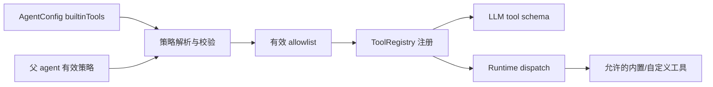

# 【runtime】内置工具权限策略

- Issue: #235
- 状态: Approved
- 最后更新: 2026-08-11

## 1. 背景

Milkie 的 `AgentRuntime.registerTools()` 目前无条件注册 system、cognitive、lineage 与 exec 内置工具。特别是 `run_command` 会在宿主机执行 shell 子进程。嵌入方即使已经为自定义工具构建了隔离后端，也无法阻止模型发现并调用该宿主机能力。Issue #235 要求把“模型可见”与“实际可执行”收敛到同一个最小权限边界，且不破坏未配置策略的现有调用方。

## 2. 名词解释

- **内置工具**：由 Milkie Runtime 提供并自动注册的工具，不包括调用方传入的 `extraTools` 和声明的 sub-agent 工具。
- **内置工具权限策略**：调用方对某个 agent 运行允许暴露哪些内置工具的声明。
- **有效策略**：父 agent、当前 agent 的策略交集；它是 Runtime 最终注册和传给模型的唯一权限集合。

## 3. 设计目标与非目标

- **目标**：
  - 允许 `AgentConfig` 声明内置工具 allowlist。
  - 未被允许的内置工具不注册，不进入 LLM 的 tool schema，也无法经 Runtime dispatch 执行。
  - 子 agent 不能通过省略或扩大自身配置绕开父 agent 的限制。
  - 未设置策略时保留当前全部内置工具的行为。
- **非目标**：
  - 不提供 Docker、网络隔离、文件系统 jail 或其他执行沙箱。
  - 不为 `extraTools` 建立新的细粒度授权系统。
  - 不改变任一内置工具自身的输入、输出或副作用。

## 4. 能力与功能设计

调用方可在 agent 定义中限制内置工具。Runtime 在构造 `ToolRegistry` 前计算有效策略，只注册其中允许的内置工具。模型收到的工具 schema 从同一 registry 派生，因此模型可见性与 dispatch 权限不存在分叉。

### 4.1 UI / UX

N/A：库 API 无页面。CLI/manifest 所加载的 agent 定义使用同一 `AgentConfig` 字段；Trace 记录生效的策略摘要，供运行者诊断。

## 5. 设计思路与折衷

选择 allowlist 而不是 denylist：受限场景中新增内置工具不应自动扩大权限；未配置策略仍以兼容模式提供全部内置工具。选择在 Runtime 注册前过滤，而不是在 handler 内拒绝：前者保证工具不会被模型调用，也不会留下可利用的注册旁路。

策略不绑定 Docker 或特定安全产品。Milkie 负责能力暴露，调用方负责把已允许工具实现为安全的执行后端。仅修改 system prompt 不能构成权限边界，故不采纳。

## 6. 架构设计

### 6.1 逻辑分层



策略模块只认识 Runtime 发布的内置工具标识；`ToolRegistry` 仍是工具可见性与执行的权威来源。Trace 在 run 开始事件保存策略摘要，但不把它作为执行判断来源。

### 6.2 核心业务流程

1. Runtime 读取当前 `AgentConfig.builtinTools` 并校验每个标识。
2. 根 agent 未声明策略时采用全部内置工具；声明 allowlist 时采用该集合。
3. 子 agent 的候选集合与父 agent 有效集合求交；未声明子策略等价于继承父集合。
4. Runtime 仅把有效集合中的内置工具注册进 `ToolRegistry`，随后注册现有的 custom/sub-agent 工具。
5. 模型请求的 schema 与工具 dispatch 都查询同一 registry；Trace 记录生效集合的稳定摘要。

## 7. 模块设计

- `types/agent.ts`：增加内置工具策略公开类型与 `AgentConfig` 可选字段。
- `runtime/AgentRuntime.ts`：在 `registerTools()` 前计算有效策略；子 agent 创建时传递父有效策略。
- `tools/*`：为 Runtime 内置工具提供稳定标识；不修改 handler。
- `runtime/ToolRegistry.ts` 与 Trace：保留现有冲突语义；run-start 元数据增加仅供诊断的有效策略摘要。
- CLI/manifest：依托已有 agent 配置加载链路，不新增独立命令。

## 8. API / CLI 设计

新增公开配置：

```ts
type BuiltinToolName = string // 仅接受 Runtime 当前发布的稳定内置工具名

interface BuiltinToolPolicy {
  allow: BuiltinToolName[]
}

interface AgentConfig {
  // 未设置：兼容模式，允许全部当前内置工具。
  // 设置为空 allowlist：不暴露任何内置工具。
  builtinTools?: BuiltinToolPolicy
}
```

`allow` 中的名称必须对应 Runtime 已发布的内置工具名，例如 `run_command`。未知名称或重复名称使 agent 配置无效并在启动前报错。`extraTools` 和 sub-agent 名称不属于 `allow` 的匹配范围，仍按现有注册与冲突规则处理。

对嵌套运行，最终集合为父有效 allowlist 与子 allowlist 的交集；根 agent 未设置策略时的父集合为全部内置工具。CLI 不新增参数，manifest 中的 `AgentConfig` 使用该字段即可。

## 9. 边界考虑

- **安全**：未允许工具不得仅因存在 handler 而可执行；策略不是 sandbox，允许的 shell 工具仍由宿主负责隔离。
- **兼容**：省略字段时行为不变；新增内置工具在兼容模式可用、在已配置 allowlist 中默认不可用。
- **错误**：未知/重复标识在启动前失败，禁止静默回退为全量授权。
- **并发**：工具并行执行只发生在已经注册的工具上；策略为每个 run 固定快照。
- **可观察性**：Trace 仅保存名称摘要，不保存调用方可能附加的敏感配置。

## 10. 迁移 / 兼容 / 回滚

现有 agent 不含 `builtinTools`，无需迁移。需要最小权限的调用方可逐步添加 allowlist；添加后应显式列出所需能力。回滚时忽略该可选字段即可恢复兼容模式；历史 Trace 仍可读取，缺少策略摘要表示旧运行。

## 11. 测试计划

- **E2E**：受限 demo agent 只看到允许的自定义工具，尝试 `run_command` 不会执行宿主机副作用；未配置策略的 demo 仍可调用既有内置工具。
- **Integration**：验证 schema、registry 和 dispatch 的允许集合一致；验证父/子交集、空 allowlist 与 manifest 加载。
- **Unit**：验证名称校验、重复项、默认值、策略交集、内置与自定义工具冲突。

## 12. 开放问题 / 决策记录

- 决策：策略以单个稳定工具名表达，而非按 `exec` 等模块分组，避免调用方因同组新增工具被意外授权。
- 决策：本期只在 `AgentConfig` 声明策略；调用级临时放宽会弱化可审计性，若未来需要只能在不扩大 agent 策略的前提下另行设计。
- 开放问题：稳定内置工具名的导出清单及弃用流程需与后续公共 API 文档一并维护。

## 13. 关联

- Issue: #235
- L1 概要：[Issue #235 comment](https://github.com/xforce-io/milkie/issues/235#issuecomment-5247842610)
- 相关模块：`src/runtime/AgentRuntime.ts`、`src/tools/exec.ts`
