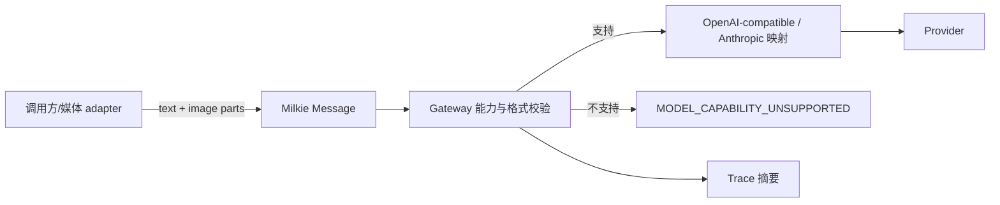

# 【gateway】图片输入消息契约

- Issue: #236
- 状态: Approved
- 最后更新: 2026-08-11

## 1. 背景

Milkie 的 `MessageContent` 仅支持文本、工具调用和工具结果；两个现有 gateway 也只把文本映射给 provider。调用方无法以统一契约向视觉模型传递图片，更无法区分 provider 不支持图片与图片被静默丢弃。Issue #236 增加最小的图片输入能力，供通用视觉 agent 与上层 adapter 使用。

## 2. 名词解释

- **图片部分**：一条 user 或 assistant 消息中与文本并列的图片输入，不是工具参数或本地文件路径。
- **图片能力**：某个已配置 gateway/model 接受图片部分的能力；它与文本、工具调用能力独立。
- **来源表示**：调用方已经准备好的图片引用，分为 provider 可访问的 HTTPS URL 或内联 base64 字节。

## 3. 设计目标与非目标

- **目标**：
  - 为消息增加 provider 无关的图片部分。
  - 让 OpenAI-compatible 与 Anthropic adapter 保真映射支持的图片请求。
  - 对不支持图片的 gateway 返回稳定、可分类的错误，不静默降级。
  - 在 Trace 中保留可审计但不重复存储大媒体字节的图片摘要。
- **非目标**：
  - 不读取本地文件路径，不下载 URL，不实现视频解码、PDF 渲染、OCR、抽帧或压缩。
  - 不保证任一 OpenAI-compatible 上游或模型实际具备视觉能力。
  - 不支持模型输出图片；本期仅覆盖输入。

## 4. 能力与功能设计

调用方可在 `Message.content` 中按顺序混合 text 与 image。adapter 在请求发出前验证 gateway 的图片能力和来源格式，成功时保留内容顺序映射给 provider。上层可先用工具把视频/PDF 转为图片，再以此契约传入模型；转换策略不属于 Milkie。

### 4.1 UI / UX

N/A：无页面。API 调用方可通过 gateway 能力和结构化错误决定是否选择视觉路径；CLI 不添加媒体发现或上传命令。

## 5. 设计思路与折衷

选择一等 `image` 消息部分，而不把 data URL、路径或 base64 拼接为文本。文本拼接既无法被 provider 可靠识别，也让图片有机会在 adapter 中丢失。选择只接收 URL/base64，而不让 Milkie 读取文件：文件访问、URL 获取、尺寸约束与租户授权是宿主的安全责任。

能力在 adapter 配置中显式声明。OpenAI-compatible API 的协议兼容不等于部署的模型支持视觉，故不根据 provider 名称作乐观推断。视频保持在上层转帧，避免将高开销媒体生命周期和工具选择引入消息核心。

## 6. 架构设计

### 6.1 逻辑分层



消息类型表达语义，gateway 负责能力检查和 provider wire 格式，Trace 负责安全可观察性。文件和视频工具留在调用方层。

### 6.2 核心业务流程

1. 调用方提供含 text/image 部分的 `ModelRequest`。
2. adapter 校验图片 `mediaType`、URL 协议或 base64 格式，并检查 `imageInput` 能力。
3. 不支持时，在发出网络请求前返回 `MODEL_CAPABILITY_UNSUPPORTED` 错误。
4. 支持时，OpenAI-compatible 转为内容数组中的 `image_url`，Anthropic 转为 `image` source；消息顺序保持不变。
5. Recording IOPort 记录每张图片的来源种类、媒体类型、字节长度（若可知）和 SHA-256，不记录内联 base64 原文。
6. 模型响应继续走既有 tool-call/文本循环；replay 使用已有记录的模型 I/O，不重新获取图片。

## 7. 模块设计

- `types/common.ts`：新增图片内容、来源与支持的媒体类型定义。
- `types/model.ts`：增加 `MODEL_CAPABILITY_UNSUPPORTED` 错误码，并公开 gateway 图片能力。
- `gateway/OpenAICompatibleAdapter.ts`：按显式配置映射图片；不能表达时拒绝。
- `gateway/AnthropicAdapter.ts`：映射图片 source；按模型配置处理能力。
- `runtime/IOPort.ts`、recording/replay 与 hash：保存图片的安全摘要，保持 replay 不触发媒体重新读取。
- 文档与测试 fixtures：只使用无敏感信息的小型确定性图片。

## 8. API / CLI 设计

新增消息类型：

```ts
type ImageMediaType = 'image/jpeg' | 'image/png' | 'image/webp' | 'image/gif'

type ImageSource =
  | { kind: 'url'; url: string }
  | { kind: 'base64'; data: string }

type MessageContent =
  | { type: 'text'; text: string }
  | { type: 'image'; mediaType: ImageMediaType; source: ImageSource }
  | { type: 'tool_use'; id: string; name: string; input: unknown; invalidArguments?: InvalidToolArguments }
  | { type: 'tool_result'; tool_use_id: string; content: string; is_error?: boolean }

interface ModelCapabilities {
  imageInput: boolean
}
```

`IModelGateway` 公开只读能力；自定义 gateway 未声明图片能力时按 `imageInput: false` 处理。模型配置可显式设置图片能力，OpenAI-compatible adapter 不根据 endpoint 自动猜测。图片请求发往无能力 gateway 时使用安全错误 envelope：`code: 'MODEL_CAPABILITY_UNSUPPORTED'`、`phase: 'request'`、`retryable: false`，并含 `capability: 'imageInput'` 的安全诊断元数据。

CLI N/A：媒体准备和传入属于 SDK/宿主 adapter，不增加通用 CLI 上传面。

## 9. 边界考虑

- **安全**：Milkie 不读本地路径；Trace 不写入 base64、URL query 中的凭证或原始图片字节。URL 仅记录去敏后的来源摘要和内容哈希。
- **兼容**：纯文本、工具调用、历史 trace 与既有 gateway 行为不变。
- **错误**：无能力、非法 URL、非法 base64、未支持 media type 都在网络调用前失败，且错误码可区分格式与能力问题。
- **性能**：不在核心复制或转码图片；调用方负责在发起请求前控制数量和大小，provider 限制按原错误保留。
- **顺序**：混合内容严格按消息数组顺序发送，避免文本对图片的指代失配。

## 10. 迁移 / 兼容 / 回滚

新 union 成员对旧文本调用方兼容。自定义 gateway 只有在收到图片部分时才需声明或实现图片能力；否则保持纯文本可用。历史 trace 没有图片摘要时按旧格式读取。回滚可拒绝图片成员，但已记录的 trace 仍应保留其摘要作为未知扩展字段。

## 11. 测试计划

- **E2E**：使用确定性 OpenAI-compatible 与 Anthropic stub，各完成一次 text+image agent 调用；断言上游 wire 请求具有等价图片、输出仍能进入工具循环。
- **Integration**：验证图片与文本顺序、能力配置、record/replay 以及 Trace 只含摘要不含 base64。
- **Unit**：验证 union 类型、media type、URL/base64 校验、纯文本兼容、无能力与格式错误的稳定 envelope。

## 12. 开放问题 / 决策记录

- 决策：第一版只接受 HTTPS URL 和内联 base64；`file://` 与宿主路径被明确排除。
- 决策：OpenAI-compatible 模型能力必须显式配置，避免协议兼容被误认为视觉兼容。
- 开放问题：音频、视频、文件等更多多模态部分应在图片契约稳定后分别设计，不能复用未定义的 `unknown` 媒体载荷。

## 13. 关联

- Issue: #236
- L1 概要：[Issue #236 comment](https://github.com/xforce-io/milkie/issues/236#issuecomment-5247842863)
- 相关模块：`src/types/common.ts`、`src/types/model.ts`、`src/gateway/OpenAICompatibleAdapter.ts`、`src/gateway/AnthropicAdapter.ts`
