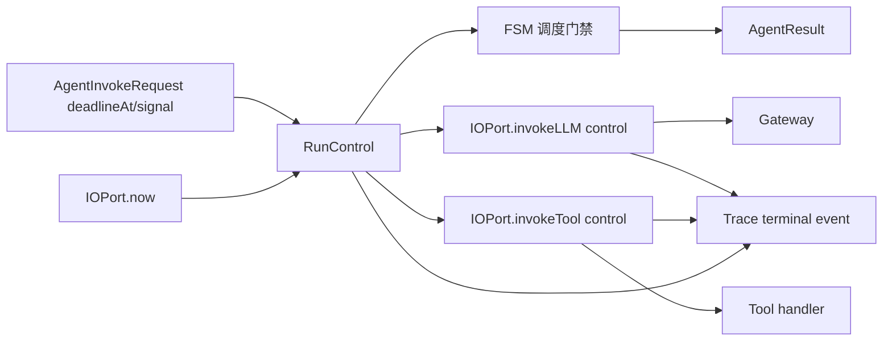

# 【runtime】运行级 deadline 与取消传播

- Issue: #237
- 状态: Approved
- 最后更新: 2026-08-11

## 1. 背景

Milkie 目前可对 FSM 状态设置迭代次数与工具调用次数上限，但没有覆盖完整运行生命周期的 deadline 或调用方取消契约。长时间模型请求和工具执行只能由宿主强制结束，Runtime 可能继续调度，结果和 Trace 也无法稳定地区分主动取消、deadline、模型错误与工具错误。Issue #237 为一次 `invoke()` 建立统一的协作式终止语义。

## 2. 名词解释

- **deadline**：运行允许存活到的绝对时间点；到达后 Runtime 不得开始新的外部调用。
- **取消信号**：调用方主动终止运行的 `AbortSignal`；语义不同于 provider 或工具自身失败。
- **协作式取消**：Runtime 传播信号并停止继续调度；外部 provider/进程是否能立即停止由其实现能力决定。

## 3. 设计目标与非目标

- **目标**：
  - 让 `invoke()` 接受 deadline 和 `AbortSignal`。
  - 将最早发生的 deadline/取消传播给 LLM 与工具 I/O，且不再调度新的模型或工具调用。
  - 在 `AgentResult` 与 Trace 中以稳定 error envelope 区分两类终止。
  - 子 agent 继承且不得放宽父运行的 deadline/取消边界。
- **非目标**：
  - 不保证第三方 provider、shell 子进程或任意自定义工具立即停止。
  - 不增加自动重试、任务队列、持久队列恢复或评测特定时限。
  - 不改变既有 FSM iterations、tool call 上限的语义。

## 4. 能力与功能设计

调用方在 `AgentInvokeRequest` 提供绝对 `deadlineAt` 和/或 `signal`。Runtime 用自身 IOPort 时钟计算剩余时间，并创建一次运行级组合信号。每次 FSM 进入、LLM 调用前、工具调度前都检查该信号；触发后不再开始新的外部效果。已开始的 I/O 收到同一信号，支持取消的 adapter/tool 负责尽快停止。

### 4.1 UI / UX

N/A：无页面。SDK 的 `AgentResult.error` 和 `trace inspect` 公开终态；CLI/serve 如已有终态错误转发，应透传同一 envelope，不新增评测专用用户界面。

## 5. 设计思路与折衷

选择绝对 `deadlineAt` 而非仅使用持续时间：父/子 agent 与多层调用可以共享同一墙钟上界，不因子运行启动较晚而获得额外时间。选择 `AbortSignal` 作为 JavaScript 调用方的主动取消入口，避免引入另一套 callback 协议。

Runtime 采用协作式停止，而不是在核心层 `SIGKILL` 或固定终止 provider 进程。后者既不适用于远程模型，也会把宿主的执行隔离策略耦合到 Milkie。deadline 后阻止新调度是 Runtime 可确定保证；在途调用最终停止时间则如实记录。

## 6. 架构设计

### 6.1 逻辑分层



`RunControl` 属于 Runtime 生命周期；IOPort 是非确定性 I/O 的取消传递边界；gateway/tool 负责各自的具体取消；Trace 只记录已经裁决的终态。

### 6.2 核心业务流程

1. `invoke()` 校验 `deadlineAt`，创建 run 级 control；若 signal 已取消或 deadline 已过，直接生成终态，不发起 I/O。
2. Runtime 在每次状态循环和每次 I/O 调度前检查 control。
3. control 触发时，Runtime 停止新调度，并向当前 `invokeLLM`/`invokeTool` 传递 signal。
4. 在途调用若以 abort 失败返回，Runtime 将其归并为 run 终态，而非模型/工具普通错误。
5. 多个来源竞争时，最先由 RunControl 观察到的取消原因成为唯一终态；后续完成只能被记录为已取消在途效果，不能重新完成 run。
6. 子 agent 使用父 deadline 与自身可选 deadline 的较早者，且共享父取消信号。
7. Recording IOPort 写入终态；Replay 使用已记录终态，不发起 live I/O 或按本地时间重新裁决。

## 7. 模块设计

- `types/common.ts`：`AgentInvokeRequest` 增加运行控制字段；`AgentResult` 沿用现有 error envelope 输出。
- `types/model.ts`：新增 `RUN_DEADLINE_EXCEEDED`、`RUN_CANCELLED` 两种 runtime error envelope。
- `runtime/RunControl.ts`：组合 deadline、外部 signal 与子运行继承，提供一次性裁决和检查接口。
- `runtime/AgentRuntime.ts`：在循环、spawn、LLM/tool 调度边界检查 control；终态去重。
- `runtime/IOPort.ts`：为 LLM 与工具 invocation 增加可选 control 参数；默认、recording、replay port 保持语义一致。
- `types/tool.ts`：`ToolContext` 增加只读 `signal`，使 handler 可协作取消。
- gateway 与 Trace：gateway 将 signal 交给 SDK 支持的取消入口；Trace/CLI/serve 复用既有结构化终态错误通道。

## 8. API / CLI 设计

```ts
interface RunControlOptions {
  /** Epoch milliseconds; 必须大于运行开始时刻。 */
  deadlineAt?: number
  /** 调用方主动取消；不序列化到 trace。 */
  signal?: AbortSignal
}

interface AgentInvokeRequest {
  agentId: string
  goal: string
  input: string
  contextId?: string
  variables?: Record<string, JSONValue>
  onModelEvent?: (e: ModelEvent) => void
  control?: RunControlOptions
}

interface IOInvocationControl {
  signal?: AbortSignal
  deadlineAt?: number
}
```

`IIOPort.invokeLLM` 与 `invokeTool` 接受可选 `IOInvocationControl`；`ToolContext.signal` 只读传给 handler。两个新增终态 envelope 均使用 `phase: 'agent_loop'`：

```ts
{ code: 'RUN_DEADLINE_EXCEEDED', message: 'Run deadline exceeded', phase: 'agent_loop', retryable: true }
{ code: 'RUN_CANCELLED', message: 'Run cancelled by caller', phase: 'agent_loop', retryable: true }
```

两者返回 `AgentResult.status: 'error'` 并携带 `error`，与 #204 的结构化运行时终态保持同一消费通道；它们不等同于可 checkpoint 的既有 `interrupted` 状态。CLI N/A：本期不新增 `--timeout` 等 CLI 参数，CLI/serve 只透传 SDK 终态。

## 9. 边界考虑

- **并发**：并行工具共享同一 signal；终态只裁决一次，已启动的兄弟工具不能在终态后促成新的状态转换。
- **兼容**：未设置 `control` 的调用维持现有行为与类型兼容；现有 IOPort 实现可先接受但忽略未支持的 signal，Runtime 仍阻止新调用。
- **错误**：主动取消/deadline 优先归并在途 abort；真实先发生的模型或工具错误仍保留原 error envelope。
- **性能**：检查是常数时间；不新增轮询线程。deadline 使用 IOPort 时钟，利于 recording/replay 的确定性。
- **安全**：取消不能被 tool handler 清除或延长；子 agent 只能缩短，不得延长父 deadline。

## 10. 迁移 / 兼容 / 回滚

所有新增字段均可选。旧调用方、旧 trace 和自定义 IOPort 不传 control 时不变；自定义 IOPort 可逐步支持底层 abort。历史 replay 不存在新终态字段时按既有结果播放。回滚时可停止暴露 `control`，已记录的终态 envelope 仍作为可忽略的扩展错误码保留。

## 11. 测试计划

- **E2E**：以可阻塞的确定性 gateway 和工具运行 agent；deadline 后无新调用，结果与 Trace 皆为 `RUN_DEADLINE_EXCEEDED`；外部取消路径为 `RUN_CANCELLED`。
- **Integration**：验证 signal 到 gateway、tool handler、并行工具和子 agent 的传播；验证终态竞争、record/replay 与结构化错误的 CLI/serve 转发。
- **Unit**：验证 deadline 校验、最早原因裁决、父子 deadline 最小值、默认兼容、在途 abort 归并和重复完成抑制。

## 12. 开放问题 / 决策记录

- 决策：deadline 与主动取消以 `status: 'error'` 表示，不复用 `interrupted`，因为后者代表可 checkpoint/resume 的既有契约。
- 决策：本期不承诺工具必须响应 signal；Runtime 保证不再调度，调用方可在其 sandbox 层追加强制回收。
- 开放问题：CLI/serve 的超时参数、自动 retry 与 task queue 应在确认 SDK 运行控制稳定后独立设计。

## 13. 关联

- Issue: #237
- L1 概要：[Issue #237 comment](https://github.com/xforce-io/milkie/issues/237#issuecomment-5247843621)
- 相关设计：`docs/design/204-structured-runtime-errors.md`
- 相关模块：`src/runtime/AgentRuntime.ts`、`src/runtime/IOPort.ts`、`src/types/common.ts`、`src/types/model.ts`
