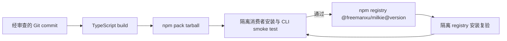

# 【发布】提供可安装的 scoped Milkie CLI 包

- Issue: #239
- 状态: Approved
- 最后更新: 2026-08-11

## 1. 背景

Milkie 的源码包名为 `milkie`，但 npm registry 中该非 scoped 名称已经属于无关的 paywall 包。用户按 README 的 `npm install milkie` 安装时，无法获得本仓库的 agent runtime 或 `milkie` CLI。当前源码仓库通过 TypeScript 构建生成 `dist/`，而 npm 安装工件只应暴露构建产物和运行必需资源；从 Git 依赖安装时不保证这些产物存在。DataSpace 等外部集成需要可固定版本、可审计且无需 Git clone 的 CLI 发行物。

本设计把发布物定义为唯一的 scoped npm package，并把“从生成 tarball 的全新消费者目录可执行 CLI”作为发布前置契约。

## 2. 名词解释

- **发布工件**：由目标 commit 构建、经 `npm pack` 生成并上传 registry 的 tarball；它是消费者安装的唯一输入。
- **消费者 smoke test**：在不含仓库源码和既有 `node_modules` 的临时目录安装该 tarball，加载最小 manifest 并执行 CLI 的端到端验证。
- **scoped package**：npm package 名称为 `@freemanxu/milkie`，所有权和解析范围属于发布者 `freemanxu` 的个人 scope。

## 3. 设计目标与非目标

- **目标**：
  - 发布唯一且可被 npm 解析到本项目的 `@freemanxu/milkie`。
  - 每个发布工件均包含 `dist/cli/index.js`、运行时 `dist/` 和 `agents/`。
  - 使用精确 package version 的消费者可直接执行 `milkie` CLI，不依赖 Git clone 或 TypeScript 构建。
  - 发布前以生成 tarball 做消费者 smoke test；发布后以 registry 安装结果复验。
- **非目标**：
  - 不变更 Milkie 的 CLI verb、Agent Runtime、模型 gateway 或 trace 语义。
  - 不实现 DataSpace harness adapter。
  - 不在仓库、Issue、release 产物或日志中保存 npm token。
  - 不迁移无关的 `milkie` paywall package 或试图复用其名称。

## 4. 能力与功能设计

发布后，开发者在 Node.js 20+ 环境运行：

```bash
npm install @freemanxu/milkie@0.1.1
./node_modules/.bin/milkie --help
```

CLI 的 `agent list` 行为与当前源码保持一致：从当前目录向上发现 `.milkie/agents.json`，并读取其声明的 agent 文件。无 manifest 时仍以空结果和零退出码结束；该行为不在本次更改中调整。

### 4.1 UI / UX

N/A — 无页面或交互界面变更；命令行输出和退出码保持兼容。

## 5. 设计思路与折衷

### 方案 A：发布 `@freemanxu/milkie` 的预构建 tarball

选择此方案。个人 scope 避免当前 `@xforce` organization scope 的发布控制面阻塞，并消除与现有 `milkie` package 的歧义；预构建工件给消费者稳定、最小的安装输入。发布前和发布后均以 tarball 安装验证，直接覆盖实际消费路径。

### 方案 B：DataSpace 等集成方固定 Git commit 并自行构建

放弃作为正式分发方式。该路径会让每个集成方承担 Git 可用性、构建工具链和源码状态的责任，且无法声明 npm 级版本契约。仅在本地开发或发布前验证源码时可使用。

### 方案 C：继续使用非 scoped 名称 `milkie`

放弃。npm registry 已解析到另一个项目，继续在 README 或集成配置中使用该名称会导致确定性错误安装。

## 6. 架构设计

### 6.1 逻辑分层



发布工件是唯一分发边界：源码与开发依赖不被消费者路径依赖。构建和 pack 在同一目标 commit 上执行；消费者验证必须安装实际 tarball，而非从源码目录调用 CLI。

### 6.2 核心业务流程

1. 发布流程只接受明确 version 与对应 Git tag。
2. 构建生成 `dist/` 后，pack 阶段只收集声明的运行时文件。
3. 验证流程在全新目录安装 tarball，执行 `milkie --help`，写入最小 manifest/agent，并运行 `milkie agent list`。
4. 仅验证成功的 tarball 可发布至 `@freemanxu` scope。
5. 发布后从 registry 在另一全新目录重做消费者验证；失败即报告发布物异常，不发布替代同版本工件。

## 7. 模块设计

| 模块 | 职责与边界 |
|---|---|
| `package.json` | 声明唯一 scoped package 名、Node ≥20 约束、CLI binary 和仅面向消费者的发布文件清单；pack 前必须生成 `dist/`。 |
| 发布 automation | 只接收显式 release version/tag；调用构建、tarball consumer test、npm publish 和 registry consumer test；不输出秘密。 |
| package consumer test | 以 tarball 和 registry package 为输入，验证文件内容、可执行 binary 和 manifest discovery；不依赖仓库工作目录。 |
| README 安装说明 | 只呈现 scoped package 的精确安装方式；不保留会安装到无关 package 的命令。 |

## 8. API / CLI 设计

- Package：`@freemanxu/milkie`。
- Binary：安装后提供 `milkie`，入口保持 `dist/cli/index.js`。
- 最低运行时：Node.js 20。
- CLI 兼容：既有 `agent`、`trace`、`serve` 命令、标准输出和退出码不变。
- 认证：npm 发布身份只在发布控制面提供；package 运行时不要求 npm token。

## 9. 边界考虑

- **版本唯一性**：npm version 不可覆盖；发布前先检查目标 version 未存在。
- **供应链**：构建、pack、consumer test 与 publish 必须针对同一 commit/version；不得发布从未测试的工作树内容。
- **凭证**：优先 npm trusted publishing；若使用人工登录，token 仅存本机 npm credential store，禁止写入仓库与日志。
- **平台**：发布 consumer test 至少在 Linux Node.js 20 上执行；本地开发机平台成功不替代 release 环境验证。
- **失败**：构建、pack、消费者测试或 registry 复验失败时停止；不重发同 version、不修改已发布 tarball。
- **性能**：验证只运行 CLI discovery/smoke，不调用模型 provider 或联网 agent 工具。

## 10. 迁移 / 兼容 / 回滚

- `v0.1.0` tag 已指向 `@xforce/milkie` 的未发布工件，保留为不可变历史记录；首个 `@freemanxu/milkie` 发行版本为 `0.1.1`，对应新的 `v0.1.1` tag。
- README 与外部集成配置改为个人 scoped package；不提供指向无关 package 或已失败 organization scope 的兼容 alias。
- 已发布 npm version 不可回滚或覆盖；发现发行缺陷时发布更高修复版本，并撤销有风险版本的推荐使用。
- DataSpace 在本 package 发布并完成 registry consumer test 前，保持不接入 Milkie。

## 11. 测试计划

- **E2E**：
  1. 在 Node.js 20 的干净临时目录安装本次 `npm pack` tarball。
  2. 执行 `milkie --help`，预期零退出码且显示 `agent`、`trace`、`serve`。
  3. 写入最小 `.milkie/agents.json` 和 frontmatter agent 文件，执行 `milkie agent list`。
  4. 预期输出对应 agent 的 JSONL，并且零退出码。
  5. 发布后从 npm registry 安装相同 exact version，重复步骤 2–4。
- **Integration**：断言 pack 文件清单包含 `dist/index.js`、`dist/cli/index.js` 与 `agents/`；断言安装目录存在可执行 `milkie` binary。
- **Unit**：继续执行现有 CLI agent tests，确认 manifest discovery、帮助输出和错误退出码不回归。

## 12. 开放问题 / 决策记录

- D1：因 `@xforce/milkie` 的组织 scope 发布请求被 npm registry 拒绝，首个公开 package 改为发布者个人 scope `@freemanxu/milkie`；不再使用冲突的非 scoped 名称。
- D2：`v0.1.0` 不重写且无对应 npm package；首个个人 scope 发行 version 为 `0.1.1`。
- D3：发布后依赖 registry 安装验证，不把源码 build 成功视为发行成功。
- D4：npm trusted publishing 是首选身份模式；当前人工 npm 登录仅用于受控发布，后续可迁移至 trusted publishing。
- 开放问题：N/A。

## 13. 关联

- Issue: #239
- L1 概要: https://github.com/xforce-io/milkie/issues/239#issuecomment-5252240451
- L1 审核: https://github.com/xforce-io/milkie/issues/239#issuecomment-5252342245
- DataSpace：Milkie harness 可复现运行时前置
