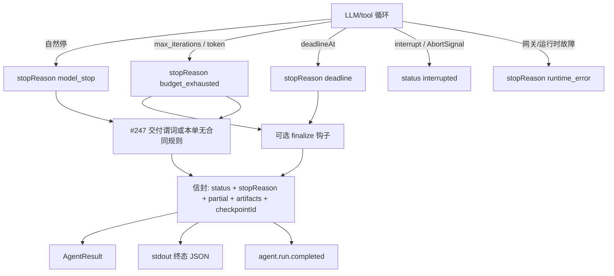

# 【runtime】预算耗尽受控收尾与 stopReason 信封

- Issue: #244
- 状态: Approved
- 最后更新: 2026-08-14

## 1. 背景

一次 `invoke` 的执行终态只有 `completed | interrupted | error`。`max_iterations` 触顶抛 `MaxIterationsError`，经 #204 映射为 `status:'error'` + `MAX_ITERATIONS_EXCEEDED` + `retryable:false`。#220 使 CLI 对此 exit 1。评测与编排把「长任务预算用尽」当成整单失败，中间产物与 checkpoint 无法被稳定消费。

#237 已用 `RUN_DEADLINE_EXCEEDED` / `RUN_CANCELLED` 区分墙钟与取消，但仍走 `status:'error'`。调用方无法在成功路径上读到停止原因。ARCHITECTURE 不变量 14 要求执行终态不等于 task outcome；#217/#227 已提供事后 outcome。本设计补第三层：**为何停**，而不把 `goal_completed` 做成执行终态。

## 2. 名词解释

- **stopReason**：封闭枚举，回答「循环为何停」，独立于 `status` 与 task outcome。
- **stopCode**：可选稳定码，兼容旧 envelope（如 `MAX_ITERATIONS_EXCEEDED`），供诊断对照，不是分支主键。
- **受控收尾**：停止继续推理后，持久化 checkpoint、汇总已登记产物、可选执行 finalize 钩子，再以非 `runtime_error` 的 reason 退出。
- **finalize 钩子**：调用方可配置的收尾回调；不得再发起 LLM 轮次。
- **交付合同**：#247 定义的生效 deliverable 清单；缺省时本单用「是否自然停」决定 `partial`。

## 3. 设计目标与非目标

- **目标**：
  - 调用方只凭结构化信封区分：模型正常停 / 预算尽 / deadline / 中断或取消 / 基础设施失败。
  - `max_iterations`、可选 token 上限、墙钟 deadline 触顶后受控收尾，可 resume 或接受 partial。
  - 与 #237 共用 `stopReason` 词表；deadline 不再伪装成笼统 run error。
  - 不判定任务是否做成。
- **非目标**：
  - 不把 `goal_completed` 或 `tool_protocol_error` 做成 `status` 或 `stopReason`。
  - 不自动 `recordTaskOutcome` / `finalizeTaskOutcome`。
  - 不恢复多态业务 FSM（#175）。
  - 不规定目录扫描如何发现产物（#247）。
  - 不保证 finalize 钩子或第三方 I/O 在 deadline 后立即被杀死。

## 4. 能力与功能设计

调用方从 SDK `AgentResult`、CLI stdout 终态 JSON、serve `agent.run.completed` 帧读取同一信封：`status`、`stopReason`、`stopCode?`、`partial`、`checkpointId?`、`artifacts[]`、`output`、`error?`。

预算类触顶（迭代 / token）与 deadline：停止新的 LLM/工具调度，写 checkpoint，跑可选 finalize，以 `status:'completed'` 返回。基础设施失败仍为 `status:'error'` + `stopReason:'runtime_error'`。

### 4.1 UI / UX

N/A：无页面。CLI/serve 透传信封字段；人类可读文案可保留在 `output` / `error.message`，分支不得依赖文案。

## 5. 设计思路与折衷

候选 A：扩展 `status` 为 `goal_completed | budget_exhausted | …`。调用方一次分支即可，但把任务判定焊进执行层，违反不变量 14，否决。

候选 B：维持 `status:'error'`，只靠 `error.code` 区分预算尽（#204 现状）。实现最小，但 CLI 非 0、harness 当失败，否决。

候选 C（采纳）：`status` 三值不变；新增 `stopReason`。预算尽与 deadline 视为**跑完了的受控停**，不是故障。代价是破坏「只看 status===error 即 max_iterations」的旧消费者，换稳定机读分支。

`partial` 不做成第五个 status。有交付合同由 #247 计算；无合同则非自然停为 true。

## 6. 架构设计

### 6.1 逻辑分层

Runtime 裁决 `stopReason` 与 `status`；#247 在存在合同时填写 `artifacts` 并覆盖 `partial`；Trace 把同一组字段写入 `agent.run.completed`。

### 6.2 核心业务流程

1. 循环每次迭代前检查：max_iterations、可选累计 token、#237 RunControl。
2. 触顶：不再 `invokeLLM` / 新工具调度；若尚未 checkpoint 则持久化。
3. 若配置了 finalize：执行之（独立超时）。成功可登记产物。失败：`stopCode` 增记 `FINALIZE_FAILED`，**不**改 `stopReason` 为 `runtime_error`。
4. 计算信封：按下表映射 status/reason；`artifacts`/`partial` 见 §7 与 #247。
5. 写 `agent.run.completed`，返回 `AgentResult`。
6. 模型连接失败等：`stopReason:'runtime_error'`，`status:'error'`，仍尽量带 `checkpointId` 与已登记 `artifacts`。

## 7. 模块设计

| 模块 | 职责 |
|---|---|
| Runtime 循环 | 裁决 stopReason；停调度；checkpoint；调 finalize |
| #247 | 有合同时的 artifacts 与 partial |
| AgentResult / CLI / serve | 同一信封投影 |
| Trace `agent.run.completed` | 持久化 status + stopReason + partial + artifacts 引用 |

无交付合同时 `partial`：

| stopReason | partial |
|---|---|
| `model_stop` | false |
| `budget_exhausted` / `deadline` / `interrupted` / `cancelled` / `runtime_error` | true |

有合同：以 #247 为准（缺必选则 true，与 stopReason 正交）。因此「预算尽但必选已齐」→ `stopReason=budget_exhausted` 且 `partial=false`。

`artifacts[]` 永不来自工作目录扫描。无合同时仅含本 run **已登记**产物（#247 的产生记录）；#244 S2 的测试须经登记路径写出至少一项。

## 8. API / CLI 设计

`status` 仍为 `completed | interrupted | error`。

`stopReason`（封闭）：

| stopReason | status | 含义 |
|---|---|---|
| `model_stop` | completed | 模型给出最终文本（或 LLM 态正常结束），循环自然停 |
| `budget_exhausted` | completed | `max_iterations` 或可选 token 上限 |
| `deadline` | completed | #237 `deadlineAt` |
| `cancelled` | interrupted | 调用方 AbortSignal |
| `interrupted` | interrupted | 既有 interrupt |
| `runtime_error` | error | 基础设施 / 未归类运行时失败 |

`stopCode` 示例（不用于主分支）：`MAX_ITERATIONS_EXCEEDED`、`BUDGET_TOKEN_EXCEEDED`、`RUN_DEADLINE_EXCEEDED`、`RUN_CANCELLED`、`FINALIZE_FAILED`。预算尽不再要求 `AgentResult.error` 必填。

可选 token 上限：agent 或 invoke 未配置则不触发。与 iterations 同时触顶时，先观察到的条件获胜，`stopReason` 仍为 `budget_exhausted`，`stopCode` 区分。

CLI stdout 在既有 `{runId, contextId, status, lastOutput}` 上增加 `stopReason`、`partial`、`checkpointId?`、`artifacts`。仅 `status==='error'` 时 #220 的 stderr + exit 1。

失败：非法 control 仍在启动前拒绝（#237 校验错误），不进入本信封。

## 9. 边界考虑

- **假设**：checkpoint 机制已能在非 reserved-terminal 路径落盘；interrupt 语义不变。
- **错误**：finalize 失败不覆盖预算/deadline reason。钩子内抛错视为钩子失败。
- **并发**：单 run 单一终态；#237 已规定多取消源先到先得。
- **权限**：信封不含 prompt/工具原始输入。
- **性能**：finalize 必须有上限，避免收尾变成第二场长循环。
- **兼容**：#204/#237 把预算/deadline 当 error 的消费者需改读 `stopReason`。Replay 使用已记录终态，不按本机时钟重判。

## 10. 迁移 / 兼容 / 回滚

- 无存储迁移。新字段写入新 run 的 completed 事件；旧事件缺 `stopReason` 时消费者按 `status` 与旧 `error.code` 降级。
- 行为变化：原 `MAX_ITERATIONS_EXCEEDED` / `RUN_DEADLINE_EXCEEDED` 不再默认 `status:'error'`。
- 回滚：恢复抛错映射会再次把预算尽变成 AGENT_RUN_ERROR。

## 11. 测试计划

- **E2E**：单态 LLM、`max_iterations` 有限、stub 永不自然停 → `stopReason=budget_exhausted`、`status≠error`、`checkpointId` 可用于 resume、触顶后 LLM 次数不增加；finalize 配置时被调用一次。对上 #244 S1/S2/S4。另跑模型连接失败 → `runtime_error` + `status:'error'`。对上 S3。
- **Integration**：#237 deadline 与 iterations 同信封、reason 不同；finalize 抛错后 reason 仍为 `budget_exhausted` 且带 `FINALIZE_FAILED`。
- **Unit**：§8 映射表；无合同时 partial 表；token 与 iterations 同时触顶只产生一个终态。

## 12. 开放问题 / 决策记录

- 决策：deadline 与预算尽同属 `completed`，取消/中断保持 `interrupted`。
- 决策：不引入 `goal_completed`。
- 决策：`partial`/`artifacts` 有合同时以 #247 为事实源。
- 开放：token 上限的计量口径（本 run 累计 input+output vs 仅 output）实现时可在不改 `stopReason` 的前提下钉死 `stopCode`。

## 13. 关联

- Issue #244 · L1 comment
- #237 · #204 · #220 · #247 · #245 · #246
- #217 / #227 · ARCHITECTURE 不变量 14
- `docs/design/247-declarative-deliverables.md`
