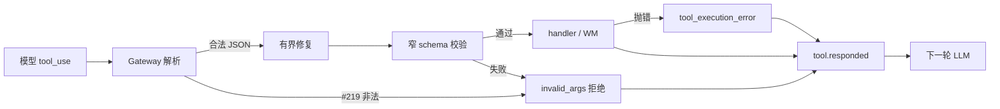

# 【runtime】控制类工具参数可修复协议

- Issue: #245
- 状态: Draft
- 最后更新: 2026-08-13

## 1. 背景

真实 run 多次出现 `update_step → TOOL_ARGUMENTS_INVALID_JSON`（短 raw）。#219 已保证：非法 JSON 与合法 `{}` 可区分、handler 前拒绝、结构化错误回传模型、单次拒绝不强制整 run 失败。控制类工具仍按宽 JSON tool 暴露，模型稍偏即整步作废并常浪费一轮。本设计在 #219 之上补有界修复、schema 分层错误、以及 `create_plan` / `update_step` 的窄输入面。

## 2. 名词解释

- **控制类工具**：本期仅 `create_plan`、`update_step`（cognitive plan/step）。`think` 不在窄接口范围内。
- **有界修复**：对接近合法 JSON 的字节做可唯一解析的语法修补，再跑 schema；不能唯一解析则拒绝。
- **invalid_args**：参数未成为合法、通过 schema 的输入（解析失败或 schema 失败）。不调用 handler。
- **tool_execution_error**：输入已合法，handler 执行失败（如尚无 plan）。

## 3. 设计目标与非目标

- **目标**：
  - 轻微畸形的 plan/step 调用不产生副作用，且不把整 run 标为 `error`。
  - 模型能依据稳定错误码与可执行提示改参，或在修复+校验通过后被接受。
  - 非法参数与 handler 失败错误码不同。
  - 合法窄输入可创建/更新 plan。
- **非目标**：
  - 不把 `tool_protocol_error` 做成 run `stopReason` / `status`（见 #244）。
  - 不改造全部业务工具。
  - 不强制所有 model provider 开启 structured outputs。
  - 不持久化完整 raw arguments（#219）。

## 4. 能力与功能设计

控制类 tool call 的处理顺序：网关解析（#219）→ 可选有界修复 → 对照该工具窄 schema 校验 → 通过则 handler，否则拒绝并回传错误 ToolResult。循环继续，除非其它规则结束 run。

若 `ModelConfig` 声明支持 tool structured / constrained decoding，gateway 应对这两工具启用；未声明则走修复+校验。两种路径对 Runtime 的错误码与「不进 handler」语义相同。

### 4.1 UI / UX

N/A：无页面。调用方与模型消费 `tool.responded` / ToolResult 的稳定码。

## 5. 设计思路与折衷

候选 A：只加长 description / few-shot。无契约变化，已证明不够，否决。

候选 B：所有工具统一激进修复。会误修带副作用的业务参数，否决。

候选 C（采纳）：仅控制类做有界修复 + 窄 schema；能上 constrained decoding 则上。协议摩擦集中在高频、无外部副作用（仅 WM plan）的工具上。

候选 D：协议失败直接 `stopReason` 停 run。与 #219 和本 issue Out 冲突，否决。

## 6. 架构设计

### 6.1 逻辑分层

Gateway 负责字节→JSON；Runtime 负责修复/校验/是否调用 handler；IOPort/trace 记录 requested/responded。终态仍由 #244 的循环规则决定。

### 6.2 核心业务流程

1. 收到 `update_step` / `create_plan` 调用。
2. 若带 `#219 invalidArguments`：不修复业务字段、不进 handler，回传解析类 invalid_args。
3. 否则对文本/对象做有界修复（尾逗号、唯一可补全的闭合括号）。多解或仍非 JSON → 拒绝。
4. 用窄 schema 校验：`create_plan` 需要 `steps: string[]`（非空）；`update_step` 需要 `stepId: number` 与 `status: 'done'|'failed'`。多余必拒或剥离规则见 §8——本期**拒绝未知必害字段之外的未声明字段**（additionalProperties=false）。
5. 通过则 handler；handler 抛错 → execution 码（如无 plan）。
6. 任一步拒绝/失败：`isError=true`，run 继续。

## 7. 模块设计

| 模块 | 职责 |
|---|---|
| Gateway | #219 解析；可选 constrained decoding |
| Runtime dispatch | 有界修复、schema、拒 handler |
| cognitive 工具 | 窄 schema 与 handler 语义不变（plan 仍在 WM） |
| Trace | 区分 invalid_args 与 execution 的 responded |

本单不把 plan 升为一等事件（那是后续 E）；查询「当前 plan」仍可读 WM / 既有 tool 输出。

## 8. API / CLI 设计

无新 CLI 动词。对外可观察码（封闭，本期）：

| 码 | 层 | 进 handler |
|---|---|---|
| `TOOL_ARGUMENTS_INVALID_JSON` | invalid_args（解析，含 #219） | 否 |
| `TOOL_ARGUMENTS_SCHEMA_INVALID` | invalid_args（schema） | 否 |
| handler 稳定码或 `TOOL_EXECUTION_ERROR` | tool_execution_error | 是（已执行） |

回传模型的 message 必须指出缺/错字段名或「JSON 无法解析」，不得只说「工具崩溃」。

窄输入：

- `create_plan`：`{ steps: string[] }`，`steps.length >= 1`
- `update_step`：`{ stepId: number, status: 'done' | 'failed' }`

成功：`create_plan` 写入 WM `plan` 并返回 plan；`update_step` 更新对应 step 并返回 steps。失败不写 WM。

CLI/SDK 终态：单步上述错误时 `status` 不得仅因此为 `error`，`stopReason` 不得为协议错误（#244）。

## 9. 边界考虑

- **假设**：#219 三条解析路径语义已一致。
- **安全**：不记录完整 raw；`rawLength` 可保留。
- **并发**：并行 tool_use 各自修复/拒绝，互不影响。
- **回放**：hash 使用拒绝元数据或修复后规范化输入，避免与合法 `{}` 碰撞。
- **性能**：修复为纯 CPU、有上限次数（一次尝试，失败即拒）。
- **权限**：不扩大工具能力面。

## 10. 迁移 / 兼容 / 回滚

- 合法调用路径不变。新增 schema 码；旧消费者只认 `TOOL_ARGUMENTS_INVALID_JSON` 仍能识别解析失败。
- `additionalProperties=false` 可能使以前被忽略的多余字段变为拒绝——仅控制类，属预期收紧。
- 回滚修复器不影响 #219 拒绝路径。

## 11. 测试计划

- **E2E**：stub 模型先发尾逗号或截断的 `update_step`（约 rawLength=29 量级），再发合法更新。handler 在非法那次为 0；run 终态非 error；第二次合法则 WM 更新。对上 S1。
- **Integration**：无 plan 时合法 JSON 的 `update_step` → execution 码且非 `TOOL_ARGUMENTS_*`。对上 S2。流式/非流式与 #219 一致。
- **Unit**：窄 schema 拒缺字段/错 enum/未知字段；合法 `create_plan` 写 plan；修复尾逗号后通过；歧义串不修复。对上 S3。

## 12. 开放问题 / 决策记录

- 决策：只覆盖 `create_plan` / `update_step`。
- 决策：协议错误不抬升 run 终态。
- 决策：修复失败与 #219 解析失败共用 invalid_args 层，schema 单独一码。
- 开放：其它高频控制工具是否后续加入同一名单——不阻塞本期。

## 13. 关联

- Issue #245 · L1 comment
- #219 · #244 · `docs/design/244-budget-stop-reason.md`
- `src/tools/cognitive.ts`
