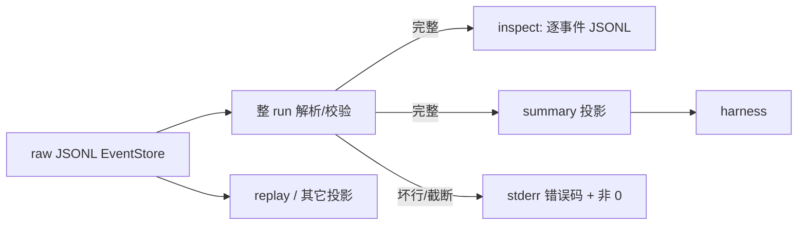

# 【trace】机器可读 run summary 与 inspect fail-closed

- Issue: #246
- 状态: Draft
- 最后更新: 2026-08-13

## 1. 背景

Agent Trace 的 source of truth 是 per-run raw JSONL。`milkie trace inspect` 已按 `readByRunId` 整流输出。外部系统仍缺一份可单独消费的 summary（turns / tools / errors / status / artifacts），只能自己滤 clock/region。展示层截断或「半截 JSON 数组」会被误认为官方 inspect 不完整。s-002 只保证时间线可读，不保证 summary，也不保证损坏源 fail-closed。

## 2. 名词解释

- **raw JSONL**：`IEventStore` 中该 `runId` 的事件文件；权威执行记录。
- **inspect**：全量事件投影，事件 id 集合必须等于 raw。
- **summary**：同一 run 的聚合投影，供 harness 不读全量事件即可分支。
- **fail-closed**：源无法完整解析时，不向 stdout 交付可被当成成功完整结果的载荷。

## 3. 设计目标与非目标

- **目标**：
  - 任意成功或失败 run：inspect 与 raw 的事件 id 集合相等。
  - JSONL 截断或坏行时，inspect 与 summary 均显式失败。
  - summary 可机读：turns、tools、errors、status，以及 #244/#247 落地后的 stopReason / artifacts。
- **非目标**：
  - 不取代 JSONL 作为权威源。
  - 不内联 object / region 字节。
  - 不生成自然语言解释（非 s-003）。
  - 不改 replay。
  - 不把 inspect 默认裁成 decision 层（#29/#36）。

## 4. 能力与功能设计

SDK 提供按 `runId` 取 summary。CLI：`trace inspect` 改为完整校验后输出；新增 `trace summary <runId>`，stdout 一条 JSON。

大 payload 继续走 object store hash；inspect 仍输出事件记录本身（含 hash 字段），不丢事件。

### 4.1 UI / UX

N/A：无新页面。`trace report` HTML 可随后消费 summary，不在本期。

## 5. 设计思路与折衷

候选 A：inspect 默认过滤 clock/region。降低噪音，但官方 inspect ≠ raw，否决。

候选 B：流式输出 JSON 数组，坏行时中途停。必然半截数组，否决。

候选 C（采纳）：inspect 保持全量 JSONL；**先解析整 run 再写 stdout**。summary 另立投影。JSONL 逐行格式在成功路径上仍是一条事件一行；失败路径 stdout 为空。

内存代价：须先装入该 run 事件。单 run 事件量已是 inspect 的既有假设；若未来需超大 run，另做分页契约，不在本期用半截输出换内存。

## 6. 架构设计

### 6.1 逻辑分层



EventStore 是唯一事实源。inspect 与 summary 都是只读投影。#244/#247 字段从 `agent.run.completed` 与登记产物读取，summary 不发明第二套终态。

### 6.2 核心业务流程

1. 打开 `runId` 对应 JSONL。
2. 逐行解析为事件；任一行失败或文件被截在半行 → 失败，stdout 不写事件/summary。
3. inspect：按 append 序输出每条事件的 JSONL。
4. summary：扫描事件，计数 LLM 轮次、按名聚合 tool、收集 error envelope、读取 completed 上的 status/stopReason/partial/artifacts。
5. `#244` 未落地时 summary 可省略 `stopReason`；落地后必须与 completed 事件一致。

## 7. 模块设计

| 模块 | 职责 |
|---|---|
| EventStore | raw 权威源 |
| inspect CLI | 校验后全量 JSONL |
| summary 投影 / CLI / SDK | 聚合契约 |
| Object store | 仍只被引用，不内联 |

与 #244/#247：summary 的 `artifacts` / `stopReason` / `partial` **复制信封**，不重新扫盘、不重算交付谓词。

## 8. API / CLI 设计

`milkie trace inspect <runId>`：成功 → stdout 仅为 JSONL 事件流；失败 → exit ≠ 0，stderr 稳定码（如 `TRACE_INSPECT_INCOMPLETE`），stdout 无事件行。

`milkie trace summary <runId>`：成功 → stdout 恰好一个 JSON 对象：

```text
runId, status, stopReason?, stopCode?, partial?, checkpointId?,
turns,                          // llm.requested 次数（或与 llm.responded 成对计数，L2 钉：以 responded 成功+失败次数为准，与 requested 对账）
tools: [{ name, count, errorCount }],
errors: [{ code, phase? }],     // 来自 tool.responded / llm 失败 / run error
artifacts: []                   // #247 形状；无则空数组
```

`turns`：以 `llm.responded` 条数为准（含失败），以便与决策轮次对齐。

失败：同 inspect，不输出半截对象。

SDK：`getRunSummary(runId)` 成功返回上述对象；源损坏抛带同一 code 的错误。

`--include-children`：本期 inspect 可保持现有子 run 追加行为，但**每个**子 run 须各自完整，任一失败则整次命令失败。summary 默认仅请求的 `runId`，不含子孙。

## 9. 边界考虑

- **假设**：单 run JSONL 可一次载入。
- **错误**：缺文件 / 未知 runId 与坏行同样 fail-closed，不得假装空成功。
- **权限**：summary 不含 prompt 全文或工具 raw 参数。
- **性能**：summary 为线性扫描；不建新索引。
- **并发**：只读。

## 10. 迁移 / 兼容 / 回滚

- inspect 成功输出形态仍是 JSONL，旧管道可用。
- 失败行为变严（以前可能打出部分行后崩）。这是本单意图。
- 回滚 summary 命令不影响 JSONL。

## 11. 测试计划

- **E2E**：一次含 llm+tool+region 的 run，inspect 事件 id 集合 = 文件 id 集合。对上 S1。将副本截断或插入坏行后 inspect/summary 均非 0，stdout 空或非合法完整 JSON。对上 S2。
- **Integration**：summary.turns / tools / errors / status 与 raw 对账；#244 落地后 stopReason 一致。对上 S3。
- **Unit**：空文件、缺 completed、仅半行。

## 12. 开放问题 / 决策记录

- 决策：JSONL 仍是 SoT；inspect 不默认过滤。
- 决策：fail-closed = 先校验再输出，失败 stdout 无载荷。
- 决策：summary 默认不含子 run。
- 开放：超大 run 分页——本期不做。

## 13. 关联

- Issue #246 · L1 comment · #29 · s-002
- `docs/design/244-budget-stop-reason.md` · `docs/design/247-declarative-deliverables.md`
