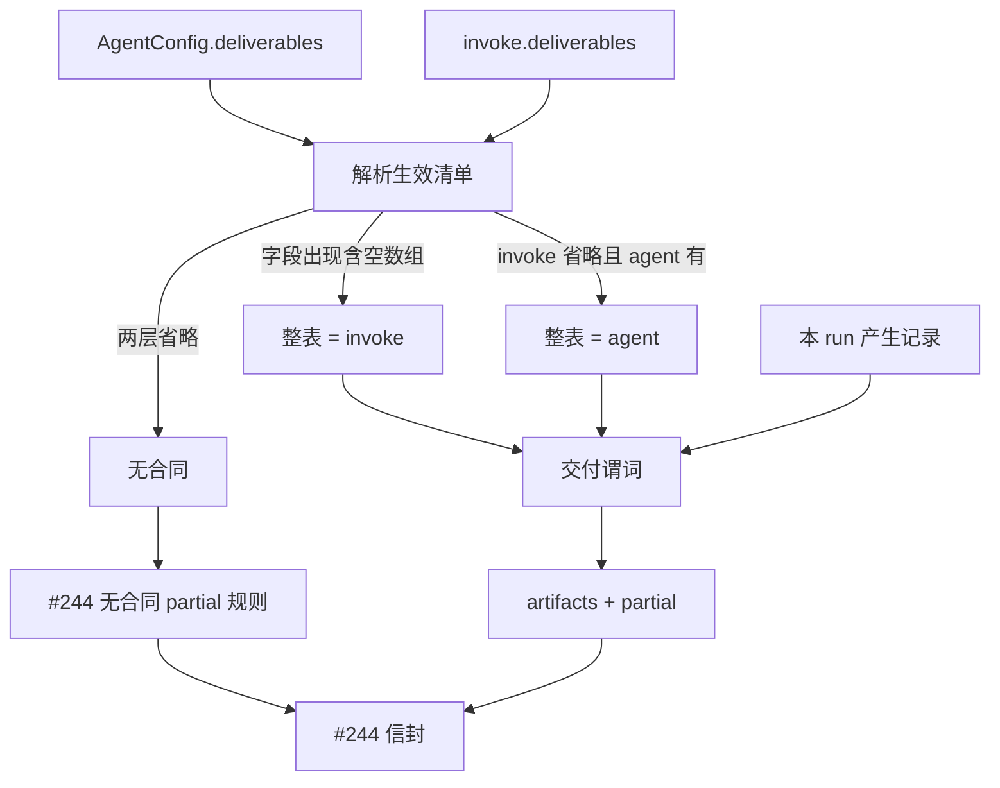

# 【runtime】声明式 deliverable（agent 默认，invoke 覆盖）

- Issue: #247
- 状态: Draft
- 最后更新: 2026-08-13

## 1. 背景

产物目前靠约定路径写文件。Runtime 不知道**这一单**必须交出什么，出现 `completed` 但无产物；上层只能扫目录。同一 agent 会接到不同任务，装箱单不能写死在 agent 上。#244 已把 `artifacts[]` / `partial` 放进返回信封；本单定义这两项在**存在交付合同**时如何填写，以及合同如何从 agent 默认与 invoke 覆盖生效。

不变量 14：交付谓词不是 task outcome，也不引入 `goal_completed` 执行终态。

## 2. 名词解释

- **deliverable**：声明的目标交付物（name / type / 定位 / 是否必选）。
- **交付合同 / 生效清单**：本 run 用来点货的那张清单。
- **产生记录**：本 run 内工具或 finalize 登记的已产出定位（path 或 objectId），不是 `ls` 结果。
- **交付谓词**：生效清单中是否所有 `required` 项都能在产生记录中匹配。
- **整表替换**：invoke 一旦出现 `deliverables` 字段（含 `[]`），即丢弃 agent 默认整表。

## 3. 设计目标与非目标

- **目标**：
  - 上层只消费信封中的 `artifacts[]`。
  - 生效清单 = invoke 覆盖，否则 agent 默认；两层省略 = 无合同。
  - 缺必选 → `partial=true`，不写 outcome，不改写成 `goal_completed`。
  - 无合同不扫盘、不因「没报告」标 partial（partial 回落 #244）。
- **非目标**：
  - 不自动 `recordTaskOutcome`。
  - 不按 name 深合并两层清单。
  - 不做 object/relation 默认世界模型。
  - 不把交付谓词做成新的 `status` / `stopReason`。

## 4. 能力与功能设计

开发者可在 `AgentConfig` 声明默认 `deliverables`。编排可在 `invoke` 传入本单 `deliverables`。Runtime 在 run 开始冻结生效清单，结束时对照产生记录填写 `artifacts[]`，有合同时据此设置 `partial`。

### 4.1 UI / UX

N/A：无页面。清单经 SDK/CLI 终态与 #246 summary 暴露。

## 5. 设计思路与折衷

候选 A：仅 agent 级。专用流水线够用，通用 agent / 评测多题不够，否决为唯一机制。

候选 B：仅 invoke 级。每次重复固定装箱单。作补充可以，作唯一来源对专用 agent 不友好。

候选 C：按 name 合并默认与 invoke。调用方难推理「删掉一项默认」，与 S2「未再声明则不点货」冲突，否决。

候选 D（采纳）：**两层 + 整表替换**。省略 invoke → 默认；出现 invoke（含空数组）→ 以本次为准；两层都省略 → 无合同。

无合同时不扫盘：避免把日志/缓存当交付物，且与 replay 可复现一致。

## 6. 架构设计

### 6.1 逻辑分层

#247 拥有：清单语法、生效规则、匹配、有合同时的 `partial` 与 `artifacts` 形状。#244 拥有：信封字段位置与无合同时的 `partial`。#246 只复制，不重算。

### 6.2 核心业务流程

1. `invoke` 开始：计算生效清单并冻结（resume 沿用原 run 合同，不在中途更换）。
2. 工具写文件或 `createObject` 等登记产生记录（既有 lineage / 写路径挂钩，不扫盘）。
3. 循环因 #244 任一 reason 停下。
4. 无合同：`artifacts` = 本 run 已登记且**显式标记为产物**的项（可空）；`partial` 按 #244。不得把未登记文件塞进数组。
5. 有合同：对生效清单每一项匹配产生记录；写 `artifacts`；`partial = 任一条 required 且 state=missing`。
6. 不调用 outcome API。

## 7. 模块设计

| 模块 | 职责 |
|---|---|
| AgentConfig / Invoke | 声明清单 |
| Runtime | 冻结合同、匹配、填信封 |
| 产生记录 | 写工具 / object.created / finalize 钩子登记 |
| #244 / #246 | 承载与投影 |

匹配：`type:'file'` 按规范化相对 path；`type:'object'` 按本 run `object.created` 的 type/meta.name 或声明的 object 引用。同 name 多项声明非法，启动时拒绝。

## 8. API / CLI 设计

声明项（agent 与 invoke 同形）：

| 字段 | 语义 |
|---|---|
| `name` | 稳定标识，合同内唯一 |
| `type` | `file` \| `object` |
| `path` | file 必填，相对本次工作根 |
| `required` | 缺省 `true`；`false` 即 optional |

`invoke` 省略 `deliverables` 键 ≠ `deliverables: []`。后者生效清单为空：无必选，交付谓词为齐（`partial` 不因交付而 true）。

`artifacts[]` 项：

| 字段 | 语义 |
|---|---|
| `name` | 对应声明 |
| `type` | 同声明 |
| `path` / `objectId` | 匹配到则填 |
| `state` | `produced` \| `missing` |
| `hash?` | 若产生记录带内容地址 |

有合同时数组**含全部生效项**（含 missing），以便 harness 不必再对声明表。无合同时只含已登记产物，`state` 均为 `produced`。

成功：必选皆 `produced` ⇒ 交付意义上非 partial。失败（缺必选）：`partial=true`，`status`/`stopReason` 仍按 #244。非法声明（重名、file 无 path）→ invoke 启动失败，不跑循环。

CLI `agent run` 若支持 `--deliverables` JSON，语义与 invoke 字段相同；未传则仅 agent 默认。

## 9. 边界考虑

- **假设**：写文件工具能把 path 记入产生记录；否则 file 交付无法匹配——这是集成约束，不是扫盘借口。
- **错误**：声明非法 fail-fast。匹配失败只影响 `state`/`partial`。
- **幂等**：同一 path 多次写，取最后一次登记。
- **权限**：artifacts 只含声明的定位与 hash，不含文件全文。
- **resume**：合同在首次 invoke 冻结，写进 checkpoint / 启动事件，resume 不得用新清单改写点货标准。
- **安全**：path 不得逃出工作根（`..` 拒绝）。

## 10. 迁移 / 兼容 / 回滚

- 既有 agent 无该字段 = 无合同，行为与今日一致（再叠加 #244 无合同 partial）。
- 无数据迁移。
- 回滚字段后信封 `artifacts` 可恒为空数组。

## 11. 测试计划

- **E2E**：agent 默认一项必选 file，工具经登记路径写出，invoke 不传清单 → `artifacts` 含 `produced`。对上 S1。
- **E2E**：agent 默认 report，invoke 改为其它 path；只写 invoke 的 path → 只点本次项，默认 report 不在合同中。无默认仅 invoke 同样生效。对上 S2。
- **E2E**：必选未出现 → `partial=true` 且无 outcome 事件。对上 S3。
- **E2E**：必选+optional，只写必选 → 不因 optional missing 而 partial。对上 S4。
- **E2E**：两层省略，工作目录有无关文件 → 不因此 partial，`artifacts` 不含扫盘项。对上 S5。
- **Unit**：键省略 vs `[]`；重名拒绝；`..` path 拒绝。

## 12. 开放问题 / 决策记录

- 决策：整表替换，不按 name 合并。
- 决策：`[]` 是空合同，省略是无合同。
- 决策：有合同 `partial` 只看 required missing；与 #244 stopReason 正交。
- 决策：有合同 `artifacts` 含 missing 行。
- 开放：schema 校验文件内容（JSON Schema）不做本期。

## 13. 关联

- Issue #247 · L1 comment
- `docs/design/244-budget-stop-reason.md` · `docs/design/246-trace-run-summary.md`
- #37 · #217 · ARCHITECTURE 不变量 14
