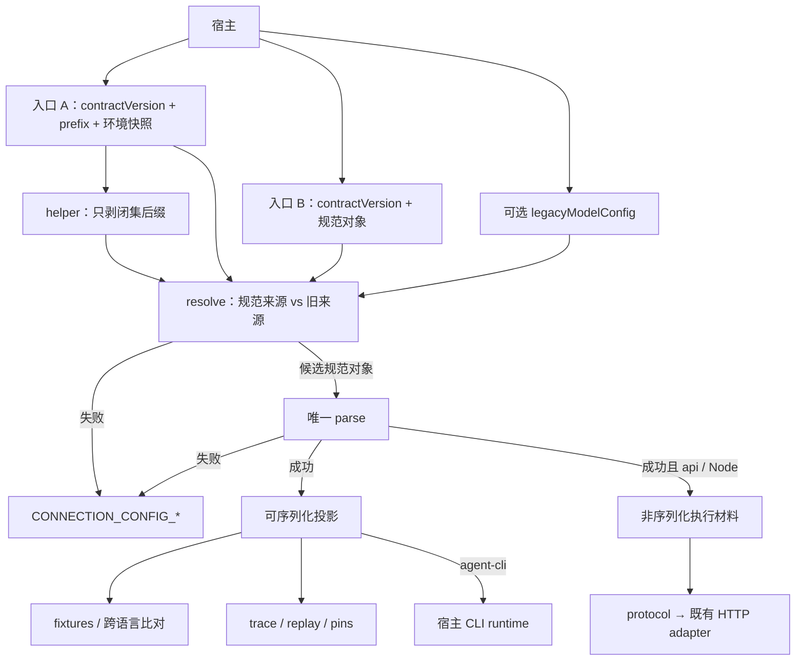

# 【gateway】统一模型连接契约

- Issue: #251
- 状态: Draft
- 最后更新: 2026-08-16

## 1. 背景

Helix、Researcher 与 Kairo 都要连接真实模型或 agent CLI，但当前把 `provider`、`adapter`、`protocol` 与 `runtime` 混用。milkie 的 Node 工厂按 `adapter` 字符串选路，并在 `GatewayFactory` / adapter 构造函数中直接读取 `VOLCENGINE_TOKEN`、`VOLCENGINE_API_BASE`、`OPENAI_API_KEY`、`ANTHROPIC_API_KEY`。各宿主又用不同前缀表达同一件事，兼容优先级与凭证脱敏无法一致演进。

Issue #251 要建立版本化、跨语言的模型连接契约：milkie 提供 Node 参考解析与 HTTP gateway 装配；其他语言通过同一份 schema 与 conformance fixtures 对齐。Helix #26 是首个 Node 消费者。本 issue 不迁移下游项目。

已批准 L1：[comment 5304840285](https://github.com/xforce-io/milkie/issues/251#issuecomment-5304840285)（`updated_at=2026-08-16T00:35:13Z`）。

## 2. 名词解释

- **规范字段**：去前缀后的闭集字段。共享层只认这些名字，不认 `HELIX_LLM_TRANSPORT` 这类完整宿主变量名。
- **前缀**：宿主命名空间，是每次收集的参数，不是进程全局状态。约定前缀已含分隔符（通常为尾部 `_`），收集时做字面拼接 `prefix + 后缀`，不再插入字符。
- **入口 A / 入口 B**：入口 A 用前缀 + 调用方传入的环境快照剥出规范字段；入口 B 直接接收手组规范对象。两者与 `contractVersion` 一起进入同一条 resolve→parse 管线。
- **来源分辨（resolve）**：parse 之前的阶段。它同时看见规范来源与旧来源，决定走 `canonical`、走 `legacy`，或 fail-closed。helper 只剥前缀，不读旧变量；resolve 才读迁移表键名。
- **规范来源**：入口 A 的 `env` 里出现任一闭集后缀，或入口 B 的 `fields` 出现任一规范字段。
- **旧来源**：出现 `legacyModelConfig`，或迁移键袋中出现任一迁移表变量。入口 A 的迁移键袋是同一份 `env`；入口 B 的迁移键袋是显式 `legacyEnv`。二者都不是进程全局环境。
- **legacyEnv**：入口 B 可选的旧变量快照，键名仅限迁移表变量。只给 resolve 读，不给 helper，不回读 `process.env`。
- **标准化/审计投影**：parse 成功后可序列化、跨语言可比较的公开产物。不含 API key，不含完整 base URL。
- **执行材料**：仅供 Node 在本次 parse 后装配 HTTP gateway 的非序列化秘密材料（API key、完整 base URL）。不得进入 projection、error、pins、trace、replay 或 fixture 期望值。
- **契约版本**：每次调用的必填整数参数 `contractVersion`。不是环境变量后缀。首发规则集为 `1`；`>= 2` 使用同一字段表但关闭迁移窗口。
- **迁移表**：把当前硬编码厂商变量和旧 `ModelConfig.adapter` 映射到规范字段的闭集表。每条有启用范围与终止。不是宿主可扩展的别名注册表。

## 3. 设计目标与非目标

- **目标**：
  - 定义版本化、语言无关的模型连接语义：字段、枚举、互斥、错误码、脱敏。
  - 让 milkie 成为 Node 参考实现：剥前缀 helper、resolve+parse、`transport=api` 时按 `protocol` 装配既有 HTTP gateway。
  - 让非 Node 项目通过 schema 与 fixtures 对齐，不嵌入 Node。
  - 把直连 HTTP API 与 agent CLI runtime 显式分开；`provider` 不得选择 adapter。
  - 前缀由宿主决定；规范字段与固定后缀由契约拥有。
- **非目标**：
  - 不新增模型协议，不实现 VLM 新 transport。
  - 不接管 Kairo / Researcher 的业务编排或 CLI 生命周期；不启动 `claude` / `grok` / `codex`。
  - 不在本 issue 迁移 Helix / Kairo / Researcher。
  - 不把真实 LLM E2E 纳入默认 CI。
  - 不向 milkie 开放「变量名 → 字段」注册表或插件式别名。
  - 不把 Node helper 做成跨语言运行时。
  - 不规定全局无前缀 `LLM_*`。
  - 不在本 issue 为 milkie CLI 增加前缀/连接配置命令。

## 4. 能力与功能设计

调用方以两种互斥 transport 描述连接：

| transport | 必填 | 禁止 | 成功后的行为 |
|---|---|---|---|
| `api` | `protocol`、`model`、`apiKey` | `runtime` | Node 按 `protocol` 装配并执行既有 HTTP gateway |
| `agent-cli` | `runtime` | `protocol`、`apiKey`、`baseUrl` | 只返回含 `runtime` 的投影；宿主自己启动 CLI |

可选：`provider`（来源/审计，两运输皆可）、`baseUrl`（仅 `api`）、`model`（`agent-cli` 可选，原样进入投影供宿主传给 CLI）。

VLM 仍是既有 `capabilities.imageInput`，不是第三种 transport，也不进入 v1 后缀表。能力在 protocol 选定 adapter 之后、发请求之前按 #236 校验。

窗口内「仅旧配置」分两层：旧来源存在 = `legacyModelConfig` 或迁移键袋非空；窗口内 api 可成功 = `contractVersion=1` 且无规范来源，并且同时具备可映射出 `transport`/`protocol`/`model` 的 `legacyModelConfig` 与可映射出 `apiKey` 的迁移表变量。仅有厂商 key、没有 `legacyModelConfig`，旧来源存在但 parse 报 `MISSING_FIELD`，不猜协议。

### 4.1 UI / UX

N/A：无页面。空态与错态由确定性配置错误码表达；调用方在任何模型/CLI 调用前看到拒绝。

## 5. 设计思路与折衷

- **选择**：`transport` 作顶层判别；`protocol` 唯一决定 HTTP adapter；`runtime` 只描述 CLI backend。放弃用 `provider` / `adapter` / `volcengine` 字符串在新路径选路——这正是当前语义漂移来源。旧 `adapter` 只出现在 `legacyModelConfig` 映射表。
- **选择**：固定后缀表 + parse-time prefix，外加 Node 参考 helper。放弃各宿主自绘映射，也放弃 milkie 内 `register()` 绑定：注册是进程级副作用，fixtures 无法对齐，契约会重新认识各项目私有变量名。
- **选择**：`contractVersion` 作为两条入口共用的显式参数，而不是后缀或默认值。放弃「未声明当 1」：否则未升级调用会永远停在迁移窗口，S4 窗外拒绝不可测。
- **选择**：共享层接收前缀或已收集值，不读全局 `LLM_*`。放弃无前缀默认：同进程多宿主会串配置。
- **选择**：一次成功拆成可序列化投影与 Node 执行材料。放弃把 key/完整 URL 放进标准化对象再靠调用方记得删——trace/replay/pins 会二次泄露。
- **选择**：旧厂商变量与旧 `ModelConfig` 只活在带启用/终止的迁移表；新旧来源并存 fail-closed。放弃在 helper 或新路径 adapter 构造函数里继续 `?? process.env[...]`。
- **放弃**：只做 Node 配置库。Kairo 是 Python，不能被逼跨进程依赖 Node。
- **放弃**：本 issue 改写 Helix/Kairo/Researcher。契约先稳定，下游各自迁移。
- **放弃**：让单独的 `ANTHROPIC_API_KEY` 推断 protocol。那会把来源重新变成选路。

## 6. 架构设计

### 6.1 逻辑分层

依赖方向：契约 schema / fixtures 不依赖 Node。helper 只依赖后缀表。resolve 依赖迁移表与 `contractVersion`。gateway 装配只依赖 parse 成功后的 `protocol` + 执行材料。trace 只依赖投影。

### 6.2 核心业务流程

**入口选择**

- 必须提供恰好一种入口：A（`prefix` + `env`）或 B（`fields`）。两者都给或都不给 → `CONNECTION_CONFIG_CONFLICT`，`fields` 为 `entry`。
- `contractVersion` 为共用必填参数。
- `legacyModelConfig` 可与 A 或 B 一起传入。`legacyEnv` 仅入口 B 可选。它们只算旧来源，不算第二种入口。入口 A 禁止 `legacyEnv`（旧变量已在 `env` 里）。

**成功（规范来源 / api）**

1. helper 或入口 B 得到规范字段；缺后缀视为未提供。
2. resolve 确认没有旧来源。
3. parse 按 §8.8 顺序校验。
4. 产出投影（无 key、无完整 URL）+ 执行材料（仅 Node）。
5. Node 用 `protocol` 选择 adapter，把执行材料显式注入构造函数，不回读进程环境。
6. 既有 IOPort / trace / replay 只记录投影与后续安全 envelope。

**成功（窗口内仅旧配置 / api）**

1. 无任何规范字段。
2. `contractVersion = 1`。
3. 旧来源存在。窗口内 api **成功**还要求：`legacyModelConfig` 能映射 `transport`/`protocol`/`model`，且迁移键袋能映射 `apiKey`。只满足「旧来源存在」但缺其中一块 → 同一 parse 报 `MISSING_FIELD`。
4. resolve 按 §10.1 物化为候选规范对象，`source=legacy`。
5. 进入同一 parse。不得猜测未列出的字段。

**成功（agent-cli）**

1. 规范来源提供 `transport=agent-cli` 与 `runtime`。
2. 只返回投影。milkie 不创建 HTTP gateway，不发起网络，不 spawn 进程。
3. 旧来源不能物化为 `agent-cli`。

**失败** 一律在模型/CLI 调用前发生；错误体只含 `code`、固定安全文案、`fields`（名，不含值）。优先级见 §8.8。

## 7. 模块设计

| 模块 | 拥有 | 不拥有 |
|---|---|---|
| 契约包（schema + fixtures + 迁移表） | 字段、枚举、错误码、优先级、脱敏、每版本四类案例 | 任何语言运行时 |
| milkie Node 参考实现 | helper、resolve、parse、api 装配、把执行材料注入既有 adapter | CLI 进程、宿主前缀登记 |
| 既有 HTTP adapter | wire 协议、#236 能力校验、网络错误 `MODEL_*` | 新路径选路、读进程环境 |
| Helix / Researcher | 自己的前缀或对象、调用 Node 参考实现 | 重写 gateway / trace |
| Kairo | 按同一后缀表与 resolve 规则自收集；用 fixtures 验证 | Node helper、milkie 运行时 |

权威：字段语义与错误码以契约包为准。Node 是参考实现，不是规范本身。

## 8. API / CLI 设计

CLI N/A：本 issue 不增加 milkie CLI 动词或全局 env 约定。未调用本契约的 agent markdown 仍走旧 `createGateway`。

### 8.1 契约版本

- 名称：`contractVersion`
- 位置：两条入口的共用显式参数。不是后缀，不进环境快照，不默认。
- 合法域：整数 `>= 1`。JSON 数字必须是整数值（`1.0` 可接受为 `1`；`1.5` 非法）。
- 当前规则：
  - `1`：字段表如 §8.2；迁移窗口开启。
  - `>= 2`：同一字段表；迁移窗口关闭，仅旧来源 → `CONNECTION_CONFIG_LEGACY_EXPIRED`。
- 缺省 → `CONNECTION_CONFIG_MISSING_FIELD`，`fields: ["contractVersion"]`。
- 非整数、小于 1 → `CONNECTION_CONFIG_UNKNOWN_VALUE`，`fields: ["contractVersion"]`。
- 实现必须接受 `2` 作为规则选择器，以便 fixtures 覆盖窗外拒绝。`2` 不引入新字段。

### 8.2 闭集后缀与规范字段

拼接：`env[prefix + suffix]`。前缀由调用方传入，例如 `HELIX_LLM_`、`KAIRO_LLM_`。

| 后缀 | 规范字段 | 允许值 | 适用 |
|---|---|---|---|
| `TRANSPORT` | `transport` | `api` \| `agent-cli` | 必填 |
| `PROTOCOL` | `protocol` | `anthropic-messages` \| `openai-chat-completions` | 仅 `api` 必填 |
| `RUNTIME` | `runtime` | `claude-code` \| `grok-cli` \| `codex` | 仅 `agent-cli` 必填 |
| `MODEL` | `model` | 不透明非空字符串 | `api` 必填；`agent-cli` 可选 |
| `BASE_URL` | `baseUrl` | 不透明非空字符串 | 仅 `api` 可选 |
| `API_KEY` | `apiKey` | 不透明非空字符串 | 仅 `api` 必填 |
| `PROVIDER` | `provider` | 不透明非空字符串 | 可选；不得选 adapter |

不做 URL 解析、不做 scheme 白名单、不 trim。值为空或含首尾空白 → `CONNECTION_CONFIG_UNKNOWN_VALUE`。内部空白保留。

v1/v2 都没有其它规范后缀。入口 A 快照中未列出的 `prefix + *` 忽略。入口 B 对象出现闭集以外的键 → `CONNECTION_CONFIG_UNKNOWN_VALUE`，`fields` 为这些键名（字典序）。

### 8.3 两条入口与 helper

公共输入形状（语义，不是跨语言函数签名）：

| 参数 | 入口 A | 入口 B |
|---|---|---|
| `contractVersion` | 必填 | 必填 |
| `prefix` | 必填 | 禁止 |
| `env` | 必填；调用方快照，禁止回读进程全局 | 禁止 |
| `fields` | 禁止 | 必填；只含规范字段。纯迁移调用传 `{}` |
| `legacyModelConfig` | 可选 | 可选 |
| `legacyEnv` | 禁止 | 可选；仅迁移表键名。未知键 → `UNKNOWN_VALUE` |

- **helper**（仅入口 A）：按闭集后缀从 `env` 取值，产出规范字段袋（可空）。不读迁移表键，不读 `legacyEnv`，不读无前缀 `LLM_*`，不读 `process.env`，不做 register，不选 adapter，不发请求，不碰 CLI。
- **resolve**：看见 helper 袋或 `fields`；迁移键袋（入口 A 用 `env`，入口 B 用 `legacyEnv`）；以及 `legacyModelConfig`。决定来源或拒绝。禁止回读进程全局环境。
- 非 Node 按本表自实现；行为由 fixtures 锁死。
- Node 参考名可用 `collectFromPrefix` / `resolveAndParseConnection` / `assembleApiGateway`，语义以本节为准。

### 8.4 成功投影

可序列化对象，字段闭集：

| 字段 | 含义 |
|---|---|
| `contractVersion` | 整数 |
| `transport` | `api` 或 `agent-cli` |
| `protocol` | 仅 `api` |
| `runtime` | 仅 `agent-cli` |
| `model` | 若输入提供 |
| `provider` | 若输入提供 |
| `hasApiKey` | 布尔；`api` 成功时为 true |
| `hasBaseUrl` | 布尔 |
| `source` | `canonical` 或 `legacy` |

禁止出现：`apiKey`、完整 `baseUrl`、原始 env 名、原始 env 值、`adapter`。

Node 执行材料（不可 JSON / 不可进 trace）：`apiKey`、可选完整 `baseUrl`（原样保留）。仅 `transport=api` 且在 Node 参考实现内交给装配函数。非 Node 实现不得声称持有或转发该对象。

### 8.5 protocol → adapter

| protocol | Node 装配目标 |
|---|---|
| `anthropic-messages` | 既有 Anthropic HTTP adapter |
| `openai-chat-completions` | 既有 OpenAI-compatible HTTP adapter |

`provider`、新路径上的旧 `adapter` 字符串、`volcengine` 名称均不得改变上表。`capabilities` 在装配后按既有 gateway 契约生效。

### 8.6 配置错误

与网络期 `MODEL_*` 分立。均可进 fixtures，均可机读。

| code | 何时 | retryable |
|---|---|---|
| `CONNECTION_CONFIG_MISSING_FIELD` | 缺 `contractVersion` 或 parse 后仍缺必填规范字段 | false |
| `CONNECTION_CONFIG_CONFLICT` | 入口 A+B 同时出现或皆缺；transport 交叉字段；多个旧 key 映射到同一规范字段且值不一致 | false |
| `CONNECTION_CONFIG_UNKNOWN_VALUE` | 非法版本；空白/首尾空白；枚举外取值；入口 B 额外键；未知 `legacyModelConfig.adapter` | false |
| `CONNECTION_CONFIG_LEGACY_EXPIRED` | 仅旧来源且 `contractVersion >= 2` | false |
| `CONNECTION_CONFIG_LEGACY_AND_CANONICAL` | 规范来源与旧来源同时出现 | false |

公开错误形状：`{ code, message, fields }`。`message` 为该 code 的固定安全文案。`fields` 为字符串数组，只列规范字段名、`contractVersion`、`entry`、或迁移表变量名，不列值；按 Unicode 码点升序，无重复。

### 8.7 与现有 `ModelConfig` 的关系

现行 `ModelConfig` 为 `{ provider, model, adapter, baseUrl?, capabilities? }`，工厂按 `adapter` 选路并回读进程环境。

- **新路径**：调用本契约。装配只看 `protocol` + 执行材料。
- **旧路径**：从不调用 resolve/parse，直接把 `AgentConfig.model` 交给现行 `createGateway`。该路径在 `contractVersion` 语义之外，本 issue 不改其行为。
- **旧配置进入新路径**：必须作为 `legacyModelConfig` 加上迁移键袋（入口 A 的 `env`，入口 B 的 `legacyEnv`）。不得把已经物化的规范字段再与旧来源混报。
- **同一次新路径调用**既有规范来源又有旧来源 → `CONNECTION_CONFIG_LEGACY_AND_CANONICAL`。
- 新路径构造 adapter 时必须显式传入执行材料；禁止再 `?? process.env[...]`。

### 8.8 校验总顺序

只报告第一层命中的 code。同层多个名字全部进入 `fields` 并排序。

1. `contractVersion` 缺失 → `MISSING_FIELD`。非法 → `UNKNOWN_VALUE`。
2. 入口形状：A、B 都给或都不给 → `CONFLICT`，`fields: ["entry"]`。入口 A 带 `legacyEnv`，或入口 B 带 `env`/`prefix` → 同层 `CONFLICT`，`fields` 含误用参数名。
3. 未知键：入口 B 的 `fields` 出现规范闭集外键，或 `legacyEnv` 出现迁移表外键 → `UNKNOWN_VALUE`。
4. 来源混合：规范来源 ∧ 旧来源 → `LEGACY_AND_CANONICAL`。`fields` 含出现的规范字段名与旧变量名 / `legacyModelConfig`。
5. 仅旧来源且 `contractVersion >= 2` → `LEGACY_EXPIRED`。`fields` 含出现的旧变量名与 `legacyModelConfig`（若传入）。
6. 空白或首尾空白（规范字段、迁移键袋值、`legacyModelConfig` 字符串）→ `UNKNOWN_VALUE`。
7. 枚举外取值（含未知 `legacyModelConfig.adapter`）→ `UNKNOWN_VALUE`。
8. 互斥与映射冲突：`api` 带 `runtime`、`agent-cli` 带 `protocol`/`apiKey`/`baseUrl`、两旧 key 映到同一字段但值不同 → `CONFLICT`。
9. 必填缺失 → `MISSING_FIELD`。

来源分辨在第 4 步：resolve 先判断来源，再物化。物化产生的规范字段不算「调用方同时提供了规范来源」。

## 9. 边界考虑

- **假设**：宿主知道自己的前缀；同一调用只处理一个前缀。多模型/多租户 = 多次调用。
- **错误**：配置错误全部 fail-closed、调用前、不可重试。网络错误仍用既有 `MODEL_*`，不得把 key/URL 写进 envelope。
- **并发 / 幂等**：无全局可变注册表，可重入。同一输入重复调用结果相同。
- **权限**：milkie 不读文件系统密钥；secret 只来自入口 B 的 `fields`、入口 A 的 `env` 对应后缀，或窗口内 `legacyEnv` / `env` 迁移键 / 旧 `baseUrl`。禁止回读进程全局环境。
- **性能**：一次线性扫描闭集后缀与闭集旧键，无网络。
- **安全**：投影、error、pins、trace、replay、日志、fixture 期望值不得含 API key 或完整 base URL。允许 `hasApiKey` / `hasBaseUrl`、`provider`、`model`、`protocol` / `runtime`。完整 URL 与 key 同级保密。
- **凭证占位**：文档与 fixtures 只用明显假值（如 `sk-test`、`https://example.invalid/v1`）。期望值侧断言这些字面量不出现在投影/错误/trace/pin 中。

## 10. 迁移 / 兼容 / 回滚

### 10.1 旧来源与迁移表

helper 永不读下表。resolve 只扫描迁移键袋：入口 A 为 `env` 中的这些键名，入口 B 为 `legacyEnv` 中的这些键名。另读取可选 `legacyModelConfig`。未出现的键视为未提供。

| 旧输入 | 映射到 | 启用 | 终止 | 淘汰说明 |
|---|---|---|---|---|
| `legacyModelConfig.adapter = anthropic` | `transport=api`，`protocol=anthropic-messages` | `1` | 自 `2` | 改用规范 `PROTOCOL` |
| `legacyModelConfig.adapter = openai-compatible` 或 `openai` 或 `volcengine` | `transport=api`，`protocol=openai-chat-completions` | `1` | 自 `2` | 同上 |
| `legacyModelConfig.model` | `model` | `1` | 自 `2` | 改用规范 `MODEL` |
| `legacyModelConfig.provider` | `provider` | `1` | 自 `2` | 改用规范 `PROVIDER` |
| `legacyModelConfig.baseUrl` | `baseUrl` | `1` | 自 `2` | 改用规范 `BASE_URL` |
| `ANTHROPIC_API_KEY` | `apiKey` | `1` | 自 `2` | 改用前缀 + `API_KEY` 或入口 B |
| `OPENAI_API_KEY` | `apiKey` | `1` | 自 `2` | 同上 |
| `VOLCENGINE_TOKEN` | `apiKey` | `1` | 自 `2` | 同上 |
| `VOLCENGINE_API_BASE` | `baseUrl` | `1` | 自 `2` | 改用前缀 + `BASE_URL` |

未知 `adapter`（含 `test` / `stub`）→ `UNKNOWN_VALUE`，不得进入新路径成功态。

多个输入映到同一规范字段：值相同视为一次提供；值不同 → `CONFLICT`。`legacyModelConfig.baseUrl` 与 `VOLCENGINE_API_BASE` 同此规则。

旧来源**单独**不能推断未列出的字段。没有 `legacyModelConfig`、只有厂商 key 时，不能得到 `transport`/`protocol`/`model`。

`source`：结果依赖任一旧输入则为 `legacy`，否则 `canonical`。

宿主不得追加私有旧名。要扩表必须升契约版本。

### 10.2 并存与回滚

- 从不调用本契约的旧 `createGateway(ModelConfig)` 保持原样。
- 新契约 opt-in。
- 回滚实现：停止导出 parse / helper；已发布 schema 版本号不复用。
- 下游项目迁移不在本 issue。

## 11. 测试计划

真实模型网络不在默认 CI。HTTP 用确定性 stub；CLI 路径断言「零 HTTP、零 spawn」。

- **E2E**（S1 / S2）
  1. 入口 B，`contractVersion=1`，`transport=api`，`protocol=anthropic-messages`，`model` 非空，唯一假 key `sk-test`，唯一非默认 `baseUrl` `https://example.invalid/v1`：受控 stub 完成一次 gateway 请求；装配 Anthropic adapter；stub 观察到该 base URL 的等价配置；投影 / 错误 / trace / pin / replay 均不含 `sk-test` 与 `https://example.invalid/v1`；投影 `hasApiKey=true`、`hasBaseUrl=true`、`source=canonical`。
  2. 对 `openai-chat-completions` 重复上一步（可换另一假 URL）；装配 OpenAI-compatible adapter；改 `provider` 不改变 adapter。
  3. `transport=agent-cli` + `runtime=claude-code`：parse 成功；过程中无 HTTP、无子进程。
  4. `api` 同时带 `runtime`，或 `agent-cli` 带 `protocol` / `apiKey`：调用前 `CONNECTION_CONFIG_CONFLICT`。
- **Integration**（S3 / S4）
  - 每个已定义规则版本（`1` 与 `>=2` 窗外集）至少四类 fixtures：成功、冲突拒绝、缺字段拒绝、脱敏。成功带可比较投影；拒绝带 `code` + 排序后的 `fields` + 脱敏预期。
  - 非迁移 fixtures 同时跑入口 A 与入口 B，投影或 `{code,fields}` 一致。
  - 迁移三态（入口 A：`env` 含迁移表键且无规范后缀；入口 B：`fields={}` + 同一 `legacyModelConfig` + 等价 `legacyEnv`；两条路径投影或 `{code,fields}` 一致）：
    - 窗口内仅旧配置可成功：`contractVersion=1`，`legacyModelConfig={adapter:anthropic,model:…}`，迁移键袋仅 `ANTHROPIC_API_KEY` 与可选 `VOLCENGINE_API_BASE`；`source=legacy`；执行材料到达 adapter；公开产物无秘密。
    - 窗外仅旧配置：同一旧输入，`contractVersion=2` → `LEGACY_EXPIRED`。
    - 新旧并存：任一规范字段 + 任一旧来源 → `LEGACY_AND_CANONICAL`。仅有厂商 key、无 `legacyModelConfig`：旧来源存在，窗口内 `MISSING_FIELD`，窗外 `LEGACY_EXPIRED`。
  - 多错误组合至少 1 条：例如空白 `API_KEY` + 旧变量，按 §8.8 先报 `LEGACY_AND_CANONICAL`（第 4 层），而不是 `UNKNOWN_VALUE`。
  - 入口 B 额外键至少 1 条 → `UNKNOWN_VALUE`，`fields` 为额外键字典序。
  - 公开产物与 fixture 期望值永不含 key / 完整 URL。
- **Unit**
  - 缺后缀 ≠ 空字符串；首尾空白 → `UNKNOWN_VALUE`。
  - helper 不读厂商变量、不读进程全局环境。
  - `baseUrl` 原样保留，不解析、不规范化。
  - `provider` 不选路。
  - 错误体无秘密；`fields` 稳定排序。

## 12. 开放问题 / 决策记录

- **决策**：前缀含分隔符，字面拼接后缀。
- **决策**：完整 base URL 与 API key 同级保密；`baseUrl` 是不透明字符串，不做 URL 解析。
- **决策**：`contractVersion` 为必填调用参数；`>=2` 作为规则选择器关闭迁移窗口。
- **决策**：窗口内 api 可成功的「仅旧配置」= `legacyModelConfig`（给出 protocol/model）+ 迁移键袋（给出 apiKey）。旧来源存在 ≠ 可成功。入口 B 用 `legacyEnv` 承载迁移键，不用 `env`、不回读进程。
- **决策**：旧变量与旧 adapter 不在新路径推断未列出的字段；`test`/`stub` adapter 不进入新路径成功态。
- **决策**：v1 后缀不含 capabilities；继续走既有 `ModelConfig.capabilities` / #236。
- **开放**：何时发布带新字段的契约 `2` 不在本 issue 锁定。本规格中的 `2` 只关闭迁移窗口。

## 13. 关联

- Issue: https://github.com/xforce-io/milkie/issues/251
- L1 概要：https://github.com/xforce-io/milkie/issues/251#issuecomment-5304840285 （修订版，`updated_at=2026-08-16T00:35:13Z`；会话批准：「批准，继续吧」）
- Helix #26：https://github.com/xforce-io/helix/issues/26
- 相关现状：`ModelConfig`、`createGateway`、`AnthropicAdapter` / `OpenAICompatibleAdapter` 构造函数中的环境回退；#202 结构化模型错误；#236 图片能力
- 目标文件：`docs/design/251-model-connection-contract.md`
- 分支：`feat/251-model-connection-contract`
