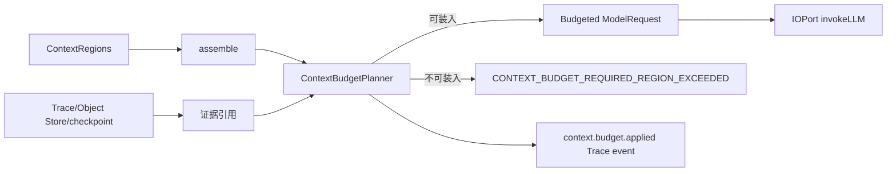

# 【runtime】全局运行时上下文预算

- Issue: #257
- 状态: Draft
- 最后更新: 2026-09-01

## 1. 背景

milkie 的 `ContextRegions` 已把系统提示、history、working memory、会话变量、当前用户输入和 scratchpad 分开，但 `assemble()` 会逐字拼接所有活跃区域。`summarize-on-overflow` 暂时按 session-persistent 保留；未声明 `resultStrategy` 的工具结果默认 verbatim。单个工具输出、累积 history 或 WorkingMemory 因而可挤掉控制信息，且调用前无法观测最终模型输入是否有界。

本设计落实 Issue #257 已批准 L1。它只管理模型可见投影；原始 I/O 仍由 Trace/Object Store 和 checkpoint 保存，也不把模型对话定义为领域状态。

## 2. 名词解释

本设计使用[名词表](../glossary.md)中的“上下文预算”“上下文区域”“模型投影”和“证据引用”。

**预算 token**是请求前的保守 UTF-8 字节上界估算值：每个字节按一个 token 计，因而不会低估支持字节编码的模型输入 token 数；Provider 返回的实际 input token 仅用于审计，不参与同次请求的准入决定。

## 3. 目标与非目标

- 目标：每次 `invokeLLM` 前，对 system、messages 与 tools 的完整请求实施一个确定性的全局预算。
- 目标：明确各上下文区域的优先级、最大份额、降级策略和可观测计量。
- 目标：当关键控制、当前用户输入或协议连续性无法装入预算时 fail closed，而非静默截断。
- 目标：未声明 `resultStrategy` 的工具结果默认成为有界模型投影，原始结果继续留在 Trace。
- 非目标：不自动生成 LLM 摘要，不修改 Trace 原始事件，不删除 checkpoint 内容。
- 非目标：不解释 Helix 或任何调用方的领域规范执行状态；领域状态应以调用方提供的结构化投影或证据引用进入上下文。
- 非目标：不承诺 Provider 端总上下文窗口或输出 token 配额；调用方仍须为输出保留 Provider 所需空间。

## 4. 能力

### 4.1 UI/UX

N/A。无页面变化。SDK、Trace 与 CLI 既有的运行诊断将显示每次模型调用的预算计量；必要内容装不下时在发起模型调用前返回稳定错误。

### 4.2 区域与默认份额

每个请求的总上界为 `contextBudget.maxInputTokens`，默认 `32768`。请求前估算覆盖 system 文本、每条消息的 role/content、tool schema 的 JSON 和固定协议字段。配置可按区域覆盖以下上限；未配置仍采用默认值。区域上限之和可以大于总额，最终仍以总额裁决。

| 区域 | 来源 | 默认上限 | 优先级 | 超额策略 |
|---|---|---:|---|---|
| `control` | header、持久/会话 skill、state instructions、tool schema | 8192 | 不可降级 | 必须完整装入，否则失败 |
| `currentTurn` | 当前用户输入及其不可分割分隔符 | 4096 | 不可降级 | 必须完整装入，否则失败 |
| `scratchpad` | 最近一组 assistant tool_use 与对应 tool_result | 8192 | 不可降级协议 | 优先缩减工具结果；仍超额则失败 |
| `workingMemory` | `wm.data` 与 `wm.log` | 4096 | 高 | 先丢最旧 log，随后改为带 hash 的省略通知 |
| `sessionContext` | session variables、turn variables | 2048 | 中 | 按键名字典序保留；省略项列入通知 |
| `history` | 已完成 user/assistant turn pair | 4096 | 低 | 从最旧完整 pair 开始丢弃 |
| `externalProjection` | delivered projections | 2048 | 低 | 按最旧投递开始降为摘要/引用通知 |

### 4.3 降级与证据

降级只作用于本次模型投影。每一项被缩减、丢弃或默认截断时都产生 `ContextProjectionNotice`：`region`、`sourceId`、`originalBudgetTokens`、`projectedBudgetTokens`、`reason`、`contentHash` 与可用时的 `evidenceRef`。工具结果的 `evidenceRef` 指向已有 `tool.responded` 事件/对象；WorkingMemory 指向本 run 的最近 checkpoint 或 `wm.mutated` snapshot；history 指向保留的 turn 区域 ID；外部投影指向 `sourceRunId`/`sourceContextId`。通知加入本次 Trace，而不伪造为用户消息。

默认工具结果策略改为 `{ kind: 'truncate', maxChars: 4096, tailHint: true }`；工具显式声明 `resultStrategy` 时保留其策略，但全局预算仍可对投影作最终缩减。错误结果默认与正常结果相同地有界，并保留 `is_error` 与错误码；不得为了保留错误而绕过总预算。

## 5. 思路与折衷

选择在 `assemble()` 后、`IOPort.invokeLLM()` 前执行纯预算裁决：这能计入完整 ModelRequest（包括工具 schema），同时保留 ContextRegions 的既有生命周期职责。裁决输入、配置和当前 epoch 相同则输出字节相同，因而录制和 replay 使用同一请求 hash。

放弃只给单个工具结果设置上限：history、working memory、系统 skill 和外部投影仍可越界。放弃只依赖 Provider 最大窗口：运行时无法说明何处占用预算，也无法在调用前保护关键协议。放弃调用 LLM 自动摘要：摘要本身额外消耗预算、不可稳定 replay，且不能替代结构化状态。使用保守 UTF-8 预算的代价是多语言文本可能比实际 token 更早触顶，换取无需 Provider tokenizer 即可 fail-closed 和确定性回放。

## 6. 架构

### 6.1 分层



`ContextBudgetPlanner` 是纯函数：输入为 assembled request、区域来源元数据、稳定配置和当前 Trace 引用；输出为预算后的 request 和计量。`AgentRuntime` 负责在每次 LLM 调用边界执行 planner、记录事件并将结果送给 IOPort。`ContextRegions` 仍负责存储和生命周期，不在运行时永久改写原始 region 内容。

### 6.2 主路径与失败路径

主路径：Runtime 刷新 transient regions，assemble 完整请求；planner 按区域上限生成候选投影，按优先级降级至总额以内，记录总量、分区用量和 notices；随后调用 IOPort。录制的请求就是预算后请求，Replay 直接匹配该请求并重演同一预算事件。

失败路径：若 `control`、当前用户输入或一组未分离的 tool protocol 在自身上限或总额内不能完整保留，planner 在任何模型网络调用前抛出 `CONTEXT_BUDGET_REQUIRED_REGION_EXCEEDED`。错误 body 只含稳定的 region 名称、上限、估算量与 reason，不含被省略文本。非法配置（非正整数、未知区域、区域 cap 超过总额）在 Runtime 初始化前报 `CONTEXT_BUDGET_INVALID_CONFIG`。

## 7. 模块

| 模块 | 职责 |
|---|---|
| `src/context/Region.ts` / section schema | 为现有区域提供稳定的预算归属；不改变显示顺序 |
| `src/context/budget.ts` | 保守估算、planner、通知、稳定错误和配置校验 |
| `src/context/assemble.ts` | 产出带区域来源的 assembled parts，供 planner 逐项降级 |
| `AgentRuntime` | 加载配置、执行 planner、默认工具投影、写 Trace 计量 |
| Trace/IOPort | 记录预算后的 LLM 请求与 `context.budget.applied`；保存原始 I/O |
| checkpoint/WorkingMemory | 提供可追踪的原始快照，不因模型投影而删除 |

## 8. API/CLI

在 `AgentConfig` 增加可选公开配置：

```ts
interface ContextBudgetConfig {
  maxInputTokens?: number // 默认 32768，正整数
  regionCaps?: Partial<Record<ContextBudgetRegion, number>>
}

type ContextBudgetRegion =
  | 'control'
  | 'currentTurn'
  | 'scratchpad'
  | 'workingMemory'
  | 'sessionContext'
  | 'history'
  | 'externalProjection'
```

配置缺省即启用默认预算，避免旧 agent 继续无界。任何显式 `resultStrategy` 仍按既有语义处理；未声明时的新默认如 §4.3。新增 Trace 事件 `context.budget.applied`，其 payload 至少包含 `totalLimit`、`totalEstimated`、每个区域的 `candidateEstimated/projectedEstimated`、`notices` 和 `contextEpoch`。不新增 CLI 命令；现有 inspect/trace 消费者可显示该事件。

## 9. 边界

- 所有计算采用 UTF-8 字节数，禁止依赖本机 locale 或 Provider tokenizer。
- history 只能整对删除，不能留下孤立 assistant/tool 消息。
- scratchpad 中仍存活的 tool_use 与 tool_result 必须成组；工具结果可缩减，但调用 ID、`is_error`、错误码和截断通知必须保留。
- planner 不修改 ContextRegions、WorkingMemory、Trace 原始数据或 checkpoint；失败请求不产生模型调用。
- 降级通知不包含原始内容、密钥、stack 或工具参数；`contentHash` 用既有 canonical hash。
- Replay 只消费录制的 budgeted request/event，不按本机配置重新裁剪旧 run；新 live run 必须记录有效配置投影。
- action state 不走 LLM request 组装，保留现有 action 输入语义；本 Issue 不把它伪装为受预算的模型上下文。

## 10. 迁移/兼容/回滚

- 新 run 默认启用预算并写 `context.budget.applied`；旧 Trace 缺该事件时按旧 request replay，不在读取时补裁剪。
- 行为变化：没有声明 `resultStrategy` 的工具结果从 verbatim 改为 4096 字符有界投影；完整原始结果仍位于既有 tool event/Object Store。
- checkpoint schema 不变；预算配置不写进业务 WorkingMemory。
- 回滚代码会停止对新 live run 应用预算，但不会删除 Trace、对象或 checkpoint；回放已录制的新 run 仍按其 budgeted request 严格匹配。

## 11. 测试计划

- E2E（S1）：构造 history、WorkingMemory、skills、外部投影和 scratchpad 总量超过 32768 的多轮 fixture；断言每次录制 request 不超过预算、`context.budget.applied` 可解释全部缩减，严格 replay 通过。
- E2E（S2）：分别让大工具输出、长 history、累积 WorkingMemory 和外部投影触顶；断言四类均有有界模型投影，Trace/checkpoint 可由 evidenceRef 找回原始内容，严格 replay 通过。
- E2E（S3）：工具无 `resultStrategy` 返回超过 4096 字符的正常和错误结果；断言模型投影有界、调用 ID/错误语义完整、原始 `tool.responded` 未丢失。
- Integration：测试跨区域竞争、history 成对丢弃、scratchpad 协议完整、默认/显式 tool strategy 叠加、预算 Trace 与 request hash 一致。
- Unit：配置校验、UTF-8 估算、区域归属、稳定降级顺序、notice 脱敏、必需区域 fail-closed 和 replay 兼容分支。

## 12. 开放问题

- 各 Provider 的真实上下文窗口和输出预留由模型连接契约决定；本 Issue 只固定输入上界，不自动推导 Provider 限制。
- 调用方如需保留比 working-memory cap 更大的领域状态，应提供结构化状态与证据引用；是否提供通用对象化 helper 留给后续 Issue。

## 13. 关联

- Issue #257
- Helix #42、#43
- `docs/design/244-budget-stop-reason.md`
- `docs/superpowers/specs/2026-05-25-context-region-substrate-design.md`
