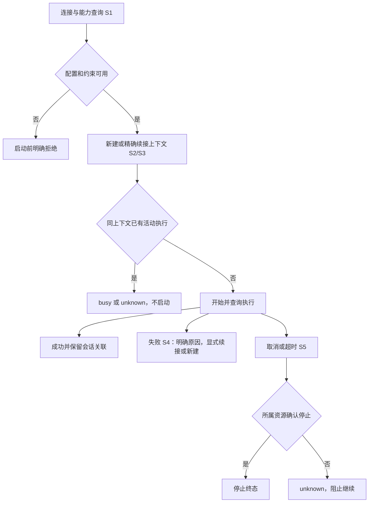

# 统一入口执行 agent CLI 并跨进程续接会话

- Issue：[#263](https://github.com/xforce-io/milkie/issues/263)
- 版本：v1；产品依据为本会话用户同意调整后的 Issue，并要求开发测试后 PR。
- L1：write，概要写入 Issue 设计摘要；L2：write，本文件。遵循项目 AGENTS 的单文件结构；不迁移项目设计规范。
- 所有验收仍以 Issue S1–S5 为准。此文档不是验证通过证据。

## 1 背景

现有 `src/connection/parse.ts` 解析连接，`assemble.ts` 只装配 API gateway；`src/runtime/Milkie.ts` 的 resume 恢复 milkie 快照。宿主仍缺少外部 CLI 执行和精确续接入口。

L1 概要：提供 Node SDK 的上下文新建、执行、查询、等待和取消；两种 CLI 共享契约。首期适配 Grok 和 Pi，Codex 保留配置但未适配，Claude Code 不提供执行支持。放弃把 CLI 包装成逐 token 的模型 gateway；外部 CLI 自己拥有工具循环和原生会话。没有页面、HTTP 或新增 milkie CLI 命令。成功可读执行结果和关联，空查询返回不存在，配置/约束错误在启动前拒绝，执行失败返回结构化状态。需要 L2，因为涉及公共接口、持久化、跨进程互斥和停止保证。

## 2 名词解释

见 [名词表](../glossary.md) 的执行上下文、原生会话、执行记录。`resume(checkpointId)` 的含义不变。

## 3 目标与非目标

同机同用户保存 milkie 数据和原生会话后跨宿主重启续接；不转运 transcript，不按最近会话猜测。只交付 SDK。非目标：跨机器迁移、业务编排、自动重放、代码恢复、Claude Code 适配、通用插件系统和文件系统沙箱。

## 4 能力

公共入口 `ExecutionClient`：`capabilities`、`createContext`、`start`、`query`、`wait`、`cancel`。客户端持有连接配置，宿主保存 contextId/runId；原生会话标识只作运行关联。

开始：传入连接、私有数据目录、工作目录，新建上下文后 start；立即获得 runId，query 可观察 starting/running，再读取 succeeded/failed/cancelled/timed_out/unknown。续接：重建客户端，使用旧 contextId；每次产生新 runId，原生会话不变。同上下文并发请求固定拒绝 busy；不同上下文独立。

最低约束：工作目录、只读工具权限、执行时限。未知约束启动前拒绝；只读不得靠 prompt。Grok 使用 CLI 权限控制及移除非只读工具；Pi 禁用扩展和非只读工具。能力声明仅说明适配范围，不保证当前登录有效；认证失败通过实际执行返回。

取消：写入持久取消请求；监督进程核对继承本轮标识的进程及已观察的后代（含脱离原进程组的后代），TERM 后 KILL，10 秒内不能证实停止则 unknown。未知保持上下文占用，禁止后续请求重放；宿主可显式新建。

### 4.1 UI/UX

N/A：没有页面。SDK 可观察主路径如下，覆盖 S1–S5；具体参数见 §8。

## 5 思路与折衷

使用一个短生命周期监督进程拥有每轮 CLI 子进程、时限和停止动作。这样宿主重启后可通过同一份记录查询/请求取消，无需拿可能复用的 PID 直接杀进程。放弃跨进程对裸 PID 发信号。进程监督不是后台调度；不保证宿主退出后任务持续执行。

存储使用私有目录、原子 rename 和排他创建的上下文占用文件；无需新增数据库依赖。未知记录不自动回收：宁可明确阻止续接，也不假定旧请求未产生副作用。原生会话由各 CLI 存储，milkie 仅保存精确关联。CLI 的配置目录与会话目录改由 [#265](https://github.com/xforce-io/milkie/issues/265) 在创建执行上下文时显式指定，不再从宿主 HOME 推导。

## 6 架构

连接解析 → SDK 校验与持久化 → 每轮监督进程 → Grok/Pi 或既有 API gateway。`processes.ts` 用仅存在于子进程环境的随机执行标识和已观察的父子关系识别资源，`ps` 快照只在内存解析，不保存命令或环境；PID 与启动时间一并核对。监督进程只把结构化结果落盘，不保存 CLI stdout/stderr 或完整 transcript。API 秘密通过 IPC 传递，不写执行记录。

主路径：排他占用上下文，写 starting 记录，启动监督进程，通过 IPC 交付请求；监督进程更新 running/心跳，启动子进程；解析 CLI 事件，确认原生会话与停止，再写终态并释放占用。

失败路径：启动失败为 failed；会话缺失禁止静默新建；认证失败为 auth_failed；异常退出保留 failed 或 unknown。缺心跳/无法确认监督状态为 unknown，仍保留占用。cancel 只写目标 runId 的请求，监督进程验证后停止属于本轮的资源；查询失败或到期仍有资源存活则 unknown。

## 7 模块

`execution/types` 定义 SDK 契约，`store` 管持久记录与互斥，`adapters` 管精确命令与事件归一化，`processes` 管资源发现及停止核对，`worker` 管执行生命周期，`ExecutionClient` 管宿主入口。既有 Milkie 和 checkpoint 不变。

## 8 API/CLI

CLI N/A：无新增公开命令。SDK 输入的 contextId/runId 必须是 milkie 生成 UUID，禁止路径片段。工作目录必须存在并固定为 realpath；续接不能换 runtime、模型或工作目录。

`constraints`：`toolPolicy: read-only|standard`（默认 read-only），`timeoutMs`（默认 120000，上限 3600000）。未声明字段拒绝。standard 是明确授权原生 CLI 的工具读写与命令执行；Grok 本轮使用 bypassPermissions 避免非交互确认，Pi 只启用指定内置工具。默认只读不启用该授权；从 standard 续接到只读仍须拒绝写入。

结果含 runId、contextId、nativeSessionId、status、固定错误码、开始/结束时间、停止确认、资源 PID/启动时间及最终文本。能力 supported 表示适配范围，availability=unchecked 明确安装与登录尚未实际验证。wait 的等待时间耗尽只返回最新已知状态，不取消执行；cancel 核对超过时限返回 unknown。最终文本属于显式结果，不进入普通日志；原始诊断、凭据、transcript 不进入持久运行记录。API 单次调用沿用现有 gateway，不承诺 CLI 原生会话语义。

## 9 边界

同机可信用户、POSIX 进程信息访问；不支持的平台启动前拒绝。存储目录应由应用拥有且权限 0700，文件 0600。已有会话必须精确存在；Pi 的会话文件缺失/损坏不得交给 CLI 自动新建。Grok 精确 UUID 恢复并核对返回 ID。不自动重试网络/未知错误。

## 10 迁移/兼容/回滚

新增 opt-in SDK；旧 API/parse/resume 行为保持。Pi 新增到 runtime 枚举及 schema/fixtures；claude-code 和 codex 配置枚举继续解析，执行明确拒绝。存储 version=1；未知版本拒绝。回滚停用新 SDK，不删除原生会话。

## 11 测试计划

| 验收 ID / Issue | 前置与入口操作 | 可判定结果与禁止行为 | 证据/执行/属性 |
|---|---|---|---|
| S1.A1 / S1 | SDK 配置真实 API、Grok、Pi，各执行查询；claude-code 执行 | 三条成功，一条启动前拒绝；无宿主 CLI 分支 | 实际结果与 runId；真实服务必需 |
| S2.A1 / S2 | 每 CLI 新建并记随机标记，宿主退出再续接两轮 | 3 轮同原生会话、不同 runId，无首轮消息重发 | 子进程退出及输入/结果断言；真实 CLI 必需 |
| S3.A1 / S3 | 同目录双上下文交替续接，显式新建 | 标记不串、原生 ID 独立 | SDK 结果；真实 CLI 必需 |
| S3.A2 / S3 | 双宿主同时续接同上下文 | 一方 busy，同上下文最多一活动执行 | 并发进程结果；Integration 与真实路径必需 |
| S4.A1 / S4 | 会话缺失、认证失败、中断/未知；宿主强杀后核对 | 固定错误、无静默替换/重放；未知阻止继续 | 故障注入及所属执行核对；每 CLI 必需 |
| S5.A1 / S5 | 指定 cwd、只读写入尝试、超时、取消、未知约束 | cwd 一致、写入被阻止、超时停、取消 ≤10秒确认子进程停止、未知约束启动前拒绝 | 目录/进程/结果证据；每 CLI 真实验证必需 |

E2E 使用公开 SDK 及真实 CLI/API；Integration 用受控子进程覆盖协议、跨进程占用、异常和取消；Unit 覆盖参数构造、事件解析、配置和存储验证。Mock 不能证明原生会话或供应商登录行为。功能地图主文件为 `.agents/skills/verify-milkie/features/16-agent-cli-execution.md`，S1–S5 均映射至该文件。

## 12 开放问题

- 资源核对覆盖继承本轮标识或被观察到的后代，包含 setsid 脱离组的任务；这不是对抗性内核进程隔离，不能约束恶意同时清除标识、逃离父子关系的任务。要求内核隔离等未声明约束时启动前拒绝。

- 适配实测版本为 Grok 1.0.41、Pi 0.85.1；CLI 升级后须重跑真实验收，不能从枚举外推兼容。
- 发布证据按候选 SHA 记录于 PR 的 S1–S5 表；本文不记录动态 pass 状态。

## 13 关联

[#251](https://github.com/xforce-io/milkie/issues/251)、[Atelier #1](https://github.com/xforce-io/atelier/issues/1)、[连接设计](251-model-connection-contract.md)。
