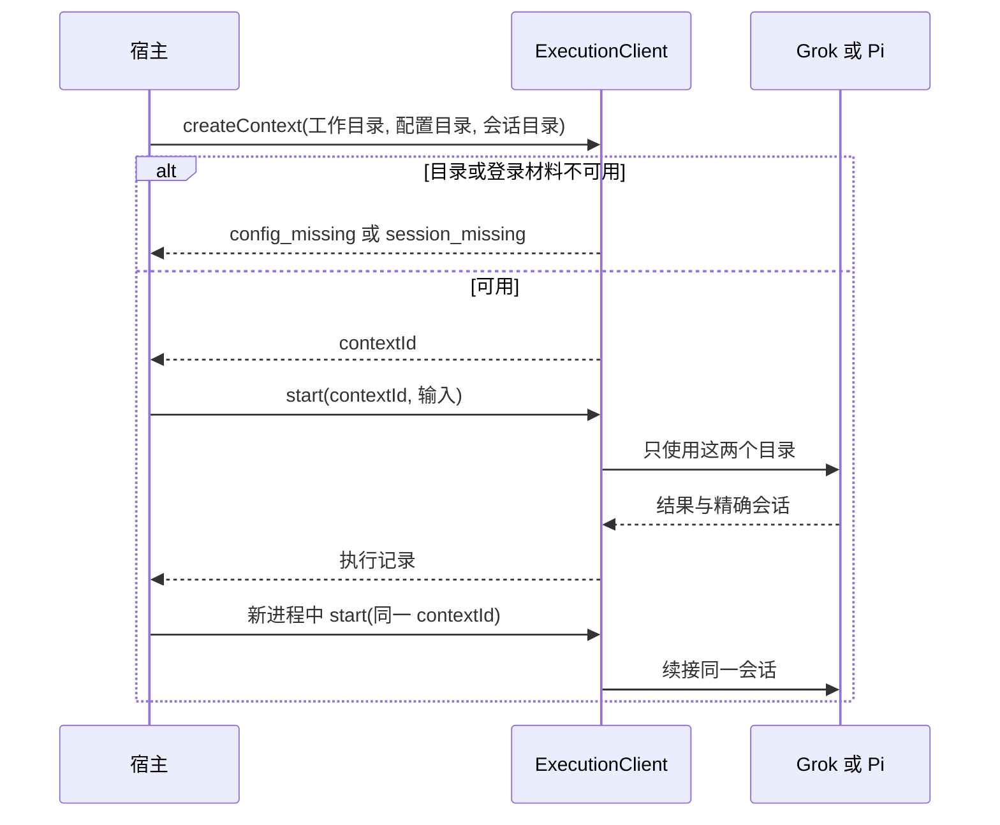
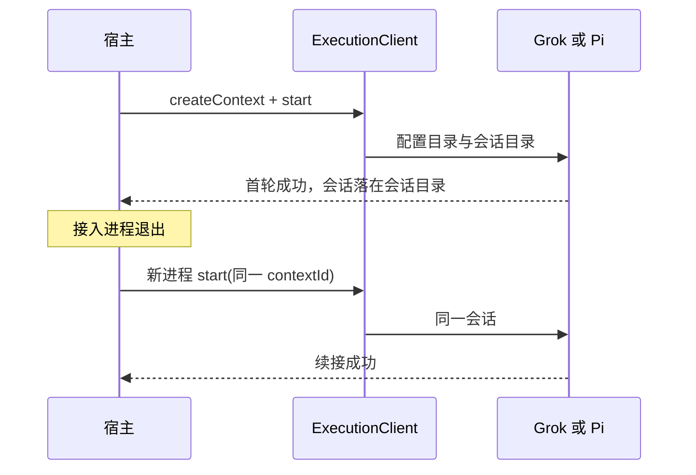
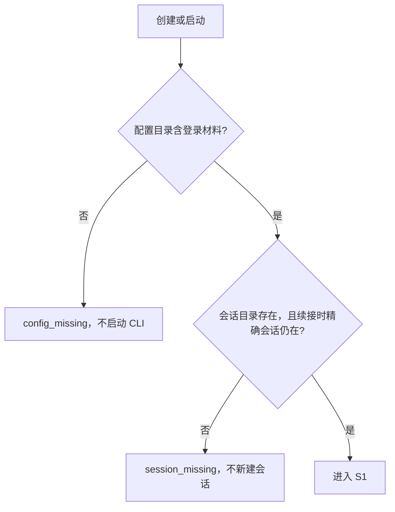

# 专用配置与会话存储

| 项 | 值 |
|---|---|
| Issue | [#265](https://github.com/xforce-io/milkie/issues/265) |
| 状态 | Draft |
| 版本 | v1 |
| 确认来源 | Issue #265 正文（xforce-io，2026-10-02）已写明 Stories、范围与验收；[#264](https://github.com/xforce-io/milkie/issues/264) 的拆分评论把原 S4 的存储部分定为第一张子票。本文整理该决定，不另增票面之外的产品取舍 |
| 关联 | L2：[technical.md](technical.md) v1；名词见 [glossary](../../glossary.md) |

## 1. 背景与目标

宿主要通过 milkie 执行 Grok 或 Pi，并让这次执行只使用宿主事先准备好的配置/登录目录和会话目录。配置或会话缺失时，启动前给出可区分的失败，不改用宿主 HOME 里的 CLI 配置，不连接共享 leader，不接上别的会话，也不静默新建会话。

## 2. 范围与非目标

前置：未发布的 #263 执行、查询与取消接口。本票只加固其中的 CLI 存储。

做：执行上下文级别的两个显式目录；Grok 与 Pi；目录或登录缺失、续接时会话缺失的明确失败；诊断不包含凭据或完整原生会话；至少一条成功续接和一条缺失失败在 Linux 容器内完成，并在该容器路径上确认停止信号能结束所属 CLI。

不做：容器、网络、挂载和凭据复制（宿主负责把登录材料放进配置目录）；宿主工具（#266）；续接时重装工具（#267）；API 传输的原生会话。

## 3. 用户与产品概念

角色是其它系统（Atelier）。它已是 #263 的执行调用方。

| 概念 | 含义 |
|---|---|
| 执行上下文 | 一次可续接的 CLI 使用关系，固定连接、工作目录、专用配置目录和专用会话目录 |
| 专用配置目录 | 宿主准备的该 CLI 配置与登录材料所在目录。milkie 不复制凭据 |
| 专用会话目录 | 宿主准备的原生会话所在目录。首轮可以在其中创建本上下文的会话；续接只认已经关联的那一份 |

## 4. 产品交互总览

对应 S1、S2。异常分支见第 6 节。

## 5. 信息架构与入口

入口只有 Node/TypeScript SDK 的 `ExecutionClient.createContext`。创建 CLI 执行上下文时必须同时给出专用配置目录和专用会话目录。之后只用 `contextId` 续接，不能改指到另一对目录。

`getContext` 返回这两个目录的绝对路径，供宿主核对，不返回登录材料或会话正文。没有新的 HTTP、CLI 或页面。API 传输仍只接收工作目录；对它传入存储目录会在创建时拒绝。

## 6. Stories 与完整交互

### S1. 使用宿主指定的专用存储执行与续接

角色：其它系统。前置：两个目录已存在；配置目录里已有该 CLI 的登录材料；会话目录为空或只含本上下文将要使用的会话。

操作：创建上下文，执行一轮，接入进程退出后用同一 `contextId` 再执行一轮。

成功终点：两轮都只读写这两个目录；原生会话标识不变；没有读取宿主 HOME 下的 CLI 配置，没有连接共享 leader，没有接上其它会话。

本图覆盖 S1.A1、S1.A2。容器内的同一路径另覆盖 S1.A3。

### S2. 存储缺失时明确失败

角色：其它系统。

操作：配置目录不存在、不是目录，或其中没有登录材料时创建或启动；首轮之后删除本上下文的会话文件再续接；会话目录不存在时创建或启动。

成功终点：启动前返回 `config_missing` 或 `session_missing`。不自动发现其它登录或最近会话，不静默新建会话。错误文本只有错误码，不含凭据或会话正文。

本图覆盖 S2.A1–S2.A5。单步且无分支的子路径不另画图：容器失败路径与上图相同，只是发生在 Linux 容器内。

## 7. 产品规则与边界

- R1：CLI 执行上下文在创建时绑定两个目录。续接沿用这份绑定，不接受另一对路径。
- R2：登录只来自专用配置目录中的登录材料。宿主 HOME 下的 CLI 配置、共享 leader，以及 milkie 从宿主进程继承到的供应商密钥，都不能充当登录。
- R3：配置或登录不可用是 `config_missing`；会话目录不可用，或续接时精确会话不在，是 `session_missing`。二者都在 CLI 进程启动前返回。
- R4：首轮可以在专用会话目录里创建本上下文的会话。续接时会话不在，则失败，不新建、不改接最近会话。
- R5：执行记录和错误文本不包含凭据、供应商密钥或完整原生会话。
- R6：API 传输不接收这对目录，也不获得 CLI 会话语义。
- R7：Grok 与 Pi 的目录形态不同，由 milkie 吸收。宿主始终只提供两个目录。

## 8. 验收与效果验证

设计版本 v1。必需验收如下。

| ID / 关联 | 前置 | 入口与操作 | 可判定结果 | 异常与禁止结果 | 证据 / 执行 / 属性 |
|---|---|---|---|---|---|
| S1.A1 / S1 / R1 R2 R4 | 本机 Grok 1.0.41；宿主已把登录材料放入临时配置目录，并准备空的会话目录 | SDK 创建上下文并执行一轮，进程退出后用同一 contextId 再执行一轮 | 两轮成功；原生会话标识相同；会话文件只出现在指定会话目录；子进程的配置位置是指定配置目录 | 不读取宿主 HOME 下的 `.grok`，不使用 `~/.grok/leader.sock`，不接上其它会话 | 两轮执行记录、会话文件位置、子进程环境与参数；真实 CLI；必需 |
| S1.A2 / S1 / R1 R2 R4 | 本机 Pi 0.85.1；同样准备两个目录 | 与 S1.A1 相同 | 与 S1.A1 相同，配置位置按 Pi 的配置目录解释 | 不读取宿主 HOME 下的 `.pi`，不接上其它会话 | 同上；必需 |
| S1.A3 / S1 / R2 | Linux 容器内具备可用的 SDK 与至少一种已安装 CLI；容器不挂载宿主 HOME | 在容器内完成 S1 的一轮执行、进程重启后续接，并请求取消一次仍在运行的执行 | 续接成功且会话仍在挂载的会话目录；取消后所属 CLI 已停止 | 容器内不存在宿主 HOME 的 CLI 配置；未停止不计为取消成功 | 容器内执行记录与进程状态；真实 CLI；必需。至少一条，不要求两种 CLI 都在容器内重复 |
| S2.A1 / S2 / R3 R5 | Grok；配置目录缺失或没有登录材料 | 创建或启动 | 启动前 `config_missing` | 不启动 CLI，不改用宿主登录；错误与执行记录无凭据或会话正文 | SDK 异常文本；可在 CLI 启动前确定性断言；必需 |
| S2.A2 / S2 / R3 R4 R5 | Grok；已有可续接上下文，随后删除精确会话 | 用原 contextId 启动 | 启动前 `session_missing`，原路径上没有新会话文件 | 不新建会话，不选择最近会话 | 启动异常与目录列表；必需 |
| S2.A3 / S2 / R3 R5 | Pi；配置缺失 | 同 S2.A1 | `config_missing` | 同 S2.A1 | 同 S2.A1；必需 |
| S2.A4 / S2 / R3 R4 R5 | Pi；会话缺失 | 同 S2.A2 | `session_missing` | 同 S2.A2 | 同 S2.A2；必需 |
| S2.A5 / S2 / R3 | Linux 容器；不挂载宿主 HOME | 在容器内触发一次配置缺失或会话缺失 | 启动前返回对应错误码 | 不静默新建，诊断无凭据或完整会话 | 容器内 SDK 输出；必需。至少一条 |

## 9. 折衷与开放问题

已决：两种目录都在创建时给定；缺失在启动前失败；登录材料由宿主放入配置目录，milkie 不复制。Grok 没有独立的会话目录参数，milkie 仍向宿主暴露两个目录，并自己把 CLI 的会话位置指到会话目录。

无未决产品问题。容器镜像如何安装 CLI 属于验证环境，不改变上述行为。
