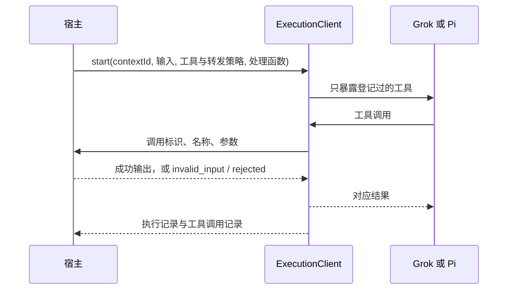

# CLI 宿主工具

| 项 | 值 |
|---|---|
| Issue | [#266](https://github.com/xforce-io/milkie/issues/266) |
| 状态 | Draft |
| 版本 | v1 |
| 确认来源 | Issue #266 正文（xforce-io）已写明 Stories、范围与验收；[#264](https://github.com/xforce-io/milkie/issues/264) 的拆分评论把宿主工具定为第二张子票。本文整理该决定。未指定转发策略时采用串行，因为票面要求宿主可以要求串行，以保证有副作用的工具保持顺序 |
| 关联 | L2：[technical.md](technical.md) v1；名词见 [glossary](../../glossary.md) |

## 1. 背景与目标

Atelier 需要让 CLI 上的业务动作走宿主自己的身份、权限和持久化检查。宿主登记工具的名称、说明和输入约束，开始一次真实执行后接收调用、按自己的规则处理并返回结果。宿主不组装 CLI 命令，也不解析原始事件。

## 2. 范围与非目标

前置：#263 的执行接口和 #265 的专用配置目录、专用会话目录。

做：Grok 与 Pi 的宿主工具登记、稳定调用标识、参数失败与宿主拒绝、只允许登记过的能力、Grok 启动前核对实际加载结果、带宿主工具的执行不脱离宿主、可声明的转发策略。

不做：续接时重装宿主工具和处理未应答调用（#267）；Atelier 的业务授权和效果账本；自研跨语言 RPC；把 milkie 做成通用 MCP 宿主。

## 3. 用户与产品概念

角色是其它系统（Atelier）。它已经是执行调用方。

| 概念 | 含义 |
|---|---|
| 宿主工具 | 宿主登记后自己执行的工具 |
| 工具调用记录 | 一次调用的稳定标识，关联执行和上下文 |
| 转发策略 | 同一轮多次调用交给宿主的方式。默认串行 |

## 4. 产品交互总览

## 5. 信息架构与入口

入口仍是 `ExecutionClient.start`。工具和转发策略放在约束里，处理函数单独传入。`toolCall(callId)` 读取工具调用记录。`capabilities()` 声明能否使用宿主工具、该 CLI 是否提供原生调用标识，以及可选的转发策略。没有新的 HTTP、CLI 或页面。API 传输不能登记宿主工具。

## 6. Stories 与完整交互

### S1. 宿主登记并处理工具

角色：其它系统。前置：CLI 执行上下文已绑定专用配置目录和专用会话目录。

操作：登记工具的名称、说明和输入约束，启动真实执行。对一次合法调用返回输出；对一次调用返回拒绝，或让参数不匹配。

成功终点：宿主收到的调用带有 milkie 生成的稳定标识，并关联这次执行和上下文。Pi 的记录含原生调用标识，Grok 的记录不含。参数失败与宿主拒绝都不是成功。宿主没有组装命令或解析原始事件。

### S2. 只有登记过的能力生效

操作：用提示、别名或工作目录里既有的项目配置试图启用终端、读文件或额外 MCP / 扩展。再传入与宿主工具冲突的原生工具策略。

成功终点：越权动作没有效果。宿主工具模式不会退回 `standard` 或 `read-only`。Grok 在模型启动前发现加载结果与登记不一致则失败。不支持的约束在启动前拒绝。

### S3. 宿主消失时执行不能继续

操作：执行已经发出宿主工具调用、宿主尚未应答时，宿主进程被杀死。

成功终点：CLI 进程结束，执行状态是 `unknown`，未应答的调用记录仍在。上下文保持占用，不能把这次执行再启动一遍。

### S4. 转发策略

操作：同一轮里让 CLI 调用两个宿主工具，策略为串行。

成功终点：宿主看到的处理顺序与 CLI 提交顺序一致，两次处理不重叠。

## 7. 产品规则与边界

- R1：宿主提供名称、说明和输入约束。milkie 组装 CLI 命令并解析事件，宿主不接触这两件事。
- R2：每次调用有 milkie 生成的调用标识，关联 `runId` 与 `contextId`。原生调用标识只在该 CLI 的能力声明它可得时记录。
- R3：`invalid_input` 与 `rejected` 都不是成功。执行本身仍可以成功结束。
- R4：出现宿主工具时不能再带 `toolPolicy`。没有退回 `standard` 或 `read-only`。
- R5：提示、别名和项目里已有配置不能启用未登记能力。Grok 关闭导入、托管配置、共享 leader 和 MCP 元工具；启动前核对实际 MCP server 与导入状态，不一致则 `policy_mismatch`，模型不会开始。
- R6：带宿主工具的执行不脱离宿主。宿主进程消失后 CLI 被终止，状态为 `unknown`，未应答调用保留。
- R7：未指定转发策略时为串行。宿主可以显式要求 `serial` 或 `parallel`。
- R8：不支持的约束在返回执行标识之前拒绝。

## 8. 验收与效果验证

设计版本 v1。成功路径必须用真实 Grok 与 Pi。协议、参数失败和启动前拒绝可以用确定性夹具，并标明它不代替成功验收。

| ID / 关联 | 前置 | 入口与操作 | 可判定结果 | 异常与禁止结果 | 证据 / 执行 / 属性 |
|---|---|---|---|---|---|
| S1.A1 / S1 / R1 R2 R3 | 本机 Grok；专用目录已备好登录材料 | 登记 `note`，真实执行中处理一次合法调用 | 执行成功；调用记录为成功，含稳定 `callId`、`runId`、`contextId`；没有 `nativeCallId` | 宿主不解析原始事件；记录里没有凭据 | 真实 CLI；必需 |
| S1.A2 / S1 / R3 | 同上 | 处理函数返回拒绝 | 该调用状态为 `rejected`，不是成功 | 不把拒绝记成成功输出 | 真实 CLI；必需 |
| S1.A3 / S1 / R1 R2 R3 | 本机 Pi | 同 S1.A1 | 同 S1.A1，且记录含非空 `nativeCallId` | 同 S1.A1 | 真实 CLI；必需 |
| S1.A4 / S1 / R3 | 本机 Pi | 同 S1.A2 | 调用状态为 `rejected` | 不把拒绝记成成功 | 真实 CLI；必需 |
| S1.A5 / S1 / R3 | 确定性夹具，不是真实模型 | 提交不符合 schema 的参数 | 调用状态为 `invalid_input`，处理函数未被调用 | 不记为成功；不代替 S1.A1–A4 | 夹具；必需，只证明可区分 |
| S2.A1 / S2 / R4 R5 | 本机 Grok；工作目录放入额外 MCP 配置，另两轮分别要求执行命令和读取密钥文件 | 三种未登记能力各一次；另一次同时传入 `toolPolicy` | 额外 MCP 在模型启动前 `policy_mismatch`；命令文件与密钥都没有出现在结果或调用记录中；冲突约束在启动前抛出 | 不退回 standard；不一致时模型不开始 | 真实 CLI；必需 |
| S2.A2 / S2 / R4 R5 | 本机 Pi；工作目录放入会写文件的扩展 | 命令、读文件、自动加载扩展三种越权；另一次冲突约束 | 扩展文件没有被写；命令与密钥没有效果；冲突约束在启动前抛出 | 不加载未指定扩展；`--tools` 只有登记名称 | 真实 CLI；必需 |
| S3.A1 / S3 / R6 | 本机 Grok；调用已经记录且宿主尚未应答 | 杀死宿主进程 | 状态为 `unknown`；CLI 已退出；调用仍是 `pending`；再次 start 为 `context_busy` | CLI 不在无人应答时继续运行 | 真实 CLI；必需 |
| S3.A2 / S3 / R6 | 本机 Pi | 同 S3.A1 | 同 S3.A1 | 同 S3.A1 | 真实 CLI；必需 |
| S4.A1 / S4 / R7 | 本机 Grok | 同一轮调用 `alpha` 与 `beta`，默认串行 | 两次处理都不重叠，且都到达宿主 | 不并行穿插 | 真实 CLI；必需 |
| S4.A2 / S4 / R7 | 本机 Pi | 同 S4.A1 | 同 S4.A1 | 同 S4.A1 | 真实 CLI；必需 |

## 9. 折衷与开放问题

已决：未指定转发策略时用串行。Grok 不提供可核对的模型工具调用标识，能力里 `nativeCallId` 为 false，调用记录不填该字段。输入约束使用 JSON Schema 的对象子集；未写 `additionalProperties` 时视为 false。

无未决产品问题。#267 的续接重装不在本票。
