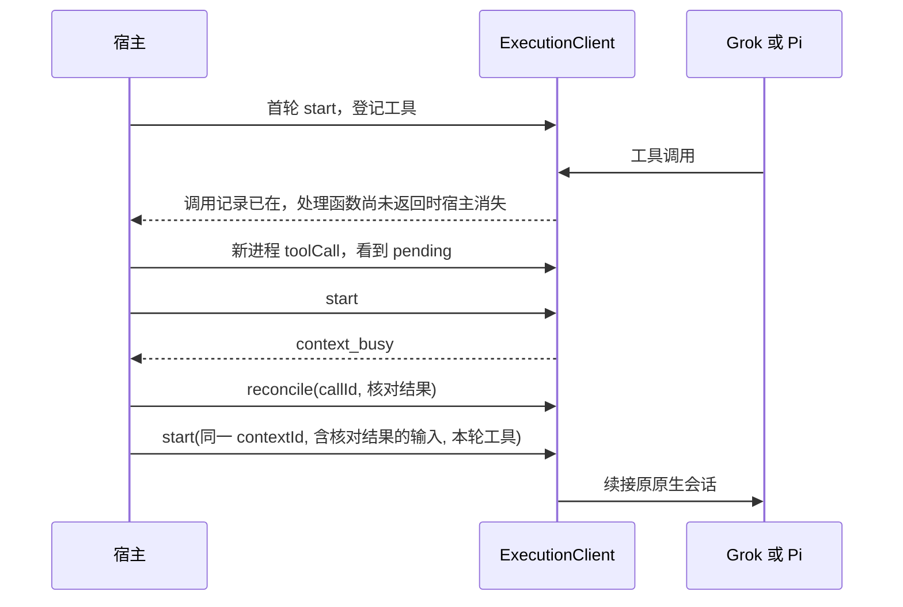
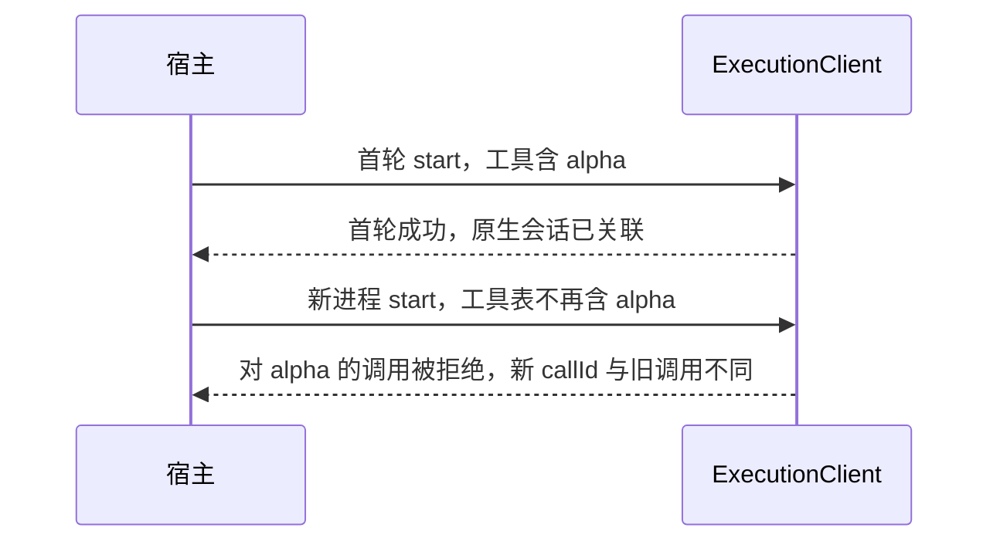

# 续接宿主工具并核对未回复调用

| 项 | 值 |
|---|---|
| Issue | [#267](https://github.com/xforce-io/milkie/issues/267) |
| 状态 | Draft |
| 版本 | v1 |
| 确认来源 | Issue #267 正文已写明 Stories、范围与验收。本文整理该决定，不另改入口或验收 |
| 关联 | L2：[technical.md](technical.md) v1；前置为 [#266](https://github.com/xforce-io/milkie/issues/266) 的 [宿主工具](../266-agent-cli-host-tools/product.md) v1；名词见 [glossary](../../glossary.md) |

## 1. 背景与目标

带宿主工具的执行会跨多轮续接同一原生会话。下一轮可能收紧工具范围，历史里的旧工具仍可能被再次调用。宿主已经做完操作、但结果没有回到 CLI 时，直接续接会让模型把操作当成未成功并再做一次。

## 2. 范围与非目标

前置：#263 的执行上下文与原生会话续接，#265 的专用目录，#266 的宿主工具与调用记录。

做：续接时按本轮登记重新装配工具，并在 milkie 入口拒绝已撤销工具；未送达的调用保持可查询；未核对前拒绝新执行；核对后由宿主把结果写进下一轮输入并续接同一原生会话。

不做：向 Grok 或 Pi 的原会话补写工具结果；承诺 CLI 本身不重放；业务授权和效果去重。

## 3. 用户与产品概念

角色仍是其它系统（Atelier）。它已经持有执行上下文。

| 概念 | 含义 |
|---|---|
| 核对 | 宿主确认一次未送达调用的实际效果，并解除它对后续执行的阻塞 |
| 未核对调用 | 已持久记录、结果尚未回到 CLI、宿主也尚未核对的调用。查询状态为 `pending` |

## 4. 产品交互总览

S1 不经过宿主消失：首轮成功结束后，新进程用更少的工具再次 `start`。

## 5. 信息架构与入口

入口仍是 `ExecutionClient`。没有新的 HTTP、CLI 或页面。

- `start(contextId, input, constraints, handler)` 续接时使用本轮的 `constraints.tools`。已撤销的工具不在这张表里。
- `toolCall(callId)` 读取调用记录。`pending` 表示状态不确定，并带有工具名和参数。
- `reconcile(callId, output)` 记录宿主核对后的结果。`output` 由宿主同时写进下一轮 `start` 的输入。milkie 不改写该输入，也不把结果补进原会话。

重新进入时使用同一 `dataDir` 和同一连接新建客户端，沿用原来的 `contextId`。`createContext` 仍表示新开上下文。

## 6. Stories 与完整交互

### S1. 续接时收紧工具范围

角色：其它系统。前置：首轮已经使用工具，原生会话和 milkie 关联都还在。

操作：结束首轮并退出接入进程。用原 `contextId` 开始下一轮，工具表里去掉一部分工具。

成功终点：续接的仍是原来的原生会话。对已撤销工具的调用在 milkie 入口被拒绝，不依赖模型自己不调用。新调用的 `callId` 与旧调用不同。

异常：工具表与 `toolPolicy` 同时出现仍在启动前拒绝。不新建会话来躲开撤销。

### S2. 工具回复丢失后的核对与阻塞

角色：其它系统。前置：注入“宿主已提交操作、工具结果未送达”。

操作：重建宿主，按原 `callId` 查询；在核对前尝试 `start`；`reconcile` 后把核对结果作为下一轮输入续接。

成功终点：调用在交给宿主前已经持久记录。查询得到工具名、参数和 `pending`。存在未核对调用时，新执行被拒绝，错误码为 `context_busy`。核对后续接同一原生会话，宿主不再重复原副作用。不静默新建会话。

异常：对不是 `pending` 的调用做 `reconcile`，或执行仍在进行时核对，都在改变记录前拒绝。空的核对结果同样拒绝。

## 7. 产品规则与边界

- R1：续接的授权表只有本轮工具。不在表里的工具调用记为 `rejected`，不调用处理函数。CLI 可见目录仍保留本上下文曾经登记的名称，否则 Grok 1.0.41 的 `use_tool` 和 Pi 的 `--tools` 不会把调用送到入口。
- R2：每次调用仍使用新的 `callId`。旧调用标识保持不变。
- R3：调用记录在交给处理函数之前写入。处理函数尚未返回时，查询已能看到 `pending`、工具名和参数。
- R4：该上下文还有 `pending` 调用时，`start` 拒绝，错误码为 `context_busy`。#266 里宿主消失后的占用保持这个结果。
- R5：`reconcile` 只接受仍为 `pending`、且所属执行已经不在 `starting` 或 `running` 的调用。核对结果是非空文本。核对后的状态是 `reconciled`。
- R6：全部未核对调用都核对完之后，下一次 `start` 续接原来的原生会话。宿主把核对结果写进这次输入。milkie 不补写 CLI 会话，也不代替宿主跳过重复的业务操作。
- R7：不支持的约束、连接不一致和会话缺失仍在启动前拒绝，规则与 #266 相同。

## 8. 验收与效果验证

设计版本 v1。成功路径必须用真实 Grok 与 Pi。协议和拒绝可以用确定性夹具，并标明它不代替成功验收。

| ID / 关联 | 前置 | 入口与操作 | 可判定结果 | 异常与禁止结果 | 证据 / 执行 / 属性 |
|---|---|---|---|---|---|
| S1.A1 / S1 / R1 R2 | 确定性夹具 | 首轮登记 alpha 与 beta 并成功；新客户端去掉 alpha 后再 start，夹具仍调用 alpha | 仍是原原生会话；alpha 为 `rejected` 且处理函数未接到；新 `callId` 与首轮不同 | 不新建会话；不把拒绝记成成功 | 夹具；必需，不代替 S1.A2–A3 |
| S1.A2 / S1 / R1 R2 | 本机 Grok；专用目录已备好登录材料 | 首轮真实调用 note；退出接入进程；下一轮工具表去掉 extra，并要求调用 extra | 原生会话标识不变；extra 的调用为 `rejected`；两轮 `callId` 不同 | 不依赖模型自觉不调用；不新建会话 | 真实 CLI；必需 |
| S1.A3 / S1 / R1 R2 | 本机 Pi | 同 S1.A2 | 同 S1.A2 | 同 S1.A2 | 真实 CLI；必需 |
| S2.A1 / S2 / R3 R4 R5 R6 | 确定性夹具 | 处理函数写入一次副作用后不返回；杀死宿主；查询；核对前 start；reconcile 后再 start，且第二轮处理函数看到已核对记录就不再写 | 查询为 `pending` 且含工具名和参数；核对前 `context_busy`；核对后续接原会话；副作用文件只有一次写入 | 不在执行仍运行时核对；不新建会话掩盖失败 | 夹具；必需，不代替 S2.A2–A3 |
| S2.A2 / S2 / R3 R4 R5 R6 | 本机 Grok | 真实执行中提交一次副作用后杀死宿主；按 S2 的查询、拒绝、核对和续接走完 | 原调用可查询且为 `pending`；未核对时 `context_busy`；核对后续接原会话；副作用只有一次 | 不把未送达记成 CLI 已收到结果；不新建会话 | 真实 CLI；必需 |
| S2.A3 / S2 / R3 R4 R5 R6 | 本机 Pi | 同 S2.A2 | 同 S2.A2 | 同 S2.A2 | 真实 CLI；必需 |

## 9. 折衷与开放问题

已决：未核对时的拒绝沿用 `context_busy`，这样 #266 的宿主消失验收不用改成另一个错误码。核对结果由宿主写入下一轮输入，milkie 不自动拼进提示，也不回写原生会话。

无未决产品问题。
