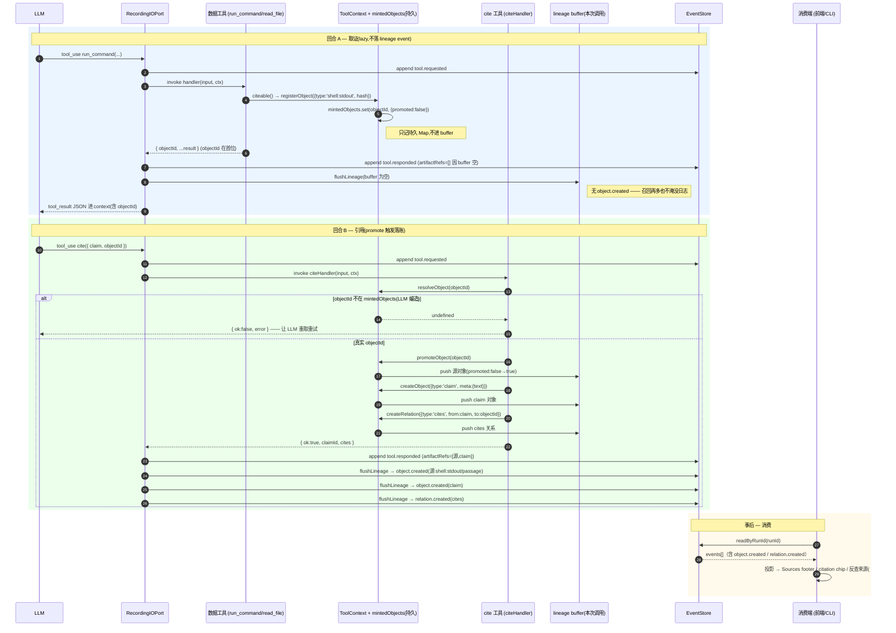

# Lineage 生命周期

一条引用(citation)从"数据被取回"到"前端渲染角标"要穿过运行时的多个层。本文用时序图
把整条链路串起来,回答三个最容易混淆的问题:

- `objectId` 是谁产生的、什么时候进 LLM context;
- `cite` 工具调用之后,记录到底**什么时候**、**以什么形态**落账;
- 为什么"宽召回 1000 条结果"不会淹没事件日志(lazy-promote)。

配套阅读:[`lineage-taxonomy.md`](./lineage-taxonomy.md)(object/relation 受控词汇表)、
[`connecting-data-tools-to-lineage.md`](./connecting-data-tools-to-lineage.md)(工具作者如何接入)、
[`design/40-lineage-citation-goal.md`](./design/40-lineage-citation-goal.md)(为什么用 objectId 句柄取代前端正则)。

---

## 角色

| 角色 | 代码位置 | 职责 |
|---|---|---|
| **LLM** | — | 决策调用数据工具与 `cite`;答案文本里**不**写来源 |
| **数据工具** | `src/tools/exec.ts`、`examples/agent-docs-qa/tools/corpus-tools.ts` | 取回内容,用 `citeable()` / `ctx.registerObject` 产出 `objectId` |
| **ToolContext lineage 原语** | `src/runtime/AgentRuntime.ts:388-427` | `registerObject` / `createObject` / `promoteObject` / `resolveObject` / `createRelation` |
| **`mintedObjects`** | `src/runtime/AgentRuntime.ts:136` | **per-run 持久** Map,记每个 objectId 的 `{type, meta, promoted}` |
| **`lineage` buffer** | `src/runtime/AgentRuntime.ts:1248` | **per-tool-call 新建** 的 `{objects:[], relations:[]}`,本次调用要落账的清单 |
| **`cite` / `declare_relation`** | `src/tools/lineage.ts` | 框架内置工具(#113 P3),`AgentRuntime.ts:263` 注册;声明 claim 与关系 |
| **RecordingIOPort** | `src/trace/RecordingIOPort.ts:225-302` | 写 `tool.requested/responded`,并在 responded 后 `flushLineage` |
| **EventStore** | `src/trace/{Memory,Jsonl,Broadcasting}EventStore.ts` | 持久化 events(lineage 是其子集) |
| **消费端** | 前端 viewer / CLI(#41 / #42) | 读 event 投影,渲染 Sources footer / citation chip / 反查 |

> 关键区分:`registerObject` 只写**持久的 `mintedObjects`**(不进本次 buffer → 不发 event);
> `createObject` / `promoteObject` / `createRelation` 才把条目 push 进**本次 buffer** → 由
> `flushLineage` 落成 event。这是 lazy-promote 的全部秘密。

---

## 时序图



---

## 状态机:一个 objectId 的一生

`mintedObjects` 里每个 objectId 只有两个状态,`promoted` 是唯一开关:

```
                registerObject                 promoteObject / createObject
   (不存在) ───────────────────▶ promoted:false ───────────────────────▶ promoted:true
                  lazy 登记            首次被 cite 时升格           对应 object.created 已入 buffer
```

- `registerObject`:幂等登记,`promoted:false`,**不**产 event。宽召回的候选都停在这里。
- `promoteObject`:把 `false` 翻成 `true` 并 push 进当次 buffer;已是 `true` 则无操作(幂等)。
- `createObject`:直接以 `promoted:true` 登记并 push(claim 走这条,因为 claim 天生要落账)。
- `resolveObject`:只读判存,`cite` 用它 fail-fast 挡住编造的 id(`lineage.ts:46-48`)。

跨调用之所以成立:回合 A 的 `registerObject` 写的是**持久** `mintedObjects`;回合 B 的
`promoteObject` 在另一次工具调用里仍能从同一个 Map 找到它,push 进**回合 B 的** buffer。

---

## 落账时机表

| 事件 | 何时写入 | causedBy / 锚点 |
|---|---|---|
| `tool.requested` | 进入 `invokeTool`,执行 handler 前 | 最近一次 `llm.responded` |
| `tool.responded` | handler 返回(或抛错)后 | 对应的 `tool.requested` |
| `object.created` | `tool.responded` **之后** 的 `flushLineage`,逐条 | `producerEventId` = **本次** `tool.responded` |
| `relation.created` | 同上 | `causedByEventId` = **本次** `tool.responded` |

> ⚠️ **lazy-promote 的语义取舍**:源对象(如 `shell:stdout`)的 `object.created` 是在
> **`cite` 这次** 的 `flushLineage` 落账的,因此它的 `producerEventId` 指向 **cite 的
> `tool.responded`**,而非真正取回它的 `run_command` 的 responded。换言之,落账锚点是
> "首次被引用"而非"被取回"。这是 lazy(召回不淹没日志)换来的代价;若未来需要精确回指取回点,
> 需在 promote 时携带原始 producerEventId。当前实现见 `RecordingIOPort.ts:199-223`。

> 出错路径:handler 抛错时只写 `status:'error'` 的 `tool.responded`,**不** `flushLineage`
> —— 失败的工具调用不产生 lineage(`RecordingIOPort.ts:275-301`)。

---

## 持久化形态

lineage event 跟随普通 event 走同一个 `IEventStore`,物理形态取决于装配的实现:

| 实现 | 存储 | 用途 |
|---|---|---|
| `MemoryEventStore` | 进程内存 Map,重启即丢 | 测试 / demo 默认 |
| `JsonlEventStore` | 每 run 一个 `${runId}.jsonl`,事件逐行 append | 持久化 |
| `BroadcastingEventStore` | 包装转发 | 实时订阅 |

落地后的两行(示意):

```jsonc
{"type":"object.created","payload":{"objectId":"obj:…","type":"claim","producerEventId":"…","meta":{"text":"X 是 42"}}}
{"type":"relation.created","payload":{"relationId":"rel:…","type":"cites","fromObjectId":"obj:<claim>","toObjectId":"obj:<source>","causedByEventId":"…"}}
```

之后 [s-004](./stories/s-004-lineage-from-artifact-to-source.md)(从 artifact 反推来源)、
[s-014](./stories/s-014-reverse-reference-lineage-query.md)(谁引用了某来源)就是 `readByRunId`
读回这些 event、重建 lineage 图来实现。

---

## 一句话总结

**生产端**(#113 / #155,已完成):数据工具产 `objectId` → LLM 被 description 引导调 `cite`
→ promote 触发 `object.created` / `relation.created` 落进 EventStore。
**消费端**(#41 / #42,进行中):读 event 投影渲染角标 / 反查。
角标永远来自 event 投影,**不来自 LLM 的散文**——这正是 [#40](./design/40-lineage-citation-goal.md)
用不可伪造的 `objectId` 句柄取代前端正则"读心"的初衷。
